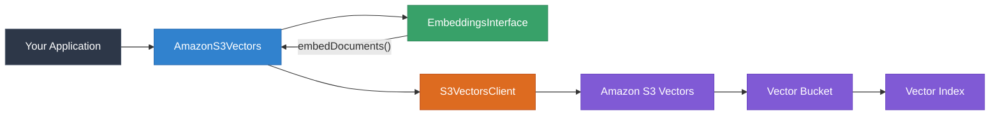

# @farukada/aws-langchain-s3-vector-ts

[](https://www.npmjs.com/package/@farukada/aws-langchain-s3-vector-ts)
[](https://github.com/FarukAda/aws-langchain-s3-vector-ts/actions/workflows/ci.yml)
[](https://nodejs.org/)
[](https://www.typescriptlang.org/)
[](https://opensource.org/licenses/MIT)
[](https://aws.amazon.com/sdk-for-javascript/)
[](https://docs.npmjs.com/generating-provenance-statements/)

Built with [LangChain](https://github.com/langchain-ai/langchainjs) · [AWS SDK v3](https://aws.amazon.com/sdk-for-javascript/) · [npm](https://www.npmjs.com/package/@farukada/aws-langchain-s3-vector-ts) · [GitHub](https://github.com/FarukAda/aws-langchain-s3-vector-ts) · [Issues](https://github.com/FarukAda/aws-langchain-s3-vector-ts/issues)

---

Drop-in LangChain-compatible **vector store** backed by [Amazon S3 Vectors](https://docs.aws.amazon.com/AmazonS3/latest/userguide/s3-vectors.html). Stores, queries, and manages vector embeddings using the native AWS S3 Vectors service with full TypeScript type safety. A faithful port of the official Python [`langchain-aws`](https://github.com/langchain-ai/langchain-aws/blob/main/libs/aws/langchain_aws/vectorstores/s3_vectors/base.py) S3 Vectors integration.

## Table of Contents

- [Features](#-key-features)
- [Architecture](#️-architecture)
- [Quick Start](#-quick-start)
- [Usage Examples](#-usage-examples)
- [Infrastructure Setup](#️-infrastructure-setup)
- [Configuration Reference](#️-configuration-reference)
- [Advanced Features](#-advanced-features)
- [API Reference](#-api-reference)
- [IAM Permissions](#-iam-permissions)
- [Testing](#-testing)
- [Project Structure](#-project-structure)
- [Contributing](#-contributing)
- [License](#-license)

## ✨ Key Features

| | Feature | Description |
|---|---|---|
| ☁️ | **Cloud-Native** | Direct integration with Amazon S3 Vectors via `@aws-sdk/client-s3vectors` |
| 🚀 | **Performance-First** | Per-batch embedding for low peak memory, configurable batch sizes |
| 🛡️ | **Fully Type-Safe** | Built with strict TypeScript 6, exported types for all config surfaces |
| 🔌 | **Drop-In Compatible** | Extends LangChain.js `VectorStore` — works with `asRetriever()`, RAG chains, agents |
| ⚙️ | **Auto-Provisioning** | Automatically creates the vector index on first write |
| 🔍 | **Metadata Filtering** | Native S3 Vectors metadata filters for similarity search |
| 🔐 | **Supply-Chain Hardened** | Published with npm provenance attestations via GitHub OIDC Trusted Publishing |

## 🏗️ Architecture



**Data flow on write (`addDocuments`):**

1. Documents are chunked into batches of 200 (configurable).
2. Each batch is embedded via the supplied `EmbeddingsInterface`.
3. On the first batch, if `createIndexIfNotExist` is enabled (default), the library checks whether the index exists (via `GetIndexCommand`) and creates it (via `CreateIndexCommand`) with the correct `dimension` inferred from the first vector.
4. Vectors plus metadata are sent via `PutVectorsCommand` — one SDK call per batch.
5. Page content is stored as a special metadata key (`_page_content` by default) and transparently extracted on reads.

**Data flow on read (`similaritySearch*`):**

1. The query is embedded via the query-side embedding model (falls back to the indexing model).
2. `QueryVectorsCommand` sends the vector with `returnMetadata: true` and optionally `returnDistance: true`.
3. Results are reconstructed as LangChain `Document` objects, lifting the page content out of metadata.

## 📦 Quick Start

### Installation

```bash
npm install @farukada/aws-langchain-s3-vector-ts @aws-sdk/client-s3vectors @langchain/core
```

### Peer Dependencies

| Package | Version |
|---|---|
| `@aws-sdk/client-s3vectors` | `^3.1014.0` |
| `@langchain/core` | `^1.1.35` |

### Runtime Requirements

- **Node.js** `>= 22.14.0` (required minimum for npm Trusted Publishing; also ensures modern `Intl` and `fetch` are available).
- **npm** `>= 10.0.0`.
- **Module format:** ESM only. If you consume this package from a CommonJS project, use dynamic `import()`.

### Basic Usage

```typescript
import { AmazonS3Vectors } from "@farukada/aws-langchain-s3-vector-ts";
import { BedrockEmbeddings } from "@langchain/aws";
import { Document } from "@langchain/core/documents";

const store = new AmazonS3Vectors(new BedrockEmbeddings(), {
  vectorBucketName: "my-vector-bucket",
  indexName: "my-index",
  region: "us-east-1",
});

// Add documents — embeddings are computed per batch automatically
await store.addDocuments([
  new Document({ pageContent: "Star Wars", metadata: { genre: "scifi" } }),
  new Document({ pageContent: "Finding Nemo", metadata: { genre: "family" } }),
]);

// Similarity search
const results = await store.similaritySearch("space adventure", 4);
```

## 📖 Usage Examples

### Add Texts Directly

```typescript
const ids = await store.addTexts(
  ["hello world", "goodbye world"],
  [{ source: "greeting" }, { source: "farewell" }],
);
```

### Similarity Search with Scores

The raw score is the `distance` returned by S3 Vectors — lower means more similar for both `cosine` and `euclidean` metrics.

```typescript
const results = await store.similaritySearchWithScore("neural networks", 5);
for (const [doc, distance] of results) {
  console.log(`${doc.pageContent} (distance: ${distance})`);
}
```

### Relevance Scores (for LangChain retrievers)

LangChain expects a *relevance score* (higher is better, normalized to ~[0, 1]). This package ships with built-in converters:

```typescript
import {
  cosineRelevanceScoreFn,       // 1.0 - distance
  euclideanRelevanceScoreFn,    // 1.0 - distance / sqrt(4096)
} from "@farukada/aws-langchain-s3-vector-ts";

// Or supply your own:
const store = new AmazonS3Vectors(embeddings, {
  vectorBucketName: "bucket",
  indexName: "index",
  relevanceScoreFn: (d) => Math.exp(-d),
});
```

### Metadata Filtering

S3 Vectors supports a MongoDB-style filter syntax:

```typescript
const filtered = await store.similaritySearch(
  "adventure",
  4,
  { genre: { $eq: "scifi" } },
);

// Range + combinator filters
const recent = await store.similaritySearch(
  "announcement",
  10,
  {
    $and: [
      { year: { $gte: 2024 } },
      { category: { $in: ["product", "security"] } },
    ],
  },
);
```

### Use as a LangChain Retriever

```typescript
const retriever = store.asRetriever({ k: 5 });
const docs = await retriever.invoke("space exploration");

// With filter
const filteredRetriever = store.asRetriever({
  k: 3,
  filter: { genre: { $eq: "scifi" } },
});
```

### Raw-Vector-Only Workflow (No Embeddings Model)

When you already have vectors (e.g., from a separate embedding service):

```typescript
const store = new AmazonS3Vectors(undefined, {
  vectorBucketName: "my-bucket",
  indexName: "my-index",
  region: "us-east-1",
});

await store.addVectors(
  [[0.1, 0.2, 0.3], [0.4, 0.5, 0.6]],
  [
    new Document({ pageContent: "first" }),
    new Document({ pageContent: "second" }),
  ],
);

const results = await store.similaritySearchVectorWithScore([0.1, 0.2, 0.3], 2);
```

### Separate Query Embeddings

Some embedding providers differentiate between document-side and query-side models (e.g., Cohere's `input_type`):

```typescript
const store = new AmazonS3Vectors(documentEmbeddings, {
  vectorBucketName: "my-bucket",
  indexName: "my-index",
  queryEmbeddings: queryEmbeddings, // falls back to documentEmbeddings if omitted
});
```

### Bring Your Own Client

```typescript
import { S3VectorsClient } from "@aws-sdk/client-s3vectors";

const client = new S3VectorsClient({
  region: "eu-west-1",
  credentials: { /* your credentials */ },
});

const store = new AmazonS3Vectors(embeddings, {
  vectorBucketName: "my-bucket",
  indexName: "my-index",
  client, // takes precedence over region/credentials/endpoint
});
```

### Static Factories

```typescript
// From texts
const store = await AmazonS3Vectors.fromTexts(
  ["hello", "world"],
  [{ source: "a" }, { source: "b" }],
  new BedrockEmbeddings(),
  { vectorBucketName: "my-bucket", indexName: "my-index", region: "us-east-1" },
);

// From documents
const store = await AmazonS3Vectors.fromDocuments(
  docs,
  new BedrockEmbeddings(),
  { vectorBucketName: "my-bucket", indexName: "my-index", region: "us-east-1" },
);
```

## 🏗️ Infrastructure Setup

> **Prerequisite:** You must manually create the S3 vector bucket before using this library. The vector index inside the bucket is created automatically on first write (unless you disable `createIndexIfNotExist`).

<details>
<summary><strong>AWS CLI</strong></summary>

```bash
# Create the vector bucket
aws s3vectors create-vector-bucket \
  --vector-bucket-name my-vector-bucket

# (Optional) Create the vector index manually — otherwise the library
# creates it on first write.
aws s3vectors create-index \
  --vector-bucket-name my-vector-bucket \
  --index-name my-index \
  --data-type float32 \
  --dimension 1536 \
  --distance-metric cosine
```

</details>

<details>
<summary><strong>AWS Console</strong></summary>

1. Open the **Amazon S3 console**.
2. Select **Vector buckets** in the left navigation.
3. Choose **Create vector bucket** and supply a bucket name.
4. Leave the index creation to the library (automatic on first write) or create one manually with the matching `dimension` for your embedding model.

</details>

<details>
<summary><strong>AWS CDK (TypeScript)</strong></summary>

As of 2026-04, CDK L2 constructs for S3 Vectors are not yet available. Use `CfnResource` with the CloudFormation raw type, or provision via the CLI / console as a one-time step outside your CDK stack.

</details>

## ⚙️ Configuration Reference

| Option | Type | Default | Description |
|---|---|---|---|
| `vectorBucketName` | `string` | **required** | Name of an existing S3 vector bucket |
| `indexName` | `string` | **required** | Name of the vector index (3–63 chars; lowercase letters, numbers, `-`, `.`) |
| `client` | `S3VectorsClient` | — | Pre-configured SDK client (takes precedence) |
| `region` | `string` | — | AWS region (ignored when `client` is set) |
| `credentials` | `AwsCredentialIdentity` | — | AWS credentials (ignored when `client` is set) |
| `endpoint` | `string` | — | Custom endpoint URL |
| `dataType` | `"float32"` | `"float32"` | Vector data type (S3 Vectors currently only supports `float32`) |
| `distanceMetric` | `"cosine" \| "euclidean"` | `"cosine"` | Distance metric for similarity search |
| `createIndexIfNotExist` | `boolean` | `true` | Auto-create the index on first write |
| `pageContentMetadataKey` | `string \| null` | `"_page_content"` | Metadata key for storing `Document.pageContent`; `null` to disable round-tripping |
| `nonFilterableMetadataKeys` | `string[]` | — | Metadata keys excluded from query filters (reduces index size for large values) |
| `queryEmbeddings` | `EmbeddingsInterface` | — | Separate embedding model for queries only |
| `relevanceScoreFn` | `(distance: number) => number` | — | Custom distance-to-score conversion |
| `embeddings` | `EmbeddingsInterface` | — | Alternative to the positional `embeddings` argument |

Full generated API docs: see [`docs/`](docs/) (TypeDoc output).

## 🔧 Advanced Features

### Per-Batch Embedding

Documents are embedded one batch at a time (default: 200 docs per batch) so peak memory stays bounded for large datasets. This matches the Python `langchain-aws` implementation exactly.

```typescript
await store.addDocuments(largeDocs, { batchSize: 50 });
```

### Non-Filterable Metadata Keys

Store large metadata values (e.g. raw HTML, full text) that don't need to be query-filterable — they're excluded from the filter index and won't count against filter-index size limits:

```typescript
const store = new AmazonS3Vectors(embeddings, {
  vectorBucketName: "my-bucket",
  indexName: "my-index",
  nonFilterableMetadataKeys: ["full_text", "raw_html"],
});
```

This configuration applies at index-creation time — it cannot be changed after the index exists.

### Disabling Page-Content Round-Tripping

By default the page content is stored as `_page_content` in metadata so it can be restored on reads. Set `pageContentMetadataKey` to `null` to skip this (e.g. when you only need embeddings + metadata, not the original text):

```typescript
const store = new AmazonS3Vectors(embeddings, {
  vectorBucketName: "my-bucket",
  indexName: "my-index",
  pageContentMetadataKey: null, // documents come back with empty pageContent
});
```

### Deep-Copy Metadata on Duplicate-ID Fetches

When `getByIds` is called with duplicate IDs, returned documents get independently-cloned metadata (via `structuredClone`) so mutating one does not affect the other — matching the Python reference implementation's behaviour exactly.

### Custom Retriever Configuration

```typescript
const retriever = store.asRetriever({
  k: 10,
  filter: { category: { $eq: "docs" } },
  // searchType: "similarity_score_threshold", scoreThreshold: 0.7, ...
});
```

## 📋 API Reference

### Instance Methods

| Method | Returns | Description |
|---|---|---|
| `addDocuments(docs, options?)` | `Promise<string[]>` | Embed and store documents (per-batch) |
| `addTexts(texts, metadatas?, options?)` | `Promise<string[]>` | Convert texts + metadata to documents and store |
| `addVectors(vectors, docs, options?)` | `Promise<string[]>` | Store pre-computed vectors |
| `similaritySearch(query, k?, filter?)` | `Promise<Document[]>` | Text query → documents |
| `similaritySearchWithScore(query, k?, filter?)` | `Promise<[Document, number][]>` | Text query → documents with distance |
| `similaritySearchVectorWithScore(vector, k?, filter?)` | `Promise<[Document, number][]>` | Vector query → documents with distance |
| `similaritySearchByVector(vector, k?, filter?)` | `Promise<Document[]>` | Vector query → documents |
| `getByIds(ids, options?)` | `Promise<Document[]>` | Retrieve documents by vector IDs |
| `delete(params?)` | `Promise<void>` | Delete by IDs, or the entire index when no `ids` are supplied |
| `asRetriever(options?)` | `VectorStoreRetriever` | Convert to a LangChain retriever |

### Static Factories

| Method | Returns | Description |
|---|---|---|
| `fromTexts(texts, metadatas, embeddings, config)` | `Promise<AmazonS3Vectors>` | Create store and add texts |
| `fromDocuments(docs, embeddings, config)` | `Promise<AmazonS3Vectors>` | Create store and add documents |

### Exported Utilities

```typescript
import {
  cosineRelevanceScoreFn,
  euclideanRelevanceScoreFn,
  // Types
  AmazonS3VectorsConfig,
  DistanceMetric,
  VectorDataType,
  S3VectorsDeleteParams,
  S3OutputVector,
} from "@farukada/aws-langchain-s3-vector-ts";
```

## 🔐 IAM Permissions

The store uses the following S3 Vectors actions. The IAM policy below enumerates them explicitly — no `s3vectors:*` wildcard.

```json
{
  "Version": "2012-10-17",
  "Statement": [
    {
      "Sid": "S3VectorsIndexLifecycle",
      "Effect": "Allow",
      "Action": [
        "s3vectors:CreateIndex",
        "s3vectors:GetIndex",
        "s3vectors:DeleteIndex"
      ],
      "Resource": [
        "arn:aws:s3vectors:<region>:<account-id>:bucket/<vector-bucket>",
        "arn:aws:s3vectors:<region>:<account-id>:bucket/<vector-bucket>/index/<index-name>"
      ]
    },
    {
      "Sid": "S3VectorsRead",
      "Effect": "Allow",
      "Action": [
        "s3vectors:GetVectors",
        "s3vectors:QueryVectors"
      ],
      "Resource": "arn:aws:s3vectors:<region>:<account-id>:bucket/<vector-bucket>/index/<index-name>"
    },
    {
      "Sid": "S3VectorsWrite",
      "Effect": "Allow",
      "Action": [
        "s3vectors:PutVectors",
        "s3vectors:DeleteVectors"
      ],
      "Resource": "arn:aws:s3vectors:<region>:<account-id>:bucket/<vector-bucket>/index/<index-name>"
    }
  ]
}
```

**Reducing the policy further:**

- If you pre-create the index (disabling `createIndexIfNotExist`), remove `s3vectors:CreateIndex` and `s3vectors:GetIndex`.
- If you never call `delete()`, remove `s3vectors:DeleteIndex` and `s3vectors:DeleteVectors`.
- If your application is read-only, keep only the `S3VectorsRead` statement.

## 🧪 Testing

### Unit tests

```bash
npm test            # Run all unit tests with coverage
npm run test:watch  # Watch mode
```

Unit tests use [`aws-sdk-client-mock`](https://github.com/m-radzikowski/aws-sdk-client-mock) — the library [AWS officially recommends](https://aws.amazon.com/blogs/developer/mocking-modular-aws-sdk-for-javascript-v3-in-unit-tests/) for SDK v3 — to mock `S3VectorsClient` without network calls. Coverage thresholds: **80% branches / 80% functions / 80% lines / 80% statements**.

### Integration tests (live AWS)

> **LocalStack does not currently support the `s3vectors` service** ([localstack/localstack#13498](https://github.com/localstack/localstack/issues/13498)). Integration tests run against real AWS and are gated off by default.

**Local run:**

```bash
export RUN_LIVE_INTEGRATION=1
export AWS_VECTOR_BUCKET=<your-pre-created-vector-bucket>
export AWS_REGION=us-east-1
# Plus AWS credentials (AWS_PROFILE or AWS_ACCESS_KEY_ID / AWS_SECRET_ACCESS_KEY)

npm run test:integration
```

Without `RUN_LIVE_INTEGRATION=1` **and** `AWS_VECTOR_BUCKET` set, the suite prints a skip message and exits 0 — no false passes, no false fails.

**CI run (on-demand):**

The [`Integration (live AWS)`](https://github.com/FarukAda/aws-langchain-s3-vector-ts/actions/workflows/integration-live.yml) workflow is triggered manually via the GitHub Actions UI (`workflow_dispatch`). It uses GitHub OIDC to assume an IAM role (configured via the `AWS_ROLE_TO_ASSUME` secret) and runs against the bucket named in the `AWS_VECTOR_BUCKET` repository variable.

### Mutation testing

```bash
npm run test:mutate         # Full run (all mutants)
npm run test:mutate:quick   # Quick variant — mutates src/shared/
```

Powered by [Stryker](https://stryker-mutator.io/). Thresholds: 80% (high) / 60% (low) / 50% (break).

> **Known limitation:** at the time of writing, the Stryker jest-runner has a test-discovery issue when combined with ESM + `ts-jest/default-esm` on Windows sandboxes. The scaffold (`stryker.conf.json` + scripts) is in place; the run will fail with "No tests were found" until the underlying interaction resolves. Unit tests and coverage thresholds remain enforced in the normal CI path.

### Type-checking, lint, build

```bash
npm run typecheck   # tsc --noEmit
npm run lint        # ESLint (read-only)
npm run lint:fix    # ESLint with --fix
npm run build       # Compile to dist/
npm run docs        # Regenerate TypeDoc output
```

## 📁 Project Structure

```
src/
├── index.ts                      # Public API — exports class, types, utilities
├── s3-vectors.ts                 # AmazonS3Vectors — core VectorStore implementation
├── relevance-scores.ts           # cosineRelevanceScoreFn, euclideanRelevanceScoreFn
├── types.ts                      # Config + output types
├── shared/                       # Internal helpers (not re-exported)
│   ├── stub-embeddings.ts        # StubEmbeddings placeholder for raw-vector workflows
│   ├── errors.ts                 # isAwsNotFoundException type guard
│   └── metadata.ts               # buildPutMetadata, createDocument (pure functions)
└── guide.md                      # In-depth usage guide

test/
├── helpers.ts                    # aws-sdk-client-mock factories
├── constructor.test.ts           # Constructor behaviour + config defaults
├── add-vectors.test.ts           # Raw vector writes + auto-index path
├── add-documents.test.ts         # Per-batch embedding, mismatch guards
├── add-texts.test.ts             # Texts + metadata wrapping
├── similarity-search.test.ts     # Query paths (vector/text/no-embeddings)
├── delete.test.ts                # Index + per-batch vector deletion
├── get-by-ids.test.ts            # Batched retrieval, duplicate-ID semantics
├── auto-index.test.ts            # CreateIndex with metadataConfiguration
├── from-texts.test.ts            # Static factory
├── relevance-scores.test.ts      # Relevance-score utility functions
└── integration/                  # Live-AWS integration tests (env-gated)
    ├── _guard.ts                 # Env gating contract
    └── smoke.test.ts             # Create-index → add → query → delete roundtrip

.github/workflows/
├── ci.yml                        # Push-to-main CI (3 OS × Node 22/24)
├── integration-live.yml          # workflow_dispatch — live-AWS tests via OIDC
└── release.yml                   # Tag-triggered publish via npm Trusted Publishing

docs/                             # TypeDoc-generated API docs (checked in)
```

## 🤝 Contributing

Contributions are welcome — please open an issue or PR on [GitHub](https://github.com/FarukAda/aws-langchain-s3-vector-ts).

### Local Development

```bash
git clone https://github.com/FarukAda/aws-langchain-s3-vector-ts.git
cd aws-langchain-s3-vector-ts
nvm use                # reads .nvmrc → Node 22
npm ci
npm test               # 36 unit tests
npm run build
```

### Coding Standards

- **TypeScript strict mode** plus `noUncheckedIndexedAccess`, `noUnusedLocals`, `noUnusedParameters`.
- **ESLint flat config** (`eslint.config.ts`) with `typescript-eslint` recommended-type-checked rules, Prettier, and import sorting via `eslint-plugin-perfectionist`.
- **No-`instanceof` rule** enforced — use brand symbols or type guards instead (see `src/shared/stub-embeddings.ts` for the pattern).
- **Commit style:** Conventional Commits (`feat`, `fix`, `refactor`, `test`, `chore`, `docs`).

See [`CODE_OF_CONDUCT.md`](./CODE_OF_CONDUCT.md) for community expectations.

### Behavioural Parity with Python

This package tracks [`langchain_aws.vectorstores.s3_vectors.base.AmazonS3Vectors`](https://github.com/langchain-ai/langchain-aws/blob/main/libs/aws/langchain_aws/vectorstores/s3_vectors/base.py) for behaviour. Batch sizes, metadata conventions, duplicate-ID deep-copy semantics, and index auto-creation all match the Python reference. If upstream Python fixes a bug or adds a feature, please open an issue so we can port it here.

## 📄 License

[MIT](./LICENSE) © Faruk Ada.
