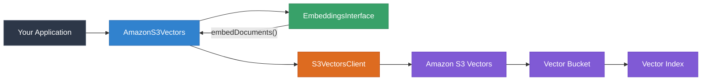

# @farukada/aws-langchain-s3-vector-ts

[](https://www.npmjs.com/package/@farukada/aws-langchain-s3-vector-ts)
[](https://www.typescriptlang.org/)
[](https://nodejs.org/)
[](https://opensource.org/licenses/MIT)
[](https://aws.amazon.com/sdk-for-javascript/)

Built with [LangChain](https://github.com/langchain-ai/langchainjs) · [AWS SDK v3](https://aws.amazon.com/sdk-for-javascript/) · [npm](https://www.npmjs.com/package/@farukada/aws-langchain-s3-vector-ts) · [GitHub](https://github.com/farukada/aws-langchain-s3-vector-ts) · [Issues](https://github.com/farukada/aws-langchain-s3-vector-ts/issues)

---

Drop-in LangChain-compatible **vector store** backed by [Amazon S3 Vectors](https://docs.aws.amazon.com/AmazonS3/latest/userguide/s3-vectors.html). Stores, queries, and manages vector embeddings using the native AWS S3 Vectors service with full TypeScript type safety. A faithful port of the official Python [`langchain-aws`](https://github.com/langchain-ai/langchain-aws) S3 Vectors integration.

## ✨ Key Features

| | Feature | Description |
|---|---|---|
| ☁️ | **Cloud-Native** | Direct integration with Amazon S3 Vectors via `@aws-sdk/client-s3vectors` |
| 🚀 | **Performance-First** | Per-batch embedding for low peak memory, configurable batch sizes |
| 🛡️ | **Fully Type-Safe** | Built with strict TypeScript, exported types for all config surfaces |
| 🔌 | **Drop-In Compatible** | Extends LangChain.js `VectorStore` — works with `asRetriever()`, RAG chains, agents |
| ⚙️ | **Auto-Provisioning** | Automatically creates the vector index on first write |
| 🔍 | **Metadata Filtering** | Native S3 Vectors metadata filters for similarity search |

## 🏗️ Architecture



## 📦 Quick Start

### Installation

```bash
npm install @farukada/aws-langchain-s3-vector-ts @aws-sdk/client-s3vectors @langchain/core
```

### Peer Dependencies

| Package | Version |
|---|---|
| `@aws-sdk/client-s3vectors` | `^3.1000.0` |
| `@langchain/core` | `^1.1.29` |

### Basic Usage

```typescript
import { AmazonS3Vectors } from "@farukada/aws-langchain-s3-vector-ts";
import { BedrockEmbeddings } from "@langchain/aws";
import { Document } from "@langchain/core/documents";

const store = new AmazonS3Vectors(new BedrockEmbeddings(), {
  vectorBucketName: "my-vector-bucket",
  indexName: "my-index",
  region: "us-east-1",
});

// Add documents — embeddings are computed per batch automatically
await store.addDocuments([
  new Document({ pageContent: "Star Wars", metadata: { genre: "scifi" } }),
  new Document({ pageContent: "Finding Nemo", metadata: { genre: "family" } }),
]);

// Similarity search
const results = await store.similaritySearch("space adventure", 4);
```

## 📖 Usage Examples

### Add Texts Directly

```typescript
const ids = await store.addTexts(
  ["hello world", "goodbye world"],
  [{ source: "greeting" }, { source: "farewell" }],
);
```

### Similarity Search with Scores

```typescript
const results = await store.similaritySearchWithScore("neural networks", 5);
for (const [doc, distance] of results) {
  console.log(`${doc.pageContent} (distance: ${distance})`);
}
```

### Metadata Filtering

```typescript
const filtered = await store.similaritySearch(
  "adventure",
  4,
  { genre: { "$eq": "scifi" } },
);
```

### Use as a LangChain Retriever

```typescript
const retriever = store.asRetriever({ k: 5 });
const docs = await retriever.invoke("space exploration");
```

### Bring Your Own Client

```typescript
import { S3VectorsClient } from "@aws-sdk/client-s3vectors";

const client = new S3VectorsClient({
  region: "eu-west-1",
  credentials: { /* your credentials */ },
});

const store = new AmazonS3Vectors(embeddings, {
  vectorBucketName: "my-bucket",
  indexName: "my-index",
  client, // takes precedence over region/credentials
});
```

### Static Factories

```typescript
// From texts
const store = await AmazonS3Vectors.fromTexts(
  ["hello", "world"],
  [{ source: "a" }, { source: "b" }],
  new BedrockEmbeddings(),
  { vectorBucketName: "my-bucket", indexName: "my-index", region: "us-east-1" },
);

// From documents
const store = await AmazonS3Vectors.fromDocuments(
  docs,
  new BedrockEmbeddings(),
  { vectorBucketName: "my-bucket", indexName: "my-index", region: "us-east-1" },
);
```

## 🏗️ Infrastructure Setup

> **Prerequisite:** You must manually create the S3 vector bucket before using this library. The vector index inside the bucket is created automatically on first write.

<details>
<summary><strong>AWS CDK (TypeScript)</strong></summary>

```typescript
import * as cdk from "aws-cdk-lib";

// Note: As of writing, CDK L2 constructs for S3 Vectors may not yet exist.
// Use the AWS CLI or console to create the vector bucket:
// aws s3vectors create-vector-bucket --vector-bucket-name my-vector-bucket
```

</details>

<details>
<summary><strong>AWS CLI</strong></summary>

```bash
# Create the vector bucket
aws s3vectors create-vector-bucket \
  --vector-bucket-name my-vector-bucket

# The vector index is created automatically by the library,
# but you can also create it manually:
aws s3vectors create-index \
  --vector-bucket-name my-vector-bucket \
  --index-name my-index \
  --data-type float32 \
  --dimension 1536 \
  --distance-metric cosine
```

</details>

## ⚙️ Configuration Reference

| Option | Type | Default | Description |
|---|---|---|---|
| `vectorBucketName` | `string` | **required** | Name of an existing S3 vector bucket |
| `indexName` | `string` | **required** | Name of the vector index (3–63 chars) |
| `client` | `S3VectorsClient` | — | Pre-configured SDK client (takes precedence) |
| `region` | `string` | — | AWS region (ignored when `client` is set) |
| `credentials` | `AwsCredentialIdentity` | — | AWS credentials (ignored when `client` is set) |
| `endpoint` | `string` | — | Custom endpoint URL |
| `dataType` | `"float32"` | `"float32"` | Vector data type |
| `distanceMetric` | `"cosine" \| "euclidean"` | `"cosine"` | Distance metric for similarity search |
| `createIndexIfNotExist` | `boolean` | `true` | Auto-create the index on first write |
| `pageContentMetadataKey` | `string \| null` | `"_page_content"` | Metadata key for storing page content (`null` to disable) |
| `nonFilterableMetadataKeys` | `string[]` | — | Keys excluded from query filters |
| `queryEmbeddings` | `EmbeddingsInterface` | — | Separate embedding model for queries only |
| `relevanceScoreFn` | `(distance: number) => number` | — | Custom distance-to-score conversion |

## 🔧 Advanced Features

### Per-Batch Embedding

Documents are embedded in batches (default: 200) to keep peak memory usage low for large datasets. This matches the Python `langchain-aws` implementation.

```typescript
await store.addDocuments(largeDocs, { batchSize: 50 });
```

### Non-Filterable Metadata Keys

Store large metadata values that don't need to be query-filterable:

```typescript
const store = new AmazonS3Vectors(embeddings, {
  vectorBucketName: "my-bucket",
  indexName: "my-index",
  nonFilterableMetadataKeys: ["full_text", "raw_html"],
});
```

### Relevance Score Functions

Built-in distance-to-relevance-score converters:

```typescript
import {
  cosineRelevanceScoreFn,    // 1.0 - distance
  euclideanRelevanceScoreFn,  // 1.0 - distance / sqrt(4096)
} from "@farukada/aws-langchain-s3-vector-ts";
```

## 📋 API Reference

### Instance Methods

| Method | Returns | Description |
|---|---|---|
| `addDocuments(docs, options?)` | `Promise<string[]>` | Embed and store documents (per-batch) |
| `addTexts(texts, metadatas?, options?)` | `Promise<string[]>` | Convert texts + metadata to documents and store |
| `addVectors(vectors, docs, options?)` | `Promise<string[]>` | Store pre-computed vectors |
| `similaritySearch(query, k?, filter?)` | `Promise<Document[]>` | Text query → documents |
| `similaritySearchWithScore(query, k?, filter?)` | `Promise<[Document, number][]>` | Text query → documents with distance |
| `similaritySearchVectorWithScore(vector, k?, filter?)` | `Promise<[Document, number][]>` | Vector query → documents with distance |
| `similaritySearchByVector(vector, k?, filter?)` | `Promise<Document[]>` | Vector query → documents |
| `getByIds(ids, options?)` | `Promise<Document[]>` | Retrieve documents by vector IDs |
| `delete(params?)` | `Promise<void>` | Delete by IDs or delete entire index |
| `asRetriever(options?)` | `VectorStoreRetriever` | Convert to a LangChain retriever |

### Static Factories

| Method | Returns | Description |
|---|---|---|
| `fromTexts(texts, metadatas, embeddings, config)` | `Promise<AmazonS3Vectors>` | Create store and add texts |
| `fromDocuments(docs, embeddings, config)` | `Promise<AmazonS3Vectors>` | Create store and add documents |

## 📚 Documentation

- [S3 Vectors Guide](src/guide.md) — Architecture, concepts, advanced patterns
- [API Reference (TypeDoc)](docs/README.md) — Full class & interface documentation

## 🧪 Testing

```bash
npm test            # Run all tests
npm run test:watch  # Watch mode
npm run build       # Type-check + compile
npm run typecheck   # Type-check only
npm run lint        # ESLint
npm run docs        # Generate API docs
```

## 📁 Project Structure

```
src/
├── index.ts           # Public API — exports class, types, utilities
├── s3-vectors.ts      # AmazonS3Vectors — core vector store implementation
├── types.ts           # TypeScript interfaces & type aliases
├── utils.ts           # Relevance score conversion functions
└── guide.md           # In-depth usage guide

tests/
├── s3-vectors.test.ts # Comprehensive unit tests (31 tests)
└── helpers.ts         # Mock client & embeddings factories

docs/                  # Auto-generated API docs (TypeDoc)
```

## 🤝 Contributing

Contributions are welcome! Please open an issue or pull request on [GitHub](https://github.com/farukada/aws-langchain-s3-vector-ts).

## 📄 License

MIT
