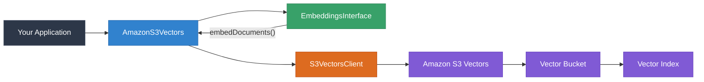

# @farukada/aws-langchain-s3-vector-ts

[](https://www.npmjs.com/package/@farukada/aws-langchain-s3-vector-ts)
[](https://github.com/FarukAda/aws-langchain-s3-vector-ts/actions/workflows/ci.yml)
[](https://github.com/FarukAda/aws-langchain-s3-vector-ts/actions/workflows/codeql.yml)
[](https://scorecard.dev/viewer/?uri=github.com/FarukAda/aws-langchain-s3-vector-ts)
[](https://nodejs.org/)
[](https://www.typescriptlang.org/)
[](https://opensource.org/licenses/MIT)
[](https://aws.amazon.com/sdk-for-javascript/)
[](https://docs.npmjs.com/generating-provenance-statements/)
[](#-testing)

Built with [LangChain](https://github.com/langchain-ai/langchainjs) · [AWS SDK v3](https://aws.amazon.com/sdk-for-javascript/) · [npm](https://www.npmjs.com/package/@farukada/aws-langchain-s3-vector-ts) · [GitHub](https://github.com/FarukAda/aws-langchain-s3-vector-ts) · [Issues](https://github.com/FarukAda/aws-langchain-s3-vector-ts/issues)

---

Drop-in LangChain-compatible **vector store** backed by [Amazon S3 Vectors](https://docs.aws.amazon.com/AmazonS3/latest/userguide/s3-vectors.html). Stores, queries, and manages vector embeddings using the native AWS S3 Vectors service with full TypeScript type safety. A faithful port of the official Python [`langchain-aws`](https://github.com/langchain-ai/langchain-aws/blob/main/libs/aws/langchain_aws/vectorstores/s3_vectors/base.py) S3 Vectors integration.

## Table of Contents

- [Features](#-key-features)
- [Architecture](#️-architecture)
- [Quick Start](#-quick-start)
- [Usage Examples](#-usage-examples)
- [Infrastructure Setup](#️-infrastructure-setup)
- [Configuration Reference](#️-configuration-reference)
- [Advanced Features](#-advanced-features)
- [API Reference](#-api-reference)
- [IAM Permissions](#-iam-permissions)
- [Testing](#-testing)
- [Project Structure](#-project-structure)
- [Contributing](#-contributing)
- [License](#-license)

## ✨ Key Features

| | Feature | Description |
|---|---|---|
| ☁️ | **Cloud-Native** | Direct integration with Amazon S3 Vectors via `@aws-sdk/client-s3vectors` |
| 🚀 | **Performance-First** | Per-batch embedding for low peak memory, configurable batch sizes |
| 🛡️ | **Fully Type-Safe** | Built with strict TypeScript 6, exported types for all config surfaces |
| 🔌 | **Drop-In Compatible** | Extends LangChain.js `VectorStore` — works with `asRetriever()`, RAG chains, agents |
| ⚙️ | **Auto-Provisioning** | Automatically creates the vector index on first write |
| 🔍 | **Metadata Filtering** | Native S3 Vectors metadata filters for similarity search |
| 🔐 | **Supply-Chain Hardened** | Published with npm provenance attestations via GitHub OIDC Trusted Publishing |

## 🏗️ Architecture


```mermaid
graph LR
    A[Your Application] --> B["AmazonS3Vectors"]
    B --> C["EmbeddingsInterface"]
    B --> D["S3VectorsClient"]
    C --> |"embedDocuments()"| B
    D --> E["Amazon S3 Vectors"]
    E --> F["Vector Bucket"]
    F --> G["Vector Index"]

    style A fill:#2d3748,stroke:#4a5568,color:#fff
    style B fill:#3182ce,stroke:#2b6cb0,color:#fff
    style C fill:#38a169,stroke:#2f855a,color:#fff
    style D fill:#dd6b20,stroke:#c05621,color:#fff
    style E fill:#805ad5,stroke:#6b46c1,color:#fff
    style F fill:#805ad5,stroke:#6b46c1,color:#fff
    style G fill:#805ad5,stroke:#6b46c1,color:#fff
```

**Data flow on write (`addDocuments`):**

1. Documents are chunked into batches of 200 (configurable).
2. Each batch is embedded via the supplied `EmbeddingsInterface`.
3. On the first write this store instance makes (not just the first batch of *this* call), if `createIndexIfNotExist` is enabled (default), the library checks whether the index exists (via `GetIndexCommand`) and creates it (via `CreateIndexCommand`) with the correct `dimension` inferred from the first vector. The result is cached for the instance's lifetime — every write after that is a single `PutVectorsCommand` call, no repeated `GetIndexCommand` round trip, regardless of `createIndexIfNotExist`.
4. Vectors plus metadata are sent via `PutVectorsCommand` — one SDK call per batch.
5. Page content is stored as a special metadata key (`_page_content` by default) and transparently extracted on reads.

**Data flow on read (`similaritySearch*`):**

1. The query is embedded via the query-side embedding model (falls back to the indexing model).
2. `QueryVectorsCommand` sends the vector with `returnMetadata: true` and optionally `returnDistance: true`.
3. Results are reconstructed as LangChain `Document` objects, lifting the page content out of metadata.

## 📦 Quick Start

### Installation

```bash
npm install @farukada/aws-langchain-s3-vector-ts @aws-sdk/client-s3vectors @langchain/core
```

### Peer Dependencies

| Package | Version |
|---|---|
| `@aws-sdk/client-s3vectors` | `^3.1117.0` |
| `@langchain/core` | `^1.2.9` |

### Runtime Requirements

- **Node.js** `>= 20` — matches the minimum required by both peer dependencies (`@aws-sdk/client-s3vectors`, `@langchain/core`). (Publishing this package to npm separately requires Node ≥24, for npm Trusted Publishing's npm-CLI requirement — that's a CI/release-only constraint and doesn't affect consumers.)
- **npm** `>= 10.0.0`.
- **Module format:** ESM only. If you consume this package from a CommonJS project, use dynamic `import()`.

### Basic Usage

```typescript
import { AmazonS3Vectors } from "@farukada/aws-langchain-s3-vector-ts";
import { BedrockEmbeddings } from "@langchain/aws";
import { Document } from "@langchain/core/documents";

const store = new AmazonS3Vectors(new BedrockEmbeddings(), {
  vectorBucketName: "my-vector-bucket",
  indexName: "my-index",
  region: "us-east-1",
});

// Add documents — embeddings are computed per batch automatically
await store.addDocuments([
  new Document({ pageContent: "Star Wars", metadata: { genre: "scifi" } }),
  new Document({ pageContent: "Finding Nemo", metadata: { genre: "family" } }),
]);

// Similarity search
const results = await store.similaritySearch("space adventure", 4);
```

## 📖 Usage Examples

### Add Texts Directly

```typescript
const ids = await store.addTexts(
  ["hello world", "goodbye world"],
  [{ source: "greeting" }, { source: "farewell" }],
);
```

### Similarity Search with Scores

The raw score is the `distance` returned by S3 Vectors — lower means more similar for both `cosine` and `euclidean` metrics.

```typescript
const results = await store.similaritySearchWithScore("neural networks", 5);
for (const [doc, distance] of results) {
  console.log(`${doc.pageContent} (distance: ${distance})`);
}
```

### Relevance Scores (for LangChain retrievers)

LangChain expects a *relevance score* (higher is better). This package ships with built-in converters:

```typescript
import {
  cosineRelevanceScoreFn,       // 1.0 - distance — bounded to [-1, 1]
  euclideanRelevanceScoreFn,    // 1.0 - distance / sqrt(4096) — see note below
} from "@farukada/aws-langchain-s3-vector-ts";

// Or supply your own:
const store = new AmazonS3Vectors(embeddings, {
  vectorBucketName: "bucket",
  indexName: "index",
  relevanceScoreFn: (d) => Math.exp(-d),
});
```

`cosineRelevanceScoreFn` is reliably bounded ([-1, 1], typically [0, 1] for normalized embeddings). `euclideanRelevanceScoreFn` is **not** reliably bounded to [0, 1]: S3 Vectors' `euclidean` metric is actually *squared* L2 distance, not linear L2, so this heuristic (inherited from the Python `langchain-aws` reference for parity) divides a squared value by a linear scale — for unit-normalized embeddings the score lands in a narrow band close to 1 rather than spanning [0, 1], and for unnormalized or high-magnitude embeddings it can go negative. Pass your own `relevanceScoreFn` if you need threshold-able scores on a euclidean index.

Use it via `similaritySearchWithRelevanceScores`:

```typescript
const results = await store.similaritySearchWithRelevanceScores("neural networks", 5);
for (const [doc, score] of results) {
  console.log(`${doc.pageContent} (relevance: ${score})`);
}
```

### Metadata Filtering

S3 Vectors supports a MongoDB-style filter syntax:

```typescript
const filtered = await store.similaritySearch(
  "adventure",
  4,
  { genre: { $eq: "scifi" } },
);

// Range + combinator filters
const recent = await store.similaritySearch(
  "announcement",
  10,
  {
    $and: [
      { year: { $gte: 2024 } },
      { category: { $in: ["product", "security"] } },
    ],
  },
);
```

A few behaviors worth knowing, confirmed live against the real service:

- **Don't pass an empty filter object.** `similaritySearch(query, k, {})` throws locally (AWS itself rejects `{}` with an opaque "Invalid filter" error rather than treating it as "no filter"). Omit the `filter` argument entirely — or pass `undefined` — to search without filtering. This matters if you build a filter dynamically and it can end up with no conditions applied.
- **A type-mismatched comparison returns zero results, not an error.** Comparing a boolean-valued field against a string (e.g. `{ popular: { $eq: "true" } }` when `popular` is actually stored as the boolean `true`) silently matches nothing rather than failing — the same as filtering on a field that doesn't exist on any document at all.
- **You can't filter on a non-filterable key.** Filtering on `pageContentMetadataKey` (or any key listed in `nonFilterableMetadataKeys`) fails with an "Invalid use of non-filterable metadata in filter" error — expected, since that's the whole point of the non-filterable list, but easy to hit by accident if you filter on the same key you excluded for index-size reasons.

### Use as a LangChain Retriever

```typescript
const retriever = store.asRetriever({ k: 5 });
const docs = await retriever.invoke("space exploration");

// With filter
const filteredRetriever = store.asRetriever({
  k: 3,
  filter: { genre: { $eq: "scifi" } },
});
```

### Raw-Vector-Only Workflow (No Embeddings Model)

When you already have vectors (e.g., from a separate embedding service):

```typescript
const store = new AmazonS3Vectors(undefined, {
  vectorBucketName: "my-bucket",
  indexName: "my-index",
  region: "us-east-1",
});

await store.addVectors(
  [[0.1, 0.2, 0.3], [0.4, 0.5, 0.6]],
  [
    new Document({ pageContent: "first" }),
    new Document({ pageContent: "second" }),
  ],
);

const results = await store.similaritySearchVectorWithScore([0.1, 0.2, 0.3], 2);
```

### Separate Query Embeddings

Some embedding providers differentiate between document-side and query-side models (e.g., Cohere's `input_type`):

```typescript
const store = new AmazonS3Vectors(documentEmbeddings, {
  vectorBucketName: "my-bucket",
  indexName: "my-index",
  queryEmbeddings: queryEmbeddings, // falls back to documentEmbeddings if omitted
});
```

### Bring Your Own Client

```typescript
import { S3VectorsClient } from "@aws-sdk/client-s3vectors";

const client = new S3VectorsClient({
  region: "eu-west-1",
  credentials: { /* your credentials */ },
});

const store = new AmazonS3Vectors(embeddings, {
  vectorBucketName: "my-bucket",
  indexName: "my-index",
  client, // takes precedence over region/credentials/endpoint
});
```

### Static Factories

```typescript
// From texts
const store = await AmazonS3Vectors.fromTexts(
  ["hello", "world"],
  [{ source: "a" }, { source: "b" }],
  new BedrockEmbeddings(),
  { vectorBucketName: "my-bucket", indexName: "my-index", region: "us-east-1" },
);

// From documents
const store = await AmazonS3Vectors.fromDocuments(
  docs,
  new BedrockEmbeddings(),
  { vectorBucketName: "my-bucket", indexName: "my-index", region: "us-east-1" },
);
```

## 🏗️ Infrastructure Setup

> **Prerequisite:** You must manually create the S3 vector bucket before using this library. The vector index inside the bucket is created automatically on first write (unless you disable `createIndexIfNotExist`).

<details>
<summary><strong>AWS CLI</strong></summary>

```bash
# Create the vector bucket
aws s3vectors create-vector-bucket \
  --vector-bucket-name my-vector-bucket

# (Optional) Create the vector index manually — otherwise the library
# creates it on first write.
aws s3vectors create-index \
  --vector-bucket-name my-vector-bucket \
  --index-name my-index \
  --data-type float32 \
  --dimension 1536 \
  --distance-metric cosine
```

</details>

<details>
<summary><strong>AWS Console</strong></summary>

1. Open the **Amazon S3 console**.
2. Select **Vector buckets** in the left navigation.
3. Choose **Create vector bucket** and supply a bucket name.
4. Leave the index creation to the library (automatic on first write) or create one manually with the matching `dimension` for your embedding model.

</details>

<details>
<summary><strong>AWS CDK (TypeScript)</strong></summary>

As of 2026-04, CDK L2 constructs for S3 Vectors are not yet available. Use `CfnResource` with the CloudFormation raw type, or provision via the CLI / console as a one-time step outside your CDK stack.

</details>

## ⚙️ Configuration Reference

| Option | Type | Default | Description |
|---|---|---|---|
| `vectorBucketName` | `string` | **required** | Name of an existing S3 vector bucket |
| `indexName` | `string` | **required** | Name of the vector index (3–63 chars; lowercase letters, numbers, `-`, `.`) |
| `client` | `S3VectorsClient` | — | Pre-configured SDK client (takes precedence) |
| `region` | `string` | — | AWS region (ignored when `client` is set) |
| `credentials` | `AwsCredentialIdentity` | — | AWS credentials (ignored when `client` is set) |
| `endpoint` | `string` | — | Custom endpoint URL |
| `dataType` | `"float32"` | `"float32"` | Vector data type (S3 Vectors currently only supports `float32`) |
| `distanceMetric` | `"cosine" \| "euclidean"` | `"cosine"` | Distance metric for similarity search |
| `createIndexIfNotExist` | `boolean` | `true` | Auto-create the index on first write |
| `pageContentMetadataKey` | `string \| null` | `"_page_content"` | Metadata key for storing `Document.pageContent`; `null` to disable round-tripping |
| `nonFilterableMetadataKeys` | `string[]` | — | Metadata keys excluded from query filters (reduces index size for large values). When this library creates a new index, `pageContentMetadataKey` is automatically added to this list too (unless doing so would exceed S3 Vectors' 10-key cap) — see [Non-Filterable Metadata Keys](#non-filterable-metadata-keys). |
| `queryEmbeddings` | `EmbeddingsInterface` | — | Separate embedding model for queries only |
| `relevanceScoreFn` | `(distance: number) => number` | — | Custom distance-to-score conversion |
| `embeddings` | `EmbeddingsInterface` | — | Alternative to the positional `embeddings` argument |
| `maxAttempts` | `number` | SDK default | Max attempts (initial + retries) for AWS requests (ignored when `client` is set) |
| `retryMode` | `"standard" \| "adaptive" \| "legacy"` | SDK default | AWS SDK retry mode (ignored when `client` is set) |

Full generated API docs: see [`docs/`](docs/) (TypeDoc output).

### Retries

Throttling (`TooManyRequestsException`) and transient 5xx failures are retried automatically by the AWS SDK. Tune the behaviour with `maxAttempts` / `retryMode`, or pass a fully pre-configured `client`.

### Errors

Every failure — validation, not-found, or an underlying AWS error — is surfaced as a single typed `S3VectorsError` carrying a `code` (`S3VectorsErrorCode`), a `context` (`{ operation, vectorBucketName, indexName }`), and the original `cause`. Detect it with the exported `isS3VectorsError()` guard — it's a proper TypeScript type guard, so a caught `unknown` narrows to `S3VectorsError` without a cast:

```typescript
try {
  await store.addDocuments(docs);
} catch (e) {
  if (isS3VectorsError(e)) {
    console.error(e.code, e.message); // e is narrowed, no `as S3VectorsError` needed
  }
}
```

**Partial-batch failures report what already succeeded.** If `addVectors`/`addDocuments` fails partway through a multi-batch write (a later batch throttled, hit a transient error, etc.), earlier batches are already durably committed in AWS — the thrown error's `context.writtenIds` lists every id confirmed written before the failure, including any concurrent batch that happened to succeed alongside the one that failed. This matters most with auto-generated ids: without `context.writtenIds`, those vectors would be undiscoverable and impossible to clean up or reconcile, since nothing else records what id they landed under. `delete({ ids })` reports the equivalent `context.deletedIds` on a partial failure — lower-stakes since delete is idempotent (a blind retry of the full `ids` list is always safe), but still useful to know exactly what happened. `delete({ deleteAll: true })` is idempotent in the same way: deleting an index that is already gone resolves cleanly instead of erroring, so retrying after an ambiguous network failure is safe.

This partial-progress guarantee doesn't extend to search: if a multi-page `QueryVectors` pagination sequence fails partway through, any pages already fetched are discarded rather than returned alongside the error. Reasonable asymmetry — a failed search is side-effect-free and trivially retryable, unlike a failed write — but worth knowing if you're relying on `writtenIds`/`deletedIds`-style partial-progress reporting from a read path too.

```typescript
try {
  await store.addDocuments(manyDocuments); // ids auto-generated
} catch (e) {
  if (isS3VectorsError(e) && e.context.writtenIds?.length) {
    console.warn(`${e.context.writtenIds.length} vectors already written before the failure:`, e.context.writtenIds);
  }
}
```

The codes are stable and exhaustive:

| Code | Raised when |
| --- | --- |
| `VALIDATION` | Caller input was invalid — mismatched counts, a non-array argument, a bad batch size, an empty filter, a reserved metadata key, or a `client` that is not an `S3VectorsClient`. |
| `NOT_FOUND` | A requested vector id was not found by `getByIds`. |
| `EMBEDDINGS_MISSING` | An operation needed an embedding model but none was configured. |
| `AWS_REQUEST_FAILED` | An underlying AWS S3 Vectors request failed. |
| `INDEX_CONFIG_MISMATCH` | The index's actual dimension or distance metric disagrees with this store's configuration. |
| `ABORTED` | The supplied `AbortSignal` fired before or during the operation. |
| `AWS_INVALID_RESPONSE` | An AWS response was missing, or carried an unusable value for, a field this library requires — a non-numeric `distance`, an unrecognised `distanceMetric`, or a malformed `GetIndex` payload. |
| `QUERY_PAGE_LIMIT_EXCEEDED` | A search hit this library's 100-page `QueryVectors` limit with more pages available and fewer than `k` results collected. `context.pagesScanned` and `context.resultsCollected` say how far short it fell — narrow the filter or lower `k`. A search that legitimately runs out of matches returns what it found, without error. |
| `NOT_IMPLEMENTED` | `maxMarginalRelevanceSearch`, which this store intentionally does not implement. |
| `UNEXPECTED_ERROR` | A failure that never touched AWS — a raw throw from a caller-supplied embeddings model, or input malformed enough to bypass validation. |

### Maximal Marginal Relevance (MMR)

`maxMarginalRelevanceSearch` is intentionally **not** implemented, matching the Python `langchain-aws` reference. Use metadata pre-filtering or client-side re-ranking when you need result diversity.

### Observability

The library emits no logs by design — no `console.*` call exists anywhere in `src/`, and a unit test pins that. It stays a thin, dependency-light adapter. To instrument requests (logging, metrics, tracing), construct your own `S3VectorsClient` with the desired `logger`/middleware and pass it via the `client` option; all operations flow through it. A `client` that is not an `S3VectorsClient` is rejected with a coded `VALIDATION` error rather than silently replaced — a silent replacement would fall back to the ambient credential chain and default region, which could point the store at a different AWS account.

## 🔧 Advanced Features

### Per-Batch Embedding and Concurrent Writes

Documents are embedded one batch at a time (default: 200 docs per batch, matching the Python `langchain-aws` implementation) — `embedDocuments` is never called concurrently for two batches, since most embedding providers rate-limit aggressively and this library gives no retry/backoff guarantee for that call.

Once a batch is embedded, its `PutVectors` call is dispatched without waiting for it to finish before embedding the next batch — up to 10 `PutVectors` calls run concurrently (AWS's SDK already retries throttling there), the same concurrency `delete()`/`getByIds()` already use for `DeleteVectors`/`GetVectors`. `addVectors` (no embedding step) parallelizes its `PutVectors` calls the same way. The very first batch of any write is always sent alone, since it's the one that creates or validates the index.

Net effect: peak memory for in-flight vectors is bounded by roughly 10× `batchSize` rather than 1× — for large ingests this is a meaningfully higher ceiling in exchange for real write throughput.

```typescript
await store.addDocuments(largeDocs, { batchSize: 50 });
```

### Non-Filterable Metadata Keys

Store large metadata values (e.g. raw HTML, full text) that don't need to be query-filterable — they're excluded from the filter index and won't count against filter-index size limits:

```typescript
const store = new AmazonS3Vectors(embeddings, {
  vectorBucketName: "my-bucket",
  indexName: "my-index",
  nonFilterableMetadataKeys: ["full_text", "raw_html"],
});
```

By default, the configured `pageContentMetadataKey` (`_page_content` unless changed) is automatically included in this list when this library creates the index — document text is exactly the kind of large value this feature exists for, and filterable metadata is capped at 2048 bytes per vector versus 40,960 bytes total. Pass your own `nonFilterableMetadataKeys` alongside it as shown above; the two lists are merged (deduplicated).

AWS caps `nonFilterableMetadataKeys` at 10 keys per index. If your own list is already at 10 and `pageContentMetadataKey` would push it to 11, index creation throws a validation error rather than silently creating the index with page content left out of the list — a `10`-and-under-with-page-content-included list would otherwise make page content *filterable* metadata (the 2048-byte cap) instead of non-filterable (40,960 bytes), with no way to fix it afterward (S3 Vectors has no way to reconfigure an existing index's metadata configuration). If you hit this, either trim your own list to 9 keys or fewer, or set `pageContentMetadataKey: null` to store page content as filterable metadata deliberately.

This configuration applies at index-creation time — it cannot be changed after the index exists.

These two caps (2048 bytes filterable, 40,960 bytes total per vector) aren't checked locally before the `PutVectors` call. AWS's own error is already specific (`"Filterable metadata must have at most 2048 bytes"` / `"Metadata object must have at most 40960 bytes"`), but reproducing the exact byte count client-side turned out not to be safe: probing the live service shows the counted size isn't a simple `JSON.stringify(...).length` of the metadata object, or of the value alone — the true boundary sits somewhere between those two measures. Since the AWS SDK doesn't publish the exact algorithm, a local check built on a guessed formula risks rejecting metadata AWS would have accepted (worse than the current opaque-but-correct AWS error), and it would silently go stale the moment AWS changes its wire encoding. If you're batching large text into metadata, keep an eye on this cap yourself rather than relying on this library to catch it early.

### Metadata Value Types

S3 Vectors only accepts metadata values that are strings, numbers, booleans, or arrays of strings/numbers (an array mixing types, e.g. a boolean alongside strings, is rejected). `null` and nested objects are rejected outright by AWS with a `PutVectors` validation error.

Two JavaScript types are **silently converted** rather than rejected — worth knowing before you rely on round-tripping them:

- A `Date` value is stored (and read back) as a **number** — Unix epoch **seconds**, not milliseconds, and not an ISO string. Reading it back gives you a plain number, not a `Date`.
- `NaN` is stored (and read back) as the **string** `"NaN"`.

A key whose value is `undefined` is silently dropped rather than stored as `null` or rejected. If you need `Date`/`NaN` values preserved as such, convert them yourself (e.g. `date.toISOString()`) before passing metadata in.

### Disabling Page-Content Round-Tripping

By default the page content is stored as `_page_content` in metadata so it can be restored on reads. Set `pageContentMetadataKey` to `null` to skip this (e.g. when you only need embeddings + metadata, not the original text):

```typescript
const store = new AmazonS3Vectors(embeddings, {
  vectorBucketName: "my-bucket",
  indexName: "my-index",
  pageContentMetadataKey: null, // documents come back with empty pageContent
});
```

If a document's own metadata already uses the reserved `pageContentMetadataKey` name, `addDocuments`/`addVectors` throws a `VALIDATION`-coded `S3VectorsError` rather than silently overwriting that field — rename the field or configure a different `pageContentMetadataKey`.

### Deep-Copy Metadata on Duplicate-ID Fetches

When `getByIds` is called with duplicate IDs, returned documents get independently-cloned metadata (via `structuredClone`) so mutating one does not affect the other — matching the Python reference implementation's behaviour exactly.

### Read-Modify-Write Upserts via `Document.id`

`addVectors`/`addDocuments` use each document's own `id` as the vector's key when `options.ids` is omitted — a fresh UUID is generated only for documents that have no `id` of their own. A document fetched via `getByIds` already has `id` set (`vector.key`), so a natural read-modify-write round-trip upserts instead of creating a duplicate:

```typescript
const [doc] = await store.getByIds(["existing-id"]);
doc.metadata.reviewed = true;
await store.addDocuments([doc]); // overwrites "existing-id", doesn't create a new vector
```

An explicit `options.ids` always takes priority over `document.id` when both are present. This is a deliberate departure from the Python `langchain-aws` reference (which only ever uses `options.ids` or a fresh UUID, never inspecting the document itself) — not a parity gap, since the improvement doesn't affect wire format or stored data shape.

### Concurrency

Multiple concurrent writers — whether separate calls on the same store instance, or entirely separate `AmazonS3Vectors` instances (different processes) — can safely race to create the same new index: whichever one loses the creation race gets a benign `ConflictException` from AWS, which this library recovers from automatically, re-validating against whichever writer actually won. This is verified against real AWS with more than two concurrent instances racing at once, not just two.

`delete({ deleteAll: true })` running concurrently with an in-progress write is not specially handled — if the delete wins the race, the write's remaining batches are expected to fail (e.g. against a since-deleted index) rather than being coordinated. Unit tests cover the case where a write has already passed local validation and is inside its actual `PutVectors` call when the delete lands, confirming this library's own state (its index-validation cache in particular) doesn't corrupt or hang under either ordering — that hasn't been separately confirmed against live AWS for this exact interleaving. If your application deletes and writes to the same index concurrently, treat that write's failure as expected and handle it, rather than assuming both always succeed independently.

### Cancellation (`AbortSignal`)

Every method that calls AWS accepts an `AbortSignal` — `addVectors`, `addDocuments`, `addTexts`, `delete`, `getByIds`, `similaritySearch*`, and the `fromTexts`/`fromDocuments` static factories:

```typescript
const controller = new AbortController();
setTimeout(() => controller.abort(), 5000); // give up after 5s

await store.addDocuments(largeDocs, { signal: controller.signal });
```

An aborted operation rejects with a coded `S3VectorsError` (`code: "ABORTED"`), distinct from `AWS_REQUEST_FAILED`. Cancellation cancels the AWS request currently in flight (confirmed live: an abort mid-write stops the request instead of waiting for it to complete) and stops any further batches or pages from starting; a signal that's already aborted before the call even starts rejects immediately, with no network call at all — and, for the text-based search and write methods, without paying for a billable `embedQuery`/`embedDocuments` call either.

One exception: the shared index existence-check/creation calls (`GetIndex`/`CreateIndex`) triggered whenever a write needs the index checked or created — whether or not another caller happens to be racing it — are not tied to any single caller's signal, so that a concurrent sibling's write sharing that same in-flight check can never be cancelled by another caller's abort. A practical consequence: aborting mid-index-creation rejects your own call promptly, but the index may still end up created.

One signature note: `similaritySearchWithRelevanceScores` takes the signal as its fifth argument, matching `similaritySearch` and `similaritySearchWithScore`. It also still accepts an `AbortSignal` in the fourth position, where earlier versions expected it, so existing callers keep working either way.

One real limitation: `embedDocuments`/`embedQuery` (from your embeddings model) have no cancellation support in LangChain's `EmbeddingsInterface`, so a batch already being embedded when the signal fires still completes — only the AWS side (and any batch not yet started) is actually cancelled.

### Custom Retriever Configuration

```typescript
const retriever = store.asRetriever({
  k: 10,
  filter: { category: { $eq: "docs" } },
});
```

`@langchain/core`'s `asRetriever()` accepts a `searchType` of `"similarity"` (the default, and the only one this store supports) or `"mmr"` — `"mmr"` throws at call time, since [Maximal Marginal Relevance](#maximal-marginal-relevance-mmr) is intentionally not implemented here. `"similarity_score_threshold"`, offered by some other LangChain vector stores, isn't a valid `searchType` for any store — check `scoreThreshold` support in your specific retriever's docs before relying on it.

## 📋 API Reference

### Instance Methods

| Method | Returns | Description |
|---|---|---|
| `addDocuments(docs, options?)` | `Promise<string[]>` | Embed and store documents (per-batch) |
| `addTexts(texts, metadatas?, options?)` | `Promise<string[]>` | Convert texts + metadata to documents and store |
| `addVectors(vectors, docs, options?)` | `Promise<string[]>` | Store pre-computed vectors |
| `similaritySearch(query, k?, filter?, callbacks?, signal?)` | `Promise<Document[]>` | Text query → documents |
| `similaritySearchWithScore(query, k?, filter?, callbacks?, signal?)` | `Promise<[Document, number][]>` | Text query → documents with distance |
| `similaritySearchWithRelevanceScores(query, k?, filter?, callbacks?, signal?)` | `Promise<[Document, number][]>` | Text query → documents with relevance score (higher is better) |
| `similaritySearchVectorWithScore(vector, k?, filter?, signal?)` | `Promise<[Document, number][]>` | Vector query → documents with distance |
| `similaritySearchByVector(vector, k?, filter?, signal?)` | `Promise<Document[]>` | Vector query → documents |
| `maxMarginalRelevanceSearch(query, options, callbacks?)` | never resolves | Always throws `NOT_IMPLEMENTED` — intentionally unsupported |
| `getByIds(ids, options?)` | `Promise<Document[]>` | Retrieve documents by vector IDs |
| `delete(params?)` | `Promise<void>` | Delete by IDs, or the entire index when `{ deleteAll: true }` is passed |
| `asRetriever(options?)` | `VectorStoreRetriever` | Convert to a LangChain retriever |

### Static Factories

| Method | Returns | Description |
|---|---|---|
| `fromTexts(texts, metadatas, embeddings, config)` | `Promise<AmazonS3Vectors>` | Create store and add texts |
| `fromDocuments(docs, embeddings, config)` | `Promise<AmazonS3Vectors>` | Create store and add documents |

### Exported Utilities

```typescript
import {
  cosineRelevanceScoreFn,
  euclideanRelevanceScoreFn,
  // Error handling
  S3VectorsError,
  S3VectorsErrorCode,
  isS3VectorsError,
  // Types
  AmazonS3VectorsConfig,
  DistanceMetric,
  VectorDataType,
  S3VectorsDeleteParams,
  S3OutputVector,
  S3VectorsErrorContext,
} from "@farukada/aws-langchain-s3-vector-ts";
```

## 🔐 IAM Permissions

The store uses the following S3 Vectors actions. The IAM policy below enumerates them explicitly — no `s3vectors:*` wildcard.

```json
{
  "Version": "2012-10-17",
  "Statement": [
    {
      "Sid": "S3VectorsIndexLifecycle",
      "Effect": "Allow",
      "Action": [
        "s3vectors:CreateIndex",
        "s3vectors:GetIndex",
        "s3vectors:DeleteIndex"
      ],
      "Resource": [
        "arn:aws:s3vectors:<region>:<account-id>:bucket/<vector-bucket>",
        "arn:aws:s3vectors:<region>:<account-id>:bucket/<vector-bucket>/index/<index-name>"
      ]
    },
    {
      "Sid": "S3VectorsRead",
      "Effect": "Allow",
      "Action": [
        "s3vectors:GetVectors",
        "s3vectors:QueryVectors"
      ],
      "Resource": "arn:aws:s3vectors:<region>:<account-id>:bucket/<vector-bucket>/index/<index-name>"
    },
    {
      "Sid": "S3VectorsWrite",
      "Effect": "Allow",
      "Action": [
        "s3vectors:PutVectors",
        "s3vectors:DeleteVectors"
      ],
      "Resource": "arn:aws:s3vectors:<region>:<account-id>:bucket/<vector-bucket>/index/<index-name>"
    }
  ]
}
```

**Reducing the policy further:**

- If you pre-create the index (disabling `createIndexIfNotExist`), remove `s3vectors:CreateIndex` and `s3vectors:GetIndex`.
- If you never call `delete()`, remove `s3vectors:DeleteIndex` and `s3vectors:DeleteVectors`.
- If your application is read-only, keep only the `S3VectorsRead` statement.

## 🧪 Testing

### Unit tests

```bash
npm test            # Run all unit tests with coverage
npm run test:watch  # Watch mode
```

Unit tests use [`aws-sdk-client-mock`](https://github.com/m-radzikowski/aws-sdk-client-mock) — the library [AWS officially recommends](https://aws.amazon.com/blogs/developer/mocking-modular-aws-sdk-for-javascript-v3-in-unit-tests/) for SDK v3 — to mock `S3VectorsClient` without network calls. Coverage thresholds: **100% branches / 100% functions / 100% lines / 100% statements**, enforced in CI.

### Integration tests (live AWS)

> **LocalStack does not currently support the `s3vectors` service** ([localstack/localstack#13498](https://github.com/localstack/localstack/issues/13498)). Integration tests run against real AWS and are gated off by default.

**Local run:**

```bash
export RUN_LIVE_INTEGRATION=1
export AWS_VECTOR_BUCKET=<your-pre-created-vector-bucket>
export AWS_REGION=us-east-1
# Plus AWS credentials (AWS_PROFILE or AWS_ACCESS_KEY_ID / AWS_SECRET_ACCESS_KEY)

npm run test:integration
```

Without `RUN_LIVE_INTEGRATION=1` **and** `AWS_VECTOR_BUCKET` set, the suite prints a skip message and exits 0 — no false passes, no false fails.

**CI run (on-demand):**

The [`Integration (live AWS)`](https://github.com/FarukAda/aws-langchain-s3-vector-ts/actions/workflows/integration-live.yml) workflow is triggered manually via the GitHub Actions UI (`workflow_dispatch`). It uses GitHub OIDC to assume an IAM role (configured via the `AWS_ROLE_TO_ASSUME` secret) and runs against the bucket named in the `AWS_VECTOR_BUCKET` repository variable.

### Verifying against real AWS

Standalone verification scripts in [`examples/`](examples/) exercise the full public API against live Amazon S3 Vectors using real [Amazon Bedrock](https://aws.amazon.com/bedrock/) embeddings (Amazon Titan Text Embeddings V2, `amazon.titan-embed-text-v2:0`). Each script provisions a unique `verify-*` index, runs its checks, prints a `PASS/FAIL` summary, tears its index down, and exits non-zero on any failure.

You need an existing S3 vector bucket and Bedrock model access to Titan Text Embeddings V2 in your region.

```bash
export AWS_VECTOR_BUCKET=<your-pre-created-vector-bucket>
export AWS_REGION=us-east-1
# Plus AWS credentials (AWS_PROFILE or AWS_ACCESS_KEY_ID / AWS_SECRET_ACCESS_KEY)

npm run verify          # build + core, search, and edge-case scripts
# or individually:
npm run verify:core     # CRUD, index lifecycle, fromTexts/fromDocuments, queryEmbeddings, retry config
npm run verify:search   # search surface, cosine/euclidean, full filter-operator matrix, asRetriever
npm run verify:edge     # null page-content key, raw vectors, duplicate ids, nonFilterable keys,
                        # typed error codes, and 200/100/500 batch boundaries
```

`@langchain/aws` (which provides the Bedrock embeddings) is a **devDependency only** — it is used by the verification scripts and never ships in the published package.

### Type-checking, lint, build

```bash
npm run typecheck   # tsc --noEmit
npm run lint        # ESLint (read-only)
npm run lint:fix    # ESLint with --fix
npm run build       # Compile to dist/
npm run docs        # Regenerate TypeDoc output
```

## 📁 Project Structure

```
src/
├── index.ts                      # Public API — class, error types, utilities
├── s3-vectors.ts                 # AmazonS3Vectors — core VectorStore implementation
├── relevance-scores.ts           # cosineRelevanceScoreFn, euclideanRelevanceScoreFn
├── types.ts                      # Config + output types
├── shared/                       # Internal helpers (not re-exported)
│   ├── stub-embeddings.ts        # StubEmbeddings placeholder for raw-vector workflows
│   ├── validation.ts             # assertValidIndexConfig (bucket/index-name checks)
│   ├── metadata.ts               # buildPutMetadata, createDocument (pure functions)
│   └── errors/                   # Typed error model
│       ├── s3-vectors-error.ts   # S3VectorsError + isS3VectorsError guard
│       ├── error-code.ts         # S3VectorsErrorCode enum
│       ├── wrap-error.ts         # wrapAwsError / toError
│       └── aws-not-found.ts      # isAwsNotFoundException guard
└── guide.md                      # In-depth usage guide

test/                             # Unit (100% coverage), contract, property, types
├── helpers.ts                    # aws-sdk-client-mock factories
├── *.test.ts                     # Per-method unit suites (add/query/delete/get/errors…)
├── shared/                       # Mirrors src/shared (incl. errors/, validation)
├── contract/                     # VectorStore + MMR contract tests
├── property/                     # fast-check invariants (metadata, batching)
├── types/                        # Compile-time public-API assertions
├── package-smoke/                # Packed-tarball import smoke (node --test)
└── integration/                  # Live-AWS integration tests (env-gated)

examples/                         # Standalone real-AWS verification scripts (.mjs)
├── _harness.mjs / _embeddings.mjs
└── verify-core / verify-search / verify-edge-cases

.github/workflows/
├── ci.yml                        # CI on push/PR to main (3 OS × Node 20/22/24)
├── codeql.yml                    # Static analysis on push/PR to main + weekly
├── dependency-review.yml         # Fails a PR introducing a high-severity+ vulnerable dependency
├── scorecard.yml                 # OpenSSF Scorecard, published weekly + on push to main
├── integration-live.yml          # Nightly + workflow_dispatch live-AWS smoke via OIDC
└── release.yml                   # Tag-triggered publish via npm Trusted Publishing (+ SBOM)

docs/                             # TypeDoc-generated API docs (checked in)
```

## 🤝 Contributing

Contributions are welcome — please open an issue to discuss non-trivial changes before submitting a PR. See [`CONTRIBUTING.md`](./CONTRIBUTING.md) for local development setup, coding standards, and PR expectations, and [`CODE_OF_CONDUCT.md`](./CODE_OF_CONDUCT.md) for community expectations.

Found a security issue? See [`SECURITY.md`](./SECURITY.md) instead of opening a public issue.

## 📄 License

[MIT](./LICENSE) © Faruk Ada.
