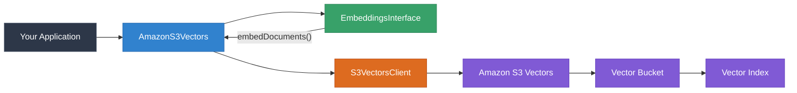

# @farukada/aws-langchain-s3-vector-ts

[](https://www.npmjs.com/package/@farukada/aws-langchain-s3-vector-ts)
[](https://github.com/FarukAda/aws-langchain-s3-vector-ts/actions/workflows/ci.yml)
[](https://github.com/FarukAda/aws-langchain-s3-vector-ts/actions/workflows/codeql.yml)
[](https://scorecard.dev/viewer/?uri=github.com/FarukAda/aws-langchain-s3-vector-ts)


[](https://www.npmjs.com/package/@farukada/aws-langchain-s3-vector-ts#provenance)
[](#-testing)
[](https://github.com/sponsors/FarukAda)

Built with [LangChain](https://github.com/langchain-ai/langchainjs) · [AWS SDK v3](https://aws.amazon.com/sdk-for-javascript/) · [npm](https://www.npmjs.com/package/@farukada/aws-langchain-s3-vector-ts) · [GitHub](https://github.com/FarukAda/aws-langchain-s3-vector-ts) · [Issues](https://github.com/FarukAda/aws-langchain-s3-vector-ts/issues)

---

Drop-in LangChain-compatible **vector store** backed by [Amazon S3 Vectors](https://docs.aws.amazon.com/AmazonS3/latest/userguide/s3-vectors.html). Stores, queries, and manages vector embeddings using the native AWS S3 Vectors service with full TypeScript type safety. Every behaviour below is specified against the AWS API references, the `@aws-sdk/client-s3vectors` service model, and `@langchain/core` itself — and, where the service's behaviour is undocumented, against recorded live probes in [`docs/evidence/`](docs/evidence/) that a live test re-checks.

> **Independent project.** Maintained by [Faruk Ada](https://github.com/FarukAda), one person, in their own time — see [SUPPORT.md](SUPPORT.md) for what that means for response times. It is **not affiliated with, endorsed by, or sponsored by** Amazon Web Services, Inc. or LangChain, Inc. "AWS", "Amazon S3" and "Amazon S3 Vectors" are trademarks of Amazon.com, Inc. or its affiliates; "LangChain" is a trademark of LangChain, Inc. They are used here only to name the service this package talks to and the framework it plugs into.

## At a glance

| | |
|---|---|
| **What it is** | A LangChain.js `VectorStore` over Amazon S3 Vectors. Drop it in wherever a store goes. |
| **Maturity** | S3 Vectors is [generally available](https://aws.amazon.com/blogs/aws/amazon-s3-vectors-now-generally-available-with-increased-scale-and-performance) (2 December 2025). This package is a `1.x`; see [Versioning and Support](#-versioning-and-support) for what that promises and who maintains it. |
| **What it costs** | Storage, writes and queries, billed by AWS — no charge for this package. [Cost model](#cost-model) has the dimensions and current figures. |
| **The limits that bite** | 40 KB metadata per vector, 2 KB of it filterable; 4,096 dimensions; 20 MiB per request; 2,500 vectors/s per index. [Full table](#limits-this-package-enforces). |
| **When it breaks** | One error class, one `code`, structured `context`. [Errors](#errors) is the section to read first. |
| **When *not* to use it** | Sub-100 ms p99 on every query, or very high query throughput. [Known limitations](#-known-limitations). |

## Table of Contents

- [Key Features](#-key-features)
- [Versioning and Support](#-versioning-and-support)
- [Architecture](#️-architecture)
- [Quick Start](#-quick-start)
  - [Installation](#installation) · [Peer Dependencies](#peer-dependencies) · [Basic Usage](#basic-usage) · [Runtime Requirements](#runtime-requirements)
- [Usage Examples](#-usage-examples)
  - [Add Documents](#add-documents) · [Similarity Search with Scores](#similarity-search-with-scores) · [Relevance Scores](#relevance-scores-for-langchain-retrievers) · [Metadata Filtering](#metadata-filtering) · [Use as a LangChain Retriever](#use-as-a-langchain-retriever) · [End-to-end RAG](#end-to-end-rag) · [Raw-Vector-Only Workflow](#raw-vector-only-workflow-no-embeddings-model) · [Static Factories](#static-factories)
- [Infrastructure Setup](#️-infrastructure-setup)
  - [Region availability](#region-availability) · [Private connectivity (VPC endpoints)](#private-connectivity-vpc-endpoints) · [Encryption with a customer managed key](#encryption-with-a-customer-managed-key)
- [Configuration Reference](#️-configuration-reference)
  - [Retries](#retries) · [**Errors**](#errors) · [Untrusted documents](#untrusted-documents) · [MMR](#maximal-marginal-relevance-mmr) · [Enumeration](#enumeration) · [Non-goals](#non-goals) · [Observability and tracing](#observability-and-tracing)
- [Advanced Features](#-advanced-features)
  - [Per-Batch Embedding and Concurrent Writes](#per-batch-embedding-and-concurrent-writes) · [Rate Limits, Payload Limits and Cost](#rate-limits-payload-limits-and-cost) · [Query performance and recall](#query-performance-and-recall) · [Non-Filterable Metadata Keys](#non-filterable-metadata-keys) · [Metadata Value Types](#metadata-value-types) · [Concurrency](#concurrency) · [Cancellation](#cancellation-abortsignal) · [Custom Retriever Configuration](#custom-retriever-configuration)
- [Known limitations](#-known-limitations)
- [Migrating from another vector store](#-migrating-from-another-vector-store)
- [API Reference](#-api-reference)
- [IAM Permissions](#-iam-permissions)
- [Testing](#-testing)
- [Project Structure](#-project-structure)
- [Design decisions and evidence](#-design-decisions-and-evidence)
- [Contributing](#-contributing)
- [License](#-license)

## ✨ Key Features

| | Feature | Description |
|---|---|---|
| ☁️ | **Cloud-Native** | Direct integration with Amazon S3 Vectors via `@aws-sdk/client-s3vectors` |
| 🚀 | **Performance-First** | Per-batch embedding for low peak memory, configurable batch sizes |
| 🛡️ | **Fully Type-Safe** | Built with strict TypeScript 6, exported types for all config surfaces |
| 🔌 | **Drop-In Compatible** | Extends LangChain.js `VectorStore` — works with `asRetriever()`, RAG chains, agents |
| ⚙️ | **Auto-Provisioning** | Automatically creates the vector index on first write |
| 🔍 | **Metadata Filtering** | Native S3 Vectors metadata filters for similarity search |
| 🎯 | **MMR and Enumeration** | Diversity-aware search through core's own algorithm, plus `listDocuments`/`listVectors` for audit and migration |
| 🧾 | **Specified, Not Guessed** | Every behaviour is cited to an AWS reference, the SDK model, or a recorded live probe under [`docs/evidence/`](docs/evidence/) that a live test re-checks |
| 🔐 | **Supply-Chain Hardened** | Published with npm provenance attestations via GitHub OIDC Trusted Publishing |

## 📌 Versioning and Support

**Semantic versioning, stated as rules rather than as a link.** A **major** is needed to remove or rename an export, narrow an input that was accepted, change a return type, or change a documented default. A **minor** adds an export or an optional option. A **patch** only fixes behaviour against what is already documented. Anything scheduled for removal carries `@deprecated` in its JSDoc and a CHANGELOG entry for at least one minor before the major that removes it, and keeps working until then.

Three specifics that are easy to get wrong, each stated where it applies: [error codes](#errors) are append-only within `1.x` and a new one may arrive in a minor; [`DistanceMetric` and `VectorDataType`](#-api-reference) are unions on both sides of the surface, so widening either is a major; and error *messages* are not covered by any of this — branch on `code`, `context` and `cause`, never on text.

**Supported Node versions.** The floor is `>=22` (`engines.node`), and CI runs the full suite on **22, 24 and 26** across Linux, macOS and Windows. Node 22 is in maintenance until **2027-04-30**; the floor will not be raised before then, and raising it afterwards is a **major**. New Node lines are added to the matrix when they reach Current, so a release is tested on the runtime before you are on it.

**Supported peer versions.** `@aws-sdk/client-s3vectors` and `@langchain/core` are peer dependencies, so *you* choose the versions and there is never a second copy in your tree. CI installs both at the exact floor of the declared range and runs the type checks and the unit suite against it, so a floor that was never published, or an API this package uses that the floor lacks, fails here rather than on you. Widening a range is a minor; raising a floor is a **major**. `@langchain/core` 2.x, when it arrives, will be handled in a major.

**TypeScript.** The published declarations are verified against TypeScript **5.x** on every CI run, by installing the tarball into a fresh project and type-checking a consumer with `skipLibCheck` off. The build itself uses a newer compiler; that is an implementation detail and does not constrain you.

**Who maintains this, and what that means.** [Faruk Ada](https://github.com/FarukAda), one person, in their own time — see [SUPPORT.md](SUPPORT.md). Response times are best effort, and there is no commercial support contract behind it. Security reports go through [SECURITY.md](SECURITY.md), which commits to acknowledging within **5 business days**. Only the latest release of the current major receives fixes; older versions are not patched.

**Production readiness.** S3 Vectors itself is generally available. This package is used in production by its author, carries 100% branch coverage with every gate run on every commit, and specifies its behaviour against AWS's own references and against [recorded live probes](docs/evidence/) rather than against assumption. What it does *not* have is a second maintainer. If that matters to your organisation, the licence is MIT and the surface is small — read [the decision records](docs/decisions/) and judge for yourself.

## 🏗️ Architecture


```mermaid
graph LR
    A[Your Application] --> B["AmazonS3Vectors"]
    B --> C["EmbeddingsInterface"]
    B --> D["S3VectorsClient"]
    C --> |"embedDocuments()"| B
    D --> E["Amazon S3 Vectors"]
    E --> F["Vector Bucket"]
    F --> G["Vector Index"]

    style A fill:#2d3748,stroke:#4a5568,color:#fff
    style B fill:#3182ce,stroke:#2b6cb0,color:#fff
    style C fill:#38a169,stroke:#2f855a,color:#fff
    style D fill:#dd6b20,stroke:#c05621,color:#fff
    style E fill:#805ad5,stroke:#6b46c1,color:#fff
    style F fill:#805ad5,stroke:#6b46c1,color:#fff
    style G fill:#805ad5,stroke:#6b46c1,color:#fff
```

**Data flow on write (`addDocuments`):**

1. Documents are chunked into batches of 200 (configurable).
2. Each batch is embedded via the supplied `EmbeddingsInterface`.
3. On the first write this store instance makes (not just the first batch of *this* call), and only when `createIndexIfNotExist` is enabled (the default), the library checks whether the index exists via `GetIndexCommand` and creates it via `CreateIndexCommand` if it does not, with the `dimension` taken from the first vector. Once it knows the index exists, every later write is a single `PutVectorsCommand`. Nothing else is cached: the dimension is enforced by AWS on every write, and the distance metric is checked twice — against the `GetIndex` that first write already makes, and against the `QueryVectors` response on every read — so there is no stale copy of the index configuration to go wrong. A `PutVectors` that reports the index gone clears the flag, so the next write re-checks and re-creates it.
4. Vectors plus metadata are sent via `PutVectorsCommand` — one SDK call per batch, pipelined against the embedding of the next batch, at most `maxConcurrentBatchCalls` in flight.
5. Page content is stored as a special metadata key (`_page_content` by default) and transparently extracted on reads.

**Data flow on read (`similaritySearch*`):**

1. The query is embedded via the query-side embedding model (falls back to the indexing model).
2. `QueryVectorsCommand` sends the vector with `returnMetadata: true` and optionally `returnDistance: true`.
3. Results are reconstructed as LangChain `Document` objects, lifting the page content out of metadata.

## 📦 Quick Start

### Installation

```bash
npm install @farukada/aws-langchain-s3-vector-ts @aws-sdk/client-s3vectors @langchain/core
```

### Peer Dependencies

| Package | Version |
|---|---|
| `@aws-sdk/client-s3vectors` | `^3.1133.0` |
| `@langchain/core` | `^1.2.11` |

### Runtime Requirements

- **Node.js** `>= 22`. Node 20 reached end of life on 30 April 2026 and is no longer tested; CI runs 22, 24 and 26 on Linux, macOS and Windows. Both peer dependencies still accept Node 20 and nothing in this package's runtime needs a newer API — the floor tracks maintained Node lines, not a feature. (Publishing this package to npm separately requires Node ≥24, for npm Trusted Publishing's npm-CLI requirement — that's a CI/release-only constraint and doesn't affect consumers.)
- **npm** `>= 10.0.0`.
- **Module format:** dual. The package ships an ES module build (`dist/esm/`) and a CommonJS build (`dist/cjs/`) compiled from the same source, and the `exports` map serves each consumer the matching one with its own declarations — `import` resolves to ESM and `require` to CommonJS on every supported Node version, with no dependence on Node's `require(esm)`. The shape is verified on every commit by [publint](https://publint.dev/) and [arethetypeswrong](https://arethetypeswrong.github.io/), and the packed tarball is installed into a fresh project and used from ESM, CommonJS and a TypeScript 5 consumer in CI.
  - `import { AmazonS3Vectors } from '@farukada/aws-langchain-s3-vector-ts';` — ESM and TypeScript.
  - `const { AmazonS3Vectors } = require('@farukada/aws-langchain-s3-vector-ts');` — CommonJS.
  - A process that mixes both loads two copies of the module. `isS3VectorsError` recognises errors from either copy (it brands with a shared `Symbol.for`, never `instanceof`), so an error thrown inside a CommonJS dependency is still identifiable from ESM code, and vice versa.
- **Tree-shaking:** the package declares `"sideEffects": false` — importing one export does not pull in module-level side effects, so bundlers may drop what you don't use.

### Basic Usage

```typescript
import { AmazonS3Vectors } from "@farukada/aws-langchain-s3-vector-ts";
import { BedrockEmbeddings } from "@langchain/aws";
import { Document } from "@langchain/core/documents";

const store = new AmazonS3Vectors(new BedrockEmbeddings(), {
  vectorBucketName: "my-vector-bucket",
  indexName: "my-index",
  region: "us-east-1",
});

// Add documents — embeddings are computed per batch automatically
await store.addDocuments([
  new Document({ pageContent: "Star Wars", metadata: { genre: "scifi" } }),
  new Document({ pageContent: "Finding Nemo", metadata: { genre: "family" } }),
]);

// Similarity search
const results = await store.similaritySearch("space adventure", 4);
```

## 📖 Usage Examples

### Add Documents

```typescript
import { Document } from "@langchain/core/documents";

const ids = await store.addDocuments([
  new Document({ pageContent: "hello world", metadata: { source: "greeting" } }),
  new Document({ pageContent: "goodbye world", metadata: { source: "farewell" } }),
]);
```

`AmazonS3Vectors.fromTexts(texts, metadatas, embeddings, config)` does the
text-to-`Document` mapping for you when you are building a store from scratch.

### Similarity Search with Scores

The raw score is the `distance` returned by S3 Vectors — lower means more similar for both `cosine` and `euclidean` metrics.

```typescript
const results = await store.similaritySearchWithScore("neural networks", 5);
for (const [doc, distance] of results) {
  console.log(`${doc.pageContent} (distance: ${distance})`);
}
```

### Relevance Scores (for LangChain retrievers)

LangChain expects a *relevance score* (higher is better). A cosine index has one built in:

```typescript
import { cosineRelevanceScoreFn } from "@farukada/aws-langchain-s3-vector-ts";
// 1.0 - distance. Cosine distance is exactly 1 - cosine similarity
// (docs/evidence/cosine-distance.md), so the range is [-1, 1] — and [0, 1]
// for the normalized embeddings most models produce.
```

**A euclidean index has none, and asking for one fails closed.**
`similaritySearchWithRelevanceScores` on a euclidean store with no
`relevanceScoreFn` raises `VALIDATION` rather than returning a number. Euclidean
distance is unbounded above, so no fixed formula can map it to a comparable
score without knowing your embedding's scale — which only you know. Supply your
own, or use `similaritySearchWithScore` and threshold on the raw distance:

```typescript
const store = new AmazonS3Vectors(embeddings, {
  vectorBucketName: "bucket",
  indexName: "index",
  distanceMetric: "euclidean",
  relevanceScoreFn: (d) => 1 / (1 + d),
});
```

Use it via `similaritySearchWithRelevanceScores`:

```typescript
const results = await store.similaritySearchWithRelevanceScores("neural networks", 5);
for (const [doc, score] of results) {
  console.log(`${doc.pageContent} (relevance: ${score})`);
}
```

### Metadata Filtering

S3 Vectors supports a MongoDB-style filter syntax:

```typescript
const filtered = await store.similaritySearch(
  "adventure",
  4,
  { genre: { $eq: "scifi" } },
);

// Range + combinator filters
const recent = await store.similaritySearch(
  "announcement",
  10,
  {
    $and: [
      { year: { $gte: 2024 } },
      { category: { $in: ["product", "security"] } },
    ],
  },
);
```

A few behaviours worth knowing, each recorded with its raw traffic in [`docs/evidence/filter-validation.md`](docs/evidence/filter-validation.md) and re-checked by a live test, so a change on AWS's side fails a run rather than quietly making this section wrong:

- **Don't pass an empty filter object.** `similaritySearch(query, k, {})` throws locally (AWS itself rejects `{}` with an opaque "Invalid filter" error rather than treating it as "no filter"). Omit the `filter` argument entirely — or pass `undefined` — to search without filtering. This matters if you build a filter dynamically and it can end up with no conditions applied.
- **One condition per object.** `{ genre: "scifi", year: 2020 }` is not an implicit AND: S3 Vectors rejects any condition object with more than one key, at the top level and inside `$and`/`$or` alike. Combine conditions explicitly — `{ $and: [{ genre: "scifi" }, { year: 2020 }] }`. Several *operators* on one field are fine: `{ year: { $gte: 2020, $lte: 2024 } }`. This library refuses the multi-key form locally, with a message showing the `$and` to write instead.
- **Operands have types.** `$eq`, `$ne` and the shorthand `{ field: value }` take a string, a number or a boolean; `$gt`, `$gte`, `$lt` and `$lte` take a number; `$in` and `$nin` take a non-empty array of those (mixed types are fine, `null` is not); `$exists` takes a boolean. A field's operator object holds only these operators — `{ genre: {} }`, `{ doc: { title: "x" } }` and `$and` inside a field are all rejected. Each rule was confirmed live, and each is enforced locally, naming the path and the rule, instead of arriving as AWS's bare "Invalid filter".
- **`NaN`, `Infinity` and `Date` are refused.** The AWS SDK sends a non-finite number as a string and a `Date` as a timestamp, so AWS would accept them and the filter would silently match nothing — or compare against a number you never wrote. Convert a date yourself to the representation the field was written with.
- **A type-mismatched comparison returns zero results, not an error.** Comparing a boolean-valued field against a string (e.g. `{ popular: { $eq: "true" } }` when `popular` is actually stored as the boolean `true`) silently matches nothing rather than failing — indistinguishable from filtering on a field that doesn't exist on any document at all. This library cannot catch it for you: the stored type is the writer's and the filter value is the reader's, and no single call sees both. Watch for it wherever a filter value arrives from a query string or a form, where everything is a string.
- **You can't filter on a non-filterable key.** Filtering on `pageContentMetadataKey` (or any key listed in `nonFilterableMetadataKeys`) fails with an "Invalid use of non-filterable metadata in filter" error — expected, since that's the whole point of the non-filterable list, but easy to hit by accident if you filter on the same key you excluded for index-size reasons.

### Use as a LangChain Retriever

```typescript
const retriever = store.asRetriever({ k: 5 });
const docs = await retriever.invoke("space exploration");

// With filter
const filteredRetriever = store.asRetriever({
  k: 3,
  filter: { genre: { $eq: "scifi" } },
});
```

### End-to-end RAG

Ingest, retrieve, answer. This compiles on every CI run against `src/` and the two peer dependencies, so it is the shape a working pipeline actually has rather than an outline — the chat model and the splitter are declared rather than imported only because choosing them is yours, not this package's.

```typescript
import { AmazonS3Vectors, flattenMetadata } from "@farukada/aws-langchain-s3-vector-ts";
import type { BaseLanguageModelInterface } from "@langchain/core/language_models/base";
import type { EmbeddingsInterface } from "@langchain/core/embeddings";
import { Document } from "@langchain/core/documents";
import { ChatPromptTemplate } from "@langchain/core/prompts";
import { StringOutputParser } from "@langchain/core/output_parsers";
import { RunnableSequence } from "@langchain/core/runnables";

// Yours: e.g. BedrockEmbeddings + ChatBedrockConverse from @langchain/aws,
// and RecursiveCharacterTextSplitter from @langchain/textsplitters.
declare const embeddings: EmbeddingsInterface;
declare const llm: BaseLanguageModelInterface;
declare const splitter: { splitDocuments(docs: Document[]): Promise<Document[]> };
declare const rawDocs: Document[];

const store = new AmazonS3Vectors(embeddings, {
  vectorBucketName: "my-vector-bucket",
  indexName: "knowledge-base",
  distanceMetric: "cosine",
});

// ── Ingest ────────────────────────────────────────────────────────────────
// flattenMetadata is not optional here: every splitter chunk carries
// `loc: { lines: { from, to } }`, which S3 Vectors stores no version of.
const chunks = await splitter.splitDocuments(rawDocs);
await store.addDocuments(
  chunks.map(
    (chunk) =>
      new Document({
        pageContent: chunk.pageContent,
        metadata: flattenMetadata(chunk.metadata),
      }),
  ),
  // Explicit ids make re-ingestion an overwrite rather than a second copy.
  { ids: chunks.map((_, index) => `doc-${index}`), batchSize: 200 },
);

// ── Retrieve and answer ───────────────────────────────────────────────────
const retriever = store.asRetriever({
  k: 4,
  // Higher is better — the relevance score, not AWS's raw distance.
  scoreThreshold: 0.5,
});

const prompt = ChatPromptTemplate.fromMessages([
  ["system", "Answer using only the context. If it is not there, say so.\n\n{context}"],
  ["human", "{question}"],
]);

const chain = RunnableSequence.from([
  {
    context: async (input: { question: string }) => {
      const docs = await retriever.invoke(input.question);
      return docs.map((doc) => doc.pageContent).join("\n\n");
    },
    question: (input: { question: string }) => input.question,
  },
  prompt,
  llm,
  new StringOutputParser(),
]);

const answer = await chain.invoke({ question: "what changed in the Q3 report?" });
```

Three things in there are specific to this store rather than to RAG in general, and each is the thing people get wrong first: `flattenMetadata` on every chunk, because the ecosystem's splitters emit nested metadata that the service refuses; `scoreThreshold` on the retriever rather than `ScoreThresholdRetriever`, which [inverts against this store](#custom-retriever-configuration); and explicit `ids`, which is what makes a re-run idempotent.

### Raw-Vector-Only Workflow (No Embeddings Model)

When you already have vectors (e.g., from a separate embedding service):

```typescript
const store = new AmazonS3Vectors(undefined, {
  vectorBucketName: "my-bucket",
  indexName: "my-index",
  region: "us-east-1",
});

await store.addVectors(
  [[0.1, 0.2, 0.3], [0.4, 0.5, 0.6]],
  [
    new Document({ pageContent: "first" }),
    new Document({ pageContent: "second" }),
  ],
);

const results = await store.similaritySearchVectorWithScore([0.1, 0.2, 0.3], 2);
```

### Separate Query Embeddings

Some embedding providers differentiate between document-side and query-side models (e.g., Cohere's `input_type`):

```typescript
const store = new AmazonS3Vectors(documentEmbeddings, {
  vectorBucketName: "my-bucket",
  indexName: "my-index",
  queryEmbeddings: queryEmbeddings, // falls back to documentEmbeddings if omitted
});
```

### Bring Your Own Client

```typescript
import { S3VectorsClient } from "@aws-sdk/client-s3vectors";

const client = new S3VectorsClient({
  region: "eu-west-1",
  credentials: myCredentialProvider, // however your application resolves them
});

const store = new AmazonS3Vectors(embeddings, {
  vectorBucketName: "my-bucket",
  indexName: "my-index",
  client, // exclusive with region/credentials/endpoint/maxAttempts/retryMode/the three timeouts
});
```

### Static Factories

```typescript
// From texts
const fromTexts = await AmazonS3Vectors.fromTexts(
  ["hello", "world"],
  [{ source: "a" }, { source: "b" }],
  new BedrockEmbeddings(),
  { vectorBucketName: "my-bucket", indexName: "my-index", region: "us-east-1" },
);

// From documents
const fromDocuments = await AmazonS3Vectors.fromDocuments(
  docs,
  new BedrockEmbeddings(),
  { vectorBucketName: "my-bucket", indexName: "my-index", region: "us-east-1" },
);
```

## 🏗️ Infrastructure Setup

> **Prerequisite:** You must manually create the S3 vector bucket before using this library. The vector index inside the bucket is created automatically on first write (unless you disable `createIndexIfNotExist`).

<details>
<summary><strong>AWS CLI</strong></summary>

```bash
# Create the vector bucket
aws s3vectors create-vector-bucket \
  --vector-bucket-name my-vector-bucket

# (Optional) Create the vector index manually — otherwise the library
# creates it on first write.
#
# --metadata-configuration is NOT optional if you then write through this
# library with its default `pageContentMetadataKey`. An index created without
# it treats `_page_content` as filterable, which spends the 2 KB filterable
# budget on document text; the store refuses the first write with
# INDEX_CONFIG_MISMATCH rather than writing into that. A non-filterable key
# set is fixed at creation and cannot be changed afterwards.
aws s3vectors create-index \
  --vector-bucket-name my-vector-bucket \
  --index-name my-index \
  --data-type float32 \
  --dimension 1536 \
  --distance-metric cosine \
  --metadata-configuration '{"nonFilterableMetadataKeys":["_page_content"]}'
```

If you set a custom `pageContentMetadataKey`, use that name instead; add any
`nonFilterableMetadataKeys` you configure to the same list; and if you set
`pageContentMetadataKey: null`, omit the flag entirely. The rule is simply that
the index's list and the store's must match — letting the library create the
index is the way to not have to think about it.

</details>

<details>
<summary><strong>AWS Console</strong></summary>

1. Open the **Amazon S3 console**.
2. Select **Vector buckets** in the left navigation.
3. Choose **Create vector bucket** and supply a bucket name.
4. Leave the index creation to the library (automatic on first write). This is the recommended path: the library creates the index with the `dimension` from your first vector *and* with `pageContentMetadataKey` in its non-filterable metadata keys.
5. If you create the index by hand instead, match both: the `dimension` for your embedding model, and a non-filterable metadata key list containing `_page_content` (or whatever `pageContentMetadataKey` you configure). A mismatch is refused on the first write with `INDEX_CONFIG_MISMATCH`, and cannot be corrected afterwards — the list is fixed at creation.

</details>

<details>
<summary><strong>AWS CDK (TypeScript)</strong></summary>

There are still no L2 constructs, but `aws-cdk-lib` ships typed **L1** constructs for both resources — `aws_s3vectors.CfnVectorBucket` (`AWS::S3Vectors::VectorBucket`) and `aws_s3vectors.CfnIndex` (`AWS::S3Vectors::Index`) — so a raw `CfnResource` is no longer needed. Checked against `aws-cdk-lib` 2.269.0.

<!-- sample:skip illustrative: aws-cdk-lib is not a dependency of this package -->
```typescript
import { aws_s3vectors as s3vectors } from "aws-cdk-lib";

const bucket = new s3vectors.CfnVectorBucket(this, "VectorBucket", {
  vectorBucketName: "my-vector-bucket",
});

new s3vectors.CfnIndex(this, "VectorIndex", {
  vectorBucketName: bucket.vectorBucketName,
  indexName: "my-index",
  dataType: "float32",
  dimension: 1536,
  distanceMetric: "cosine",
  // Same rule as the CLI above: this must match the store's configuration,
  // and it is fixed at creation.
  metadataConfiguration: { nonFilterableMetadataKeys: ["_page_content"] },
});
```

</details>

### Region availability

S3 Vectors is not in every AWS Region. The authoritative list is [AWS Regions, endpoints, and quotas for S3 Vectors](https://docs.aws.amazon.com/AmazonS3/latest/userguide/s3-vectors-regions-quotas.html) — check it before you plan a deployment, because a Region that has S3 does not necessarily have S3 Vectors. It was in 5 Regions at preview and 34 as of 20 September 2026, so the gap is closing, but it is still a gap.

Two consequences worth knowing:

- **The endpoint is `s3vectors.<region>.api.aws`**, a dual-stack endpoint serving IPv6 and IPv4 — not the `s3.<region>.amazonaws.com` shape you may expect from S3. You do not normally set it: pass `region` and the SDK resolves it.
- **Cross-Region does not exist here.** A vector bucket, its indexes and the KMS key that encrypts them all live in one Region. If your embeddings model runs in another, that is a separate call and a separate Region — this store only talks to S3 Vectors.

### Private connectivity (VPC endpoints)

S3 Vectors supports [AWS PrivateLink interface endpoints](https://docs.aws.amazon.com/AmazonS3/latest/userguide/s3-vectors-privatelink.html), so traffic from your VPC reaches it without crossing the public internet. Create one for the service name `com.amazonaws.<region>.s3vectors`:

```bash
aws ec2 create-vpc-endpoint \
  --vpc-id vpc-12345678 \
  --service-name com.amazonaws.us-east-1.s3vectors \
  --vpc-endpoint-type Interface \
  --subnet-ids subnet-12345678 subnet-87654321 \
  --security-group-ids sg-12345678 \
  --ip-address-type dualstack \
  --private-dns-enabled
```

**With `--private-dns-enabled`, this package needs no configuration at all.** Requests to the public name `s3vectors.<region>.api.aws` resolve to your endpoint, so an ordinary `new AmazonS3Vectors(embeddings, { region, … })` already goes through it. That is the arrangement to prefer.

Without private DNS — or to pin a specific endpoint deliberately — the `endpoint` option is the knob:

```typescript
import { AmazonS3Vectors } from "@farukada/aws-langchain-s3-vector-ts";

const store = new AmazonS3Vectors(embeddings, {
  vectorBucketName: "my-vector-bucket",
  indexName: "my-index",
  region: "us-east-1",
  // The Regional VPC endpoint DNS name. Always resolves to a private address.
  endpoint: "https://vpce-1a2b3c4d-5e6f.s3vectors.us-east-1.vpce.amazonaws.com",
});
```

A VPC endpoint policy restricts what can be reached through it; `s3vectors:*` actions and the ARNs in [IAM Permissions](#-iam-permissions) are what you would name in one.

### Encryption with a customer managed key

By default S3 Vectors encrypts everything with S3-managed keys (SSE-S3, AES-256) at no extra cost. If your organisation requires a customer managed KMS key, there are three things to get right, and two of them are not guessable from the error you get when they are wrong.

**1. Set it at index creation, because it cannot be set afterwards.** An index inherits its bucket's encryption unless it is given its own, and neither can be changed once created. This store forwards `encryptionConfiguration` verbatim to `CreateIndex` — so it applies only when the store creates the index (`createIndexIfNotExist: true`, the default) and is ignored for one that already exists.

```typescript
import { AmazonS3Vectors } from "@farukada/aws-langchain-s3-vector-ts";

const store = new AmazonS3Vectors(embeddings, {
  vectorBucketName: "my-vector-bucket",
  indexName: "my-index",
  encryptionConfiguration: {
    sseType: "aws:kms",
    // A full ARN. S3 Vectors does not accept a key ID or an alias, and this
    // package refuses the pairing rules AWS enforces before the request goes out.
    kmsKeyArn: "arn:aws:kms:us-east-1:123456789012:key/12345678-1234-1234-1234-123456789012",
  },
});
```

**2. The key policy must name the S3 Vectors service principal.** This is the step that is easy to miss: the service encrypts and decrypts on your behalf, so `indexing.s3vectors.amazonaws.com` needs `kms:Decrypt` on the key. Without it, writes fail with `KMS_ERROR` and nothing in the message says which principal is missing.

**3. Your own principals need `kms:Decrypt` and `kms:GenerateDataKey`** — the first to read, the second to write. Scope them with `kms:ViaService` so the grant only applies through S3 Vectors:

```json
{
  "Version": "2012-10-17",
  "Statement": [
    {
      "Sid": "AllowS3VectorsServicePrincipal",
      "Effect": "Allow",
      "Principal": { "Service": "indexing.s3vectors.amazonaws.com" },
      "Action": "kms:Decrypt",
      "Resource": "*",
      "Condition": {
        "ArnLike": { "aws:SourceArn": "arn:aws:s3vectors:<region>:<account-id>:bucket/*" },
        "StringEquals": { "aws:SourceAccount": "<account-id>" },
        "ForAnyValue:StringEquals": {
          "kms:EncryptionContextKeys": ["aws:s3vectors:arn", "aws:s3vectors:resource-id"]
        }
      }
    },
    {
      "Sid": "AllowApplicationAccess",
      "Effect": "Allow",
      "Principal": { "AWS": "arn:aws:iam::<account-id>:role/VectorApplicationRole" },
      "Action": ["kms:Decrypt", "kms:GenerateDataKey"],
      "Resource": "*",
      "Condition": {
        "StringEquals": { "kms:ViaService": "s3vectors.<region>.amazonaws.com" }
      }
    }
  ]
}
```

**Enforcing it across an account.** S3 Vectors publishes two IAM condition keys — `s3vectors:sseType` (`AES256` or `aws:kms`) and `s3vectors:kmsKeyArn` — so a service control policy can require SSE-KMS, or require one specific key. Note that both are documented as condition keys for *vector buckets*: they constrain bucket creation, which this package never performs. Creating the bucket with the right encryption, and letting indexes inherit it, is the arrangement that an SCP can actually enforce.

See [Data protection and encryption in S3 Vectors](https://docs.aws.amazon.com/AmazonS3/latest/userguide/s3-vectors-data-encryption.html) for AWS's full treatment, and [`docs/evidence/index-encryption.md`](docs/evidence/index-encryption.md) for the pairing rules this package enforces locally and how they were established.

## ⚙️ Configuration Reference

| Option | Type | Default | Description |
|---|---|---|---|
| `vectorBucketName` | `string` | **required** | Name of an existing S3 vector bucket. 3–63 characters, lowercase letters, digits and hyphens only, beginning and ending alphanumeric — **no dots**, unlike an index name. AWS enforces these at bucket creation, so a name breaking them names no bucket that exists; this package refuses it at construction rather than on the first request. |
| `indexName` | `string` | **required** | Name of the vector index (3–63 chars; lowercase letters, numbers, `-`, `.`) |
| `client` | `S3VectorsClient` | — | Pre-configured SDK client. Mutually exclusive with every option that would configure one: supplying `client` together with `region`, `credentials`, `endpoint`, `maxAttempts`, `retryMode`, `connectionTimeout`, `socketTimeout` or `requestTimeout` raises `VALIDATION` rather than silently ignoring them |
| `region` | `string` | — | AWS region (not allowed together with `client`) |
| `credentials` | `AwsCredentialIdentity` | — | AWS credentials (not allowed together with `client`) |
| `endpoint` | `string` | — | Custom endpoint URL (not allowed together with `client`) |
| `dataType` | `"float32"` | `"float32"` | Vector data type (S3 Vectors currently only supports `float32`) |
| `distanceMetric` | `"cosine" \| "euclidean"` | `"cosine"` | Distance metric for similarity search |
| `createIndexIfNotExist` | `boolean` | `true` | Auto-create the index on first write. `false` issues **no** `GetIndex` at all, so a store that never creates an index needs no control-plane permission — see [IAM Permissions](#-iam-permissions). The check that rides on that `GetIndex` goes with it: an existing index's distance metric and non-filterable keys are then not compared with this configuration on a write. The metric is still verified on every read; the non-filterable keys are not, so configure both to match the index you provisioned |
| `encryptionConfiguration` | `EncryptionConfiguration` (SDK type) | bucket default | Server-side encryption for an index **this store creates**, e.g. `{ sseType: "aws:kms", kmsKeyArn: "arn:aws:kms:…" }`. Ignored for an existing index (encryption is fixed at creation; S3 Vectors has no `UpdateIndex`) |
| `tags` | `Record<string, string>` | — | Tags applied to an index **this store creates** (cost allocation, ABAC). Ignored for an existing index |
| `maxConcurrentBatchCalls` | `number` | `10` | Cap on concurrent `PutVectors`/`DeleteVectors`/`GetVectors` calls **within one call** — two concurrent `addVectors` have two of these windows, not one. It bounds memory, not the store's request rate; `writeRateLimit` is what bounds the rate. Peak in-flight write payload scales with `maxConcurrentBatchCalls × batchSize` — see [Rate Limits, Payload Limits and Cost](#rate-limits-payload-limits-and-cost) |
| `writeRateLimit` | `{ vectorsPerSecond?: number; requestsPerSecond?: number }` \| `false` | `{ vectorsPerSecond: 2500, requestsPerSecond: 1000 }` | How fast this store may write, in the two units AWS counts per index, shared by every call on the store. Defaults to AWS's own documented limits; `false` turns pacing off. This is the knob that keeps concurrent writers inside the limit — `maxConcurrentBatchCalls` bounds one call's requests in flight, not the store's rate — see [Rate Limits, Payload Limits and Cost](#rate-limits-payload-limits-and-cost) |
| `pageContentMetadataKey` | `string \| null` | `"_page_content"` | Metadata key for storing `Document.pageContent`; `null` to disable round-tripping |
| `nonFilterableMetadataKeys` | `string[]` | — | Metadata keys excluded from query filters (reduces index size for large values). `pageContentMetadataKey` is added to this list too (unless it is `null`); the merged result must fit an index — at most 10 keys, each 1–63 characters — and a list that could not is refused with `VALIDATION` at construction, before any AWS call, rather than the key being silently dropped. This list must also match the index being written to: it sets the local 2 KB filterable-metadata budget, and a disagreement with an existing index raises `INDEX_CONFIG_MISMATCH`. See [Non-Filterable Metadata Keys](#non-filterable-metadata-keys). |
| `queryEmbeddings` | `EmbeddingsInterface` | — | Separate embedding model for queries only |
| `relevanceScoreFn` | `(distance: number) => number` | — | Custom distance-to-score conversion |
| `embeddings` | `EmbeddingsInterface` | — | Alternative to the positional `embeddings` argument |
| `maxAttempts` | `number` | SDK default | Max attempts (initial + retries) for AWS requests (not allowed together with `client`) |
| `retryMode` | `"standard" \| "adaptive"` | SDK default | AWS SDK retry mode (not allowed together with `client`) |
| `connectionTimeout` | `number` (ms) | `5000` | Ceiling on the connection phase of a request; `0` disables it (not allowed together with `client`) |
| `socketTimeout` | `number` (ms) | `60000` | Ceiling on how long a socket may sit **idle** before the request fails — the one that ends a request to an endpoint that accepts the connection and then never answers. Being idle-based, it does not cut short a large upload that is still making progress. `0` disables it (not allowed together with `client`) |
| `requestTimeout` | `number` (ms) | — | A **total** deadline for a request and its response. Deliberately not defaulted: a 500-vector batch at 4,096 dimensions is a large upload, and a deadline would end it however healthy the transfer is. Setting it also sets the SDK's `throwOnRequestTimeout`, without which the SDK only warns and keeps waiting. `0` disables it (not allowed together with `client`) |

Every method that takes an options bag — `addVectors`, `addDocuments`, `getByIds`, `delete`, `deleteIndex`, `listDocuments`, `listVectors`, `maxMarginalRelevanceSearch` — refuses a non-object one with `VALIDATION` rather than reading each option in it as unset. `undefined` and `null` still mean "no options". The two enumeration methods raise it on the first `next()`, where an out-of-range `pageSize` is also raised, so one `try` around the loop catches both.

**Every option above is validated at construction, before any AWS call.** A closed-set option (`distanceMetric`, `dataType`, `encryptionConfiguration.sseType`) is checked against the SDK's own enum, so the check cannot drift from the service model; the rest are shape and bound checks (`pageContentMetadataKey` 1–63 characters or `null` and never `__proto__`, `nonFilterableMetadataKeys` an array of strings that, merged with `pageContentMetadataKey`, must fit an index — at most 10 keys, each 1–63 characters, `relevanceScoreFn` a function, `tags` string keys of 1–128 and values of at most 256 characters, `maxConcurrentBatchCalls` a positive integer, `writeRateLimit` `false` or positive finite rates, `region` a non-empty string, `endpoint` an absolute URL, `credentials` a credential pair or a provider function, `maxAttempts` an integer of 1 or more, `createIndexIfNotExist` a boolean — the string `"false"` an environment variable hands you is refused, not read as truthy — and each of the three timeouts a non-negative integer). Each raises `VALIDATION` naming the option, and the `credentials` message describes the value by kind without ever echoing it. The alternative is a round trip that fails, or — for `relevanceScoreFn` — an uncoded `TypeError` thrown from inside a search hours later.

Constructing a store issues no AWS request.

Full generated API docs: see [`docs/`](docs/) (TypeDoc output).

**A misspelled option is refused, not ignored.** An unknown key that differs from a real option only in case, or — from six characters up — is within two edits of one or is the start of one, raises `VALIDATION` naming both. `createIndexIfNotExists` (one letter out) used to construct a store that created the index with every default, and an index's configuration cannot be changed afterwards. Unknown keys that are *not* near misses are still accepted, deliberately: `@langchain/core`'s `SemanticSimilarityExampleSelector` passes its own `k`, `filter`, `exampleKeys` and `inputKeys` through the same object, and the closest any of those comes to an option here is four edits. So spreading an application config object into the constructor is fine, unless it happens to carry a near miss.

Only the options listed above are read by this library. The constructor builds its `S3VectorsClient` from exactly `region`, `credentials`, `endpoint`, `maxAttempts`, `retryMode` and a `requestHandler` carrying the three timeouts — any other `S3VectorsClientConfig` field (a `logger`, a `customUserAgent`, a proxy, a fully custom `retryStrategy`, a `requestHandler` of your own, …) is **not** passed through. Build the client yourself and hand it in via `client` for anything beyond those; every operation then flows through your client unchanged, its own timeouts included, and this library imposes none of its own on it.

### Retries

Throttling (`TooManyRequestsException`, HTTP 429 — S3 Vectors' name for it; not `ThrottlingException`, which several other AWS services use and this one never sends) and transient 5xx failures are retried automatically by the AWS SDK's retry strategy — **3 attempts total (1 + 2 retries) with exponential backoff and jitter** under the default `"standard"` mode. This library adds no retry layer of its own: a `THROTTLED` or `SERVICE_UNAVAILABLE` error you catch means the SDK's attempts were exhausted.

One `SERVICE_UNAVAILABLE` will never recover: a mistyped `region` or `endpoint` fails DNS resolution (`ENOTFOUND`), which the SDK retries as transient and this library therefore reports as `SERVICE_UNAVAILABLE` with `retryable: true`. `region` is checked only as a non-empty string, so `"us-est-1"` constructs a store whose every request fails this way — check the configuration before backing off.

Tune it with `maxAttempts` / `retryMode`, or pass a fully pre-configured `client`:

- **`retryMode: "adaptive"`** adds a client-side token bucket that slows the *request rate* after throttling rather than only retrying. It is **not** a substitute for `writeRateLimit`, and this package no longer recommends it for bulk ingest: measured against the load that fails without pacing — eight concurrent `addVectors` on one store — adaptive mode still took 95 `TooManyRequestsException`s and still failed every call, at 774 vectors/s, because it reacts only once throttling has begun. In a lighter four-writer run it cost 9× throughput for the same number of 429s ([`docs/evidence/write-rate.md`](docs/evidence/write-rate.md)). Pace the writes instead; keep `adaptive` for sharing an account-level quota with workloads this store knows nothing about.
- **`maxAttempts`** controls attempts per individual call (e.g. one `PutVectors` batch), not per `addDocuments`. Raising it lengthens the worst-case time a single batch can block.
- Every error from an AWS call carries `context.retryable` (`true` for throttling, 5xx, a timed-out or reset connection, and a refused or unreachable one), `context.awsErrorName`, `context.httpStatusCode` and `context.requestId`, so an application-level retry or dead-letter decision can be made from the error alone — see [Errors](#errors).

The embeddings side is different: `embedDocuments`/`embedQuery` come from *your* embeddings model, and this library never retries them (the interface gives no way to know whether a failure is safe to retry). Configure retries on the embeddings client itself. A model that throws surfaces as `EMBEDDINGS_FAILED` — a code of its own, so a retry policy for a provider outage does not also retry a bug — with the provider's error as `error.cause` and no `context.awsCommand`; when the model is itself built on an AWS SDK (Bedrock embeddings, say) and throws that SDK's own service exception or `TimeoutError`, `context.awsErrorName` and `context.retryable` still describe it — about the model's service, not S3 Vectors.

### Errors

Every failure — validation, not-found, or an underlying AWS error — is surfaced as a single typed `S3VectorsError` carrying a `code` (`S3VectorsErrorCode`), a `context` (`{ operation, awsCommand, vectorBucketName, indexName, … }`), and the original `cause`. Detect it with the exported `isS3VectorsError()` guard — it's a proper TypeScript type guard, so a caught `unknown` narrows to `S3VectorsError` without a cast:

```typescript
try {
  await store.addDocuments(docs);
} catch (e) {
  if (isS3VectorsError(e)) {
    console.error(e.code, e.message); // e is narrowed, no `as S3VectorsError` needed
  }
}
```

**`context.operation` names the method you called; `context.awsCommand` names the request that failed.** `operation` is always the public method you called — `addDocuments`, `getByIds`, `deleteIndex`, `fromDocuments`, `retriever.invoke` — whatever raised the error underneath, and never an AWS command, even when an AWS request is what failed. That request is `awsCommand`: `GetIndex`, `CreateIndex`, `DeleteIndex`, `GetVectorBucket`, `PutVectors`, `DeleteVectors`, `QueryVectors`, `GetVectors` or `ListVectors`, set on every error that wraps a failed AWS request (an `ABORTED` that cancelled one in flight included) and absent from every other — a validation error, an abort that cancelled no request, a failure of your embeddings model or `relevanceScoreFn`, and an `AWS_INVALID_RESPONSE` about a response that did arrive. So an `addDocuments` whose `PutVectors` is refused reports `operation: "addDocuments"` with `awsCommand: "PutVectors"`, a retriever whose search is throttled reports `operation: "retriever.invoke"` with `awsCommand: "QueryVectors"`, and concurrent writes that share one failed index check each report their own method.

**When several things are wrong at once, one order decides which error you get**, on every public method: (1) every refusal the arguments alone decide (`VALIDATION`, and `addVectors`' `INDEX_CONFIG_MISMATCH` for vectors that disagree on dimension) — the options bag, argument types and counts, ids, documents and metadata, `batchSize`/`pageSize`/`k`/other options, signal type, filter; (2) `ABORTED` for an already-fired signal; (3) an empty input (`[]` ids, `[]` documents) returns its empty result, without a request or an embedding call; (4) only then is anything spent — resolving the embeddings model (`EMBEDDINGS_MISSING`), embedding, and the AWS request itself. So a malformed id beats a fired signal, a fired signal beats an empty input's free return, and `addDocuments([])` on a store with no embeddings model resolves `[]` rather than raising `EMBEDDINGS_MISSING`. A retriever's own fields are arguments to `asRetriever()`, so they are checked there, before any `invoke`; `retriever.invoke` then follows the same order for its query and its config.

**Partial-batch failures report what already succeeded.** Nothing is written for an input this library can refuse: every document, id and vector it can check is checked before the first request, and — for `addDocuments` — before the first embedding call. A multi-batch write can still fail partway (a later batch throttled, a transient error, an embeddings model returning an unusable vector for a later batch), and then earlier batches are already durably committed in AWS — the thrown error's `context.writtenIds` lists every id confirmed written before the failure, including any concurrent batch that happened to succeed alongside the one that failed. This matters most with auto-generated ids: without `context.writtenIds`, those vectors would be undiscoverable and impossible to clean up or reconcile, since nothing else records what id they landed under. `delete({ ids })` reports the equivalent `context.deletedIds` on a partial failure — lower-stakes since delete is idempotent (a blind retry of the full `ids` list is always safe), but still useful to know exactly what happened. `deleteIndex()` is idempotent in the same way: deleting an index that is already gone resolves cleanly instead of erroring, so retrying after an ambiguous network failure is safe.

This partial-progress guarantee doesn't extend to search: if a multi-page `QueryVectors` pagination sequence fails partway through, any pages already fetched are discarded rather than returned alongside the error. Reasonable asymmetry — a failed search is side-effect-free and trivially retryable, unlike a failed write — but worth knowing if you're relying on `writtenIds`/`deletedIds`-style partial-progress reporting from a read path too. The error does still report *how far* it got, via `context.pagesScanned` and `context.resultsCollected`, and a failure on page 2 or later says so explicitly — AWS pagination tokens are only valid for a few minutes, so the fix for a long-running paginated search is to re-issue the original query rather than resume it.

```typescript
try {
  await store.addDocuments(manyDocuments); // ids auto-generated
} catch (e) {
  if (isS3VectorsError(e) && e.context.writtenIds?.length) {
    console.warn(`${e.context.writtenIds.length} vectors already written before the failure:`, e.context.writtenIds);
  }
}
```

The codes are stable and exhaustive. Everything a caller branches on is its own
class, decided from the exception's `name`, which is a literal type on every
exception the service declares — never a substring match on a message:

| Code | Raised when |
| --- | --- |
| `VALIDATION` | Caller input was invalid — a mismatched count, a missing or non-array argument, an options bag that is not an object, the removed `deleteAll` option, a document, text or `metadatas` entry of the wrong type, a bad batch size, page size, `k`, `fetchK` or `lambda`, a retriever `searchType` other than `similarity` or `mmr`, a `retriever.invoke` `timeout` that is not a whole number of milliseconds from 1 to 2,147,483,647, a `signal` that is not an `AbortSignal` or is passed in the callbacks slot, a malformed filter (one condition per object, operand types per operator, no `NaN`/`Date`), a reserved metadata key or metadata S3 Vectors cannot store (including an empty or mixed array), a malformed or repeated vector id, a vector S3 Vectors cannot store or search with, a string that is not well-formed UTF-16 anywhere it would be sent to AWS, a text query that is not a string, a configuration option outside its documented set, a `client` supplied alongside the options that would configure one, or a relevance-score search on a euclidean index with no `relevanceScoreFn`. Also an embeddings model returning something other than one storable vector per document, or an unusable query vector; and response metadata `structuredClone` cannot copy, which only a non-conforming client returns. Raised before any AWS call and before any billable embedding, with two exceptions. A model's output is refused after that embedding call and before the request it would feed; on a write it carries `context.writtenIds`, because earlier batches may already be written. Uncopyable response metadata is refused after that response. An error about one element of a list carries `context.recordIndex` (its position in your input) and, where it has one, `context.recordId`. |
| `AWS_REJECTED` | `ValidationException` (400): AWS itself refused the request. `context.fieldList` carries the field-level detail AWS returned, which is the actionable half of an otherwise opaque rejection. |
| `THROTTLED` | `TooManyRequestsException` (429). Retry after a backoff; the SDK has already retried. |
| `SERVICE_UNAVAILABLE` | `InternalServerException` (500), `ServiceUnavailableException` (503) or `RequestTimeoutException` (408), or the SDK's own `TimeoutError` — a connection, socket-idle or request timeout, or a connection reset or broken on the way. Also a refused, unreachable or DNS-failed connection, matched on the error's own Node.js system error `code` against the codes the SDK's retry strategy lists as transient (the SDK also finds such a code in the error's `cause`; this package does not). Transient — except that a 503 from `PutVectors` is also AWS's documented answer to a batch exceeding resource capacity, which backoff cannot fix. The two are indistinguishable by code, so a write failure carries `context.batchSize`: that is what tells you whether to back off or to split. |
| `ACCESS_DENIED` | `AccessDeniedException` (403). An IAM problem, not a retryable one. A missing `s3vectors:GetVectors` raises it on **any** search as well as on enumeration, because both request metadata; the message says so in each case. |
| `QUOTA_EXCEEDED` | `ServiceQuotaExceededException` (402). Needs a quota increase, not a retry. |
| `CONFLICT` | `ConflictException` (409) from `CreateIndex`: the index already exists. Two writers racing to create the same index is normal and handled internally — the loser re-reads the index and checks the winner's non-filterable metadata keys against its own, so a disagreement surfaces as `INDEX_CONFIG_MISMATCH` rather than as this code. `CONFLICT` surfaces only when it is not that race. |
| `KMS_ERROR` | One of the four KMS exceptions (400). Key state — an operator's problem, not a caller's. |
| `NOT_FOUND` | `NotFoundException` (404): the bucket or index is not there. `deleteIndex` raises it only for a bucket that does not exist — an index that is already gone is a success there, and the two are told apart by asking `GetVectorBucket` (see [IAM Permissions](#-iam-permissions)). **Not** a missing vector id — `getByIds` reports that as `undefined` in the id's slot (see [`getByIds` and missing ids](#getbyids-and-missing-ids)). |
| `EMBEDDINGS_MISSING` | An operation needed an embedding model but none was configured. The message names which option to set. |
| `AWS_REQUEST_FAILED` | An AWS request failed and no narrower class applies. `context.awsCommand` says which request, and `context.awsErrorName`/`httpStatusCode`/`requestId`/`retryable` say what AWS answered and whether to retry. |
| `INDEX_CONFIG_MISMATCH` | An existing index disagrees with this store's configuration: its distance metric, checked both against the `GetIndex` that precedes a first write — so a write-only workload catches it too — and against the `QueryVectors` response on every read, so it cannot go stale; or its non-filterable metadata keys, checked against that same `GetIndex`. That `GetIndex` is only issued with `createIndexIfNotExist: true` (the default): with `false`, the read-side metric check is the only one left, and a write-only workload catches neither mismatch. Also raised when the vectors a write is given disagree on dimension — anywhere in an `addVectors` call, before any request; within one embedded batch for `addDocuments`, before that batch is written. |
| `ABORTED` | The supplied `AbortSignal` fired before or during the operation. `error.cause` is the signal's `reason`, always normalised to an `Error`. |
| `AWS_INVALID_RESPONSE` | An AWS response was missing, or carried an unusable value for, something this library requires — a non-numeric `distance`, an unrecognised `distanceMetric`, a vector returned without data despite `returnData: true`, or a response that was not an object at all. Reachable only from a mocked, stubbed or otherwise non-conforming client. |
| `PAGE_LIMIT_EXCEEDED` | A paginated read stopped with pages still outstanding. `context.awsCommand` says which: on a **search**, the 1,000-page runaway ceiling was reached with fewer than `k` results collected, and `context.pagesScanned`/`context.resultsCollected` say how far short it fell — narrow the filter or lower `k`. On an **enumeration**, `ListVectors` answered with the pagination token it was given, which is the same page again; `context.pagesScanned`/`context.yielded` say how far it got. That is not the index being large — it is a replayed or cached response, typically from a custom `endpoint`, a proxy or a stubbed client. A read that legitimately runs out returns what it found, without error; removing that ambiguity is what this code is for. |
| `EMBEDDINGS_FAILED` | Your embeddings model threw — `embedDocuments` on a write, `embedQuery` on a text search. The provider's own error is `error.cause`. It never touched AWS, so there is no `context.awsCommand`; a model that is itself built on an AWS SDK (Bedrock embeddings, say) still carries `context.awsErrorName` and `context.retryable`, about *its* service. On a write it carries `context.writtenIds`, because earlier batches may already be written. A model that *returns* something unusable, rather than throwing, is `VALIDATION`. |
| `UNEXPECTED_ERROR` | A failure that never touched AWS and was not the embeddings model — a raw throw from other caller-supplied code (a `relevanceScoreFn`, a callback handler), or input malformed enough to bypass validation. The commonest of those is a **getter that throws**: reading a property off a document, its metadata, a filter, an options bag or the configuration runs whatever getter is behind it — a lazily loaded ORM field, a revoked `Proxy`, a config object that raises on a missing variable — and that is your code running inside the check. Every public method, and both constructors, report it this way, naming the method you called and keeping what the getter threw as `error.cause`; it is refused before anything is spent. |

**The codes are append-only for `1.x`.** A value is never removed, never renamed, and never reassigned to a different condition, so a code you stored or logged means the same thing for all of `1.x`; `S3VectorsErrorContext` only gains fields, and `operation` is always present. A *new* code may arrive in a minor — the set grows, it does not change underneath you. That is safe for a `switch` with a `default` and for an `if` on a single code, and it is the reason to write them that way: `Record<S3VectorsErrorCode, T>` and a `never`-typed exhaustiveness assertion are the two shapes a new member breaks, and they are explicitly **not** covered by this promise. Error *messages* are not covered either — branch on `code`, on `context` and on `cause`, never on text. `isS3VectorsError` is the supported way to recognise these errors: it checks a brand, `Symbol.for('@farukada/aws-langchain-s3-vector-ts:S3VectorsError')`, rather than `instanceof`, so it works across realms and across the ESM and CommonJS copies of the module, and that brand string is stable for `1.x` too.

**Logging errors safely.** `error.context.instance` (set only by the `fromDocuments`/`fromTexts` factories) is a live store handle for programmatic recovery. It is a *non-enumerable* property, so `JSON.stringify(error.context)`, `util.inspect(error)`, `console.error(error)` and structured loggers all omit it; direct access still works. Independently of that, the store keeps every internal — the SDK `client` included — in a `#private` field, so it is neither an enumerable own property nor reachable from outside the class at all, and `credentials` are additionally excluded from LangChain's `lc_kwargs`. Printing a store, or an error that carries one, therefore cannot leak credential material. Regression tests pin both, and a third pins that no internal name appears in `util.inspect(store)` at depth.

**What an error *does* carry, and why it matters for PII.** Credentials, document text, query text and embedding vectors never appear in a message or in `context` — a rejected value is described by kind, and a metadata value only ever by `NaN`/`Infinity`. Ids are different, and deliberately so: `context.recordId`, and the whole of `context.writtenIds`, `attemptedIds`, `deletedIds` and `foundIds`, carry your ids verbatim, because recovering from a partial write is impossible without them. `context` is enumerable, so a structured logger and a LangSmith trace will serialise those arrays in full — a failed ingest of a million documents produces a million-element `attemptedIds`. If your ids are derived from personal data (`patient-…`, an email address), treat `error.context` as carrying it, and log `writtenIds.length` rather than the array unless you are about to retry. Metadata **keys** may also appear in a refusal, capped at 64 characters; metadata **values** do not.

### Untrusted documents

This store runs inside your trust boundary and does not sanitise what you give it. Two things are worth deciding deliberately when documents come from your users:

**An id is an overwrite.** Where you do not pass `options.ids`, each document's own `id` is used as the vector key, and writing a key that already exists replaces that vector's embedding, content and metadata — which is the intended behaviour and what makes re-ingestion idempotent. It also means that a user who can influence `doc.id` can overwrite *any* vector in the index, including another tenant's. Duplicate ids are rejected only *within* one call. If document ids come from user input — an uploaded JSON file, a webhook payload, a CMS field — pass `options.ids` explicitly, or namespace them (`` `${tenant}:${id}` ``), rather than letting the document choose.

**`__proto__` survives as a metadata key.** S3 Vectors stores what you send, and a document whose metadata carries a `__proto__` key has it written and read back as an ordinary own property — this store neither drops it nor renames it. Nothing here is affected, and `Object.prototype` is never polluted. But `Object.assign({}, doc.metadata)`, a `for…in` copy, or a deep-merge helper in *your* code will follow that key to `Object.prototype`'s setter and end up with the attacker's value as the merged object's prototype. Copy metadata with `structuredClone`, with `{ ...doc.metadata }` (which is safe — it defines rather than assigns), or strip the key, if your documents are not trusted. `flattenMetadata` preserves such a key as an own property too, rather than losing it.

### Maximal Marginal Relevance (MMR)

`maxMarginalRelevanceSearch(query, { k, fetchK, lambda }, callbacks?, signal?)` is
implemented: `fetchK` candidates come from `QueryVectors`, their embeddings from
`GetVectors`, and the selection from `@langchain/core`'s own
`maximalMarginalRelevance` — so the ranking is core's, not a reimplementation.

```typescript
const diverse = await store.maxMarginalRelevanceSearch("space exploration", {
  k: 4,          // documents returned
  fetchK: 20,    // candidates considered first
  lambda: 0.5,   // 0 = diversity only, 1 = relevance only
});
```

It costs two round trips rather than one, because S3 Vectors does not return
vector data from `QueryVectors`. A candidate that the search listed but the
fetch no longer holds — deleted between the two calls — is skipped silently:
MMR is a ranking heuristic, and failing a whole search because one of twenty
candidates vanished would make it fragile in exactly the workloads that use it.

The fourth parameter is a `signal`, which this package adds: core declares three
and passes no config to a retriever's extension point, so there is no other
route for a retriever-scoped signal to reach the AWS requests.

### Enumeration

An index's dimension, distance metric and non-filterable keys are fixed at
creation, so changing any of them means copying every vector into a new index.
That makes enumeration a capability this package has to provide rather than an
operational extra:

```typescript
// Audit: what is in this index?
for await (const doc of store.listDocuments()) {
  console.log(doc.id, doc.pageContent);
}

// Migrate: copy an index whose dimension or metric must change.
const ids: string[] = [];
const vectors: number[][] = [];
const documents: Document[] = [];
for await (const { id, vector, document } of store.listVectors()) {
  ids.push(id);
  vectors.push(vector);
  documents.push(document);
}
await target.addVectors(vectors, documents, { ids });
```

Both are async generators, so memory stays bounded by one page however large the
index, and breaking out of the loop issues no further request. Both accept
`{ pageSize, signal }`; `pageSize` is 1–1,000 and **advisory**, because AWS ends
a page at 1 MB of processed data regardless — a short page is normal, and only
an absent `nextToken` ends a listing. Neither accepts a filter: `ListVectors`
takes none, and enumerating to discard client-side would bill for the whole
index while looking like a server-side filter.

They are two methods rather than one flag because they are economically
different: at 1,536 dimensions a vector is roughly 24 KB of JSON, so
`listVectors` fills a page at around 40 records where `listDocuments` reaches
the 500-row default comfortably. Both request metadata, so both need
`s3vectors:GetVectors` **in addition to** `s3vectors:ListVectors`; without it
AWS answers `403`, and the error says so.

No order is promised, because AWS documents none.

### Non-goals

Deliberately outside this library's scope, so you can plan around them rather than wait for them:

- **Segmented parallel enumeration.** `ListVectors` accepts `segmentCount`/`segmentIndex` for partitioned scans. The sequential generators above cover audit and migration; a parallel scan is a different operation with its own failure modes, and is not offered rather than half-offered.
- **Bucket lifecycle** (`CreateVectorBucket`, bucket policies, encryption defaults). The vector bucket is infrastructure — provision it with the console, CLI or IaC.
- **A retry layer of its own.** Retries are the AWS SDK's job; configure them there (see [Retries](#retries)).
- **`delete({ filter })`.** `ListVectors` takes no filter and `QueryVectors` needs a query vector and a `topK`, so any emulation would be non-atomic, racy and silently capped at 10,000 vectors. Enumerate and delete by id, where the cost and the semantics are yours to see.

### Observability and tracing

**This package emits no logs, deliberately.** No `console.*` call exists in any `src/**/*.ts`, and a unit test pins that. It stays a thin adapter and leaves the choice of logger to you.

**LangSmith and LangChain callbacks work.** A retriever built with `asRetriever()` is an ordinary `@langchain/core` runnable: `handleRetrieverStart`, `handleRetrieverEnd` and `handleRetrieverError` all fire, and the run manager is forwarded into the store's `Callbacks` slot exactly as core's own `VectorStoreRetriever` forwards it. So a store dropped into a chain traces like any other, and `LANGCHAIN_TRACING_V2` needs nothing from this package:

```typescript
import { AmazonS3Vectors } from "@farukada/aws-langchain-s3-vector-ts";

const retriever = store.asRetriever({ k: 4 });
// Traced, with the run tree the rest of your chain is on.
const docs = await retriever.invoke("what changed in the Q3 report?", {
  runName: "kb-retrieval",
  tags: ["production"],
  metadata: { tenant: "acme" },
});
```

The store is marked non-serialisable (`lc_serializable = false`) and strips `credentials`, `client` and the embedding models from what LangChain records, so a trace carries the run, not your AWS configuration. See [Errors](#errors) for what an error *does* carry — ids, verbatim — and why that matters for a trace that leaves your account.

**AWS-level metrics and tracing** belong to the SDK client, not here. Build your own `S3VectorsClient` with whatever middleware you use — an OpenTelemetry instrumentation, a `logger`, a custom `requestHandler` — and pass it as `client`; every request this store makes then flows through it, including your own timeouts:

```typescript
import { S3VectorsClient } from "@aws-sdk/client-s3vectors";
import { AmazonS3Vectors } from "@farukada/aws-langchain-s3-vector-ts";

declare function recordLatency(command: string | undefined, ms: number): void;

const client = new S3VectorsClient({ region: "us-east-1" });
client.middlewareStack.add(
  (next, context) => async (args) => {
    const started = performance.now();
    try {
      return await next(args);
    } finally {
      // context.commandName is GetIndex, PutVectors, QueryVectors, …
      recordLatency(context.commandName, performance.now() - started);
    }
  },
  { step: "deserialize", name: "latency" },
);

const store = new AmazonS3Vectors(embeddings, {
  vectorBucketName: "my-vector-bucket",
  indexName: "my-index",
  client,
});
```

A `client` that is not an `S3VectorsClient` is rejected with a coded `VALIDATION` error rather than silently replaced — a silent replacement would fall back to the ambient credential chain and default Region, which could point the store at a different AWS account.

**Audit logging** is AWS's: S3 Vectors data-plane calls can be recorded as CloudTrail data events on the `AWS::S3Vectors::VectorBucket` and `AWS::S3Vectors::Index` resource types.

## 🔧 Advanced Features

### Per-Batch Embedding and Concurrent Writes

Documents are embedded one batch at a time (default: 200 docs per batch) — `embedDocuments` is never called concurrently for two batches, since most embedding providers rate-limit aggressively and this library gives no retry/backoff guarantee for that call.

Before the first batch is embedded, every document is checked — its id, its metadata, its page content — and built into the record that will be written. An input S3 Vectors cannot store is therefore refused whole, with a `VALIDATION` naming the document, having cost no embedding call and no request. `addVectors` checks its vectors the same way, across the whole call; `addDocuments` checks each batch's vectors as they come back from the model, since they do not exist sooner. The price is one small record per document for the duration of the call — a copy of its metadata, and references to its text and id — beside the documents you already hold.

Embedding and writing are **pipelined**. Once a batch is embedded, its `PutVectors` call is dispatched and the *next* batch is embedded immediately, without waiting for that put to finish — so a large ingest is bounded by embedding time, not embedding-plus-put time. At most `maxConcurrentBatchCalls` (default 10) `PutVectors` calls are in flight at once; when that window is full, embedding pauses until one settles (AWS's SDK already retries throttling on the put side). `delete()`/`getByIds()` use the same cap for `DeleteVectors`/`GetVectors`, and `addVectors` (no embedding step) dispatches its `PutVectors` calls under it too. The very first batch of any write is always embedded and sent alone, since it's the one that creates or validates the index.

Peak memory for in-flight **vectors** is therefore bounded by roughly `(maxConcurrentBatchCalls + 1) × batchSize` vectors — a deliberately higher ceiling than a strict one-batch-at-a-time loop, in exchange for real write throughput. The vectors are the large part: at 1,536 dimensions one is roughly 12 KB as JavaScript numbers, against typically well under 1 KB of metadata. The **records** described above are the other part, and they are not per-batch — one per document for the whole call, since the whole input is checked before the first batch is embedded. A single call passing a million documents holds a million records; split it into several calls if that matters more to you than refusing a bad input whole. Tune either knob:

```typescript
// Smaller batches, default concurrency:
await store.addDocuments(largeDocs, { batchSize: 50 });

// Strictly sequential AWS calls (share a tight account quota):
const gentle = new AmazonS3Vectors(embeddings, { ...config, maxConcurrentBatchCalls: 1 });
```

On a failure, no further batch is embedded or written; the error is thrown only after every `PutVectors` already in flight has settled, so `context.writtenIds` is complete and in document order. Because each document was checked first, such a failure comes from AWS, from an abort, from the embeddings model, or — on the first batch only, while it checks the index — from an existing index's non-filterable keys disagreeing with this store's; never from a document that could have been refused before anything was spent.

### Rate Limits, Payload Limits and Cost

#### Limits this package enforces

The limits this library enforces locally (failing fast with a `VALIDATION` error, before any round trip) and the ones it leaves to AWS:

| Limit | Value | Enforced |
|---|---|---|
| Vectors per `PutVectors` call (`batchSize` for `addDocuments`/`addVectors`) | ≤ 500 (default 200) | locally |
| Keys per `DeleteVectors` call (`batchSize` for `delete`) | ≤ 500 (default 500) | locally |
| Keys per `GetVectors` call (`batchSize` for `getByIds`) | ≤ 100 (default 100) | locally |
| `k` (`topK`) per query | 1 – 10,000 | locally |
| Results per `QueryVectors` page | up to 100 (paginated transparently, to a 1,000-page ceiling) | — |
| Vectors per `ListVectors` page (`pageSize`) | 1 – 1,000 (service default 500; a 1 MB page cap may return fewer) | locally |
| Vector ids | non-empty strings, unique within one write call | locally |
| Vector dimension | 1 – 4,096, and the same for every vector in the call | the range and within-call consistency locally; agreement with the index by AWS, on every write |
| Metadata keys per vector | ≤ 50, page-content key included | locally |
| Metadata value types | string, number, boolean, or an array of strings/numbers | locally |
| Filterable metadata per vector | 2,048 bytes | locally, then AWS |
| Total metadata per vector | 40,960 bytes | locally, then AWS |
| Non-filterable metadata keys per index | 10 | locally, at construction |
| Request payload per call | 20 MiB exactly, inclusive | locally — a batch that would exceed it is split across several requests |

The metadata byte caps **are** checked locally, because the counting rule is now known rather than guessed: AWS counts the UTF-8 byte length of the JSON serialisation — key names, quotes and punctuation included — plus a fixed 5-byte overhead. That was established by binary search against the live service and recorded in [`docs/evidence/metadata-limits.md`](docs/evidence/metadata-limits.md), with a live test that fails if AWS ever changes it. A local check turns a round trip into an immediate, specific error naming the key at fault; see [Non-Filterable Metadata Keys](#non-filterable-metadata-keys) for keeping large text out of the filterable budget. Request-rate quotas are account-level and published by AWS; see [Retries](#retries) for how to behave under them.

**Writes are paced to AWS's per-index rate.** S3 Vectors allows up to 1,000 `PutVectors`/`DeleteVectors` requests a second per index, or 2,500 vectors, whichever comes first, and answers an overrun with `429 TooManyRequestsException`. Every store holds one token bucket in those two units, shared by every call on it, defaulting to exactly those numbers — so concurrent writers pace against one budget instead of each other:

```typescript
const store = new AmazonS3Vectors(embeddings, {
  ...config,
  // Raise it if you have measured your own headroom, lower it to share the
  // index with another workload, or `false` to pace nothing.
  writeRateLimit: { vectorsPerSecond: 2500, requestsPerSecond: 1000 },
});
```

This is the knob that keeps a store inside the limit; `maxConcurrentBatchCalls` is not, and never was. It bounds one call's requests in flight, so eight concurrent `addVectors` had eighty. Measured against live AWS, that load reached 18,078 vectors/s, took 120 throttling errors and **failed all eight calls** with two thirds of the vectors unwritten; through the limiter it wrote all 200,000 without a single throttle. A store-wide cap on *concurrency* was measured too and does not work — ten small batches in flight still ran at ~7,000 vectors/s and still failed every call ([`docs/evidence/write-rate.md`](docs/evidence/write-rate.md)).

Requests are admitted in the order they asked, whatever their sizes, so a 500-vector `delete` batch waiting beside an ingest of 200-vector batches goes when its turn comes rather than when the ingest ends; a call that is aborted while it waits leaves the line at once.

Two things it does not do: it is per store instance, so separate processes writing one index can still exceed the limit between them (the SDK's retries remain the backstop there), and it paces writes only — reads have their own, looser, documented limit and are left alone.

#### Cost model

S3 Vectors bills per API request plus storage; the request count is what this library's knobs control. A write of *N* documents costs `ceil(N / batchSize)` `PutVectors` requests, plus — only with `createIndexIfNotExist` on — one `GetIndex` and possibly one `CreateIndex` per store instance lifetime, plus whatever your embeddings provider charges. A `similaritySearch` with `k > 100` costs one `QueryVectors` request per 100-result page. `getByIds`/`delete` cost `ceil(N / batchSize)` requests each. Larger `batchSize` values therefore mean fewer billable requests — the default 200 for writes is a balance between request count and the size of a failed batch to retry; raise it toward 500 for bulk backfills. A batch is one request only while it fits AWS's 20 MiB body: at 3,072 dimensions with 4 KB of page content, 500 records serialise to about 33 MiB, so that batch is sent as two requests and the saving is smaller than the count suggests. Nothing fails — the split happens before anything is sent — but the request count follows the bytes, not only the batch size. `maxConcurrentBatchCalls` changes *how fast* those requests are issued, not how many.

**What AWS actually charges.** From the [S3 Vectors pricing page](https://aws.amazon.com/s3/pricing/) (Vectors tab), as published on **20 September 2026** — check it rather than trusting this table, which will age:

| Dimension | Rate | What it means here |
|---|---|---|
| Storage | $0.06 per GB-month | Vector data is 4 bytes per dimension, plus metadata and the key. 1M × 1,536-dim vectors ≈ 6.1 GB of vector data alone. |
| Writes | $0.20 per GB, **minimum 128 KB per PUT** | The minimum is why `batchSize` matters for small writes: 200 tiny records in one `PutVectors` is one 128 KB minimum, not 200. |
| Queries | $2.50 per million | One charge per `QueryVectors` request — so a `k` above the 100-result page size costs one per page. |
| Query data processed | $0.004/TB up to 100K vectors, $0.002/TB for 100K–10M, $0.0004/TB above | Falls as the index grows; this is the term that makes large indexes cheap to query. |
| Query data returned | $0.01 per GB, **first 512 KB per query free**, minimum 256 bytes per result | `returnMetadata` is always on for searches here, so large metadata is returned data. Consider [`pageContentMetadataKey: null`](#disabling-page-content-round-tripping) if you re-fetch content elsewhere. |

Two consequences for how you configure this store. The 128 KB write minimum means many small `addDocuments` calls cost far more than the same documents in fewer, larger ones — batch your ingest. And the free 512 KB of returned data per query means page content rides along free for ordinary `k`, but a large `k` over documents with big `page_content` crosses into returned-data charges; that is the case where keeping content out of metadata pays.

### Query performance and recall

These are AWS's numbers for the service, not this package's — it adds one `QueryVectors` round trip and, for MMR, a `GetVectors` fan-out on top. They are quoted because "how fast is a query" is the first thing an evaluator asks and the answer is not in this repository.

| | AWS's published figure |
|---|---|
| Cold query | "sub-second response times", across billions of vectors |
| Warm query | "as low as 100 ms", for repeated or frequent query patterns |
| Recall | "90%+ average recall for most datasets" |

Recall is the share of the true nearest neighbours a query actually returns; 90% means one result in ten is not among the true closest. AWS names the things that move it — the embedding model, the number of vectors and dimensions, and the distribution of queries — and recommends measuring with your own data rather than taking the number on faith. [Querying vectors](https://docs.aws.amazon.com/AmazonS3/latest/userguide/s3-vectors-query.html) is the source for all four.

**This package publishes no query benchmark, deliberately.** A latency number measured from one machine, in one Region, against one index shape, would be a worse guide than AWS's own range. What it *does* publish is a measured write figure, because that one depends on this package's own pacing rather than the service's: 200,000 vectors across eight concurrent `addVectors` calls, all written, no throttling, at 2,495 vectors/s — see [`docs/evidence/write-rate.md`](docs/evidence/write-rate.md) for the method and for the two alternatives that failed the same load.

**Where the cost of a search actually goes.** Embedding the query is usually the largest share of wall-clock time and is not this store's call at all. Then one `QueryVectors` per 100 results. MMR adds a second round trip — candidates come back as keys only, and their embeddings are fetched with `GetVectors` — so a `fetchK` of 500 is six more requests before any scoring happens.

### Non-Filterable Metadata Keys

Store large metadata values (e.g. raw HTML, full text) that don't need to be query-filterable — they're excluded from the filter index and won't count against filter-index size limits:

```typescript
const store = new AmazonS3Vectors(embeddings, {
  vectorBucketName: "my-bucket",
  indexName: "my-index",
  nonFilterableMetadataKeys: ["full_text", "raw_html"],
});
```

By default, the configured `pageContentMetadataKey` (`_page_content` unless changed) is automatically included in this list when this library creates the index — document text is exactly the kind of large value this feature exists for, and filterable metadata is capped at 2048 bytes per vector versus 40,960 bytes total. Pass your own `nonFilterableMetadataKeys` alongside it as shown above; the two lists are merged (deduplicated).

AWS caps `nonFilterableMetadataKeys` at 10 keys per index, and the page-content key counts toward that 10 whenever `pageContentMetadataKey` is not `null`. So a list of 10 keys of your own that does not already contain the page-content key merges into 11, which no index can be created with: the store's constructor refuses it with `VALIDATION`, before any AWS call, even for a store that only ever reads. Leaving page content out of the list instead would make it *filterable* metadata (the 2048-byte cap) rather than non-filterable (40,960 bytes), with no way to fix it afterward (S3 Vectors has no way to reconfigure an existing index's metadata configuration), so this library never does that for you. If you hit this, either trim your own list to 9 keys or fewer, or set `pageContentMetadataKey: null`, which stores no page content at all.

This configuration applies at index-creation time — it cannot be changed after the index exists.

Both caps (2048 bytes filterable, 40,960 bytes total per vector) **are** checked locally, before the `PutVectors` call. The counting rule was established by binary search against the live service and recorded in [`docs/evidence/metadata-limits.md`](docs/evidence/metadata-limits.md): AWS counts the UTF-8 byte length of the JSON serialisation plus a fixed 5-byte overhead. The filterable subset is the metadata minus the keys declared non-filterable at index creation, which this library knows because it sets them. Erring by the overhead is conservative in your favour — a payload this library accepts is one AWS accepts — and a live test fails if AWS ever changes the rule.

### Metadata Value Types

S3 Vectors stores a metadata value only if it is a string, a number, a boolean, or a **non-empty array holding only strings or only numbers**. That is stricter than the user guide's "string, number, boolean, and list types": an array holding a boolean or an object is refused, an empty array is refused, and so is an array that mixes strings with numbers. Each rejection was confirmed against the live service and recorded in [`docs/evidence/metadata-value-types.md`](docs/evidence/metadata-value-types.md).

Because the service's own rules are known rather than assumed, this library enforces them **locally**, for the whole input, before the first embedding call and the first round trip. Anything outside that set raises a `VALIDATION` error naming the document — its position in your input and its id, also on `error.context.recordIndex` and `error.context.recordId` — and the key at fault, rather than being converted, dropped or sent:

- `null` and nested objects (and arrays containing them) are rejected.
- An empty array is rejected. Omit the key instead; an empty tag list is the usual way to hit this.
- An array mixing strings with numbers is rejected. Store one type per array.
- A `Date` is rejected. Convert it yourself first — `date.toISOString()` for a string, or `date.getTime()` for a number — so the stored representation is the one you chose.
- `NaN` and `±Infinity` are rejected. The AWS SDK would send them as the strings `"NaN"` and `"Infinity"`, so a numeric filter would never match them again.
- A key whose value is `undefined` is rejected rather than quietly omitted, so a typo'd or unset field is visible instead of silently missing from the index.
- Every string — a value, an array element, a key, and the page content stored under `pageContentMetadataKey` — must be well-formed UTF-16. Text cut by UTF-16 code unit can split an emoji and leave half of it behind, and S3 Vectors fails the entire request carrying it ([`docs/evidence/string-encoding.md`](docs/evidence/string-encoding.md)). Split text with `Intl.Segmenter`, or check `text.isWellFormed()`, before writing it.

**Documents from a loader or a splitter need flattening first.** Every chunk `@langchain/textsplitters` returns carries `loc: { lines: { from, to } }`, and the `@langchain/community` PDF loaders add `pdf: { version, info, metadata, totalPages }` and `loc: { pageNumber }` — nested objects, which S3 Vectors stores under no key, filterable or not. So the standard pipeline is refused on its first write, by this library rather than by AWS, naming the document and the key. `flattenMetadata` is the way through:

```typescript
import { flattenMetadata } from "@farukada/aws-langchain-s3-vector-ts";
import { Document } from "@langchain/core/documents";

const chunks = await splitter.splitDocuments(await loader.load());

await store.addDocuments(
  chunks.map((doc) => new Document({ ...doc, metadata: flattenMetadata(doc.metadata) })),
);
// { source: "a.pdf", "pdf.version": "1.10.100", "loc.pageNumber": 2, … }
```

It turns nested objects into dotted keys, drops the four empty shapes a loader emits for a field it has no value for (`null`, `undefined`, `[]`, `{}`), and passes everything else through untouched — so a `Date` or a mixed array is still refused at the write, naming the key, rather than being quietly converted into something you did not choose. Two fields that would land on the same key (`"loc.pageNumber"` alongside `loc: { pageNumber }`) are refused rather than silently resolved. It is a function you call, not a store option, so what a store writes stays what you passed it. The keys it produces are filterable like any other — `{ "loc.pageNumber": { $gte: 5 } }` selects as `{ source: "a.pdf" }` does, including `$exists` and keys flattened from two levels down ([`docs/evidence/filter-validation.md`](docs/evidence/filter-validation.md)) — so flattening costs no query.

### Disabling Page-Content Round-Tripping

By default the page content is stored as `_page_content` in metadata so it can be restored on reads. Set `pageContentMetadataKey` to `null` to skip this (e.g. when you only need embeddings + metadata, not the original text):

```typescript
const store = new AmazonS3Vectors(embeddings, {
  vectorBucketName: "my-bucket",
  indexName: "my-index",
  pageContentMetadataKey: null, // documents come back with empty pageContent
});
```

If a document's own metadata already uses the reserved `pageContentMetadataKey` name, `addDocuments`/`addVectors` throws a `VALIDATION`-coded `S3VectorsError` rather than silently overwriting that field — rename the field or configure a different `pageContentMetadataKey`.

### `getByIds` and missing ids

`getByIds` returns **one slot per requested id, in order**, with `undefined` where an id is not there.

`getByIds` is this package's own method, not an inherited one: `@langchain/core` 1.2.11 declares no `getByIds` on `VectorStore` or `VectorStoreInterface`. The `(Document | undefined)[]` shape is chosen to match what LangChain uses elsewhere for an id-keyed read, so it holds no surprises — but code that holds this store as a `VectorStoreInterface` will not see the method, and core promises nothing about it.

Every id is checked before any request: it must be a string of 1–1,024 characters and well-formed UTF-16 — the bounds `GetVectors` itself enforces. A malformed id raises `VALIDATION` naming its position (`error.context.recordIndex`) instead of failing its whole `GetVectors` batch, and every valid id in it, at AWS. A repeated id is fine: it is fetched once and fills every slot that asked for it.

Absence is an ordinary answer, not a fault: `GetVectors` returns neither an entry nor an error for a key that is not stored ([`docs/evidence/get-vectors-absent-keys.md`](docs/evidence/get-vectors-absent-keys.md)), so there is nothing to report as a failure. Keeping the slot means the result can never be silently misaligned against the id list you passed in — `result[i]` is always the answer for `ids[i]`:

```typescript
const ids = ["a", "b", "c"];
const docs = await store.getByIds(ids);
const missing = ids.filter((_id, i) => docs[i] === undefined);
```

A `GetVectors` batch that genuinely *fails* still throws, and the error's `context.foundIds` lists every id already retrieved — including by a concurrent batch that succeeded alongside the one that failed — so a retry need not start from scratch. No further batch is dispatched once one has failed, so a persistent failure — a denied read, a throttled index — costs at most `maxConcurrentBatchCalls` requests rather than one per batch, and `foundIds` covers everything that was dispatched. Unknown and absent stay distinguishable.

### Deep-Copy Metadata on Duplicate-ID Fetches

Every document this store returns carries a deep copy of its metadata (via `structuredClone`), so two documents built from one response — `getByIds(["a", "a"])`, or a search result that also appears in an enumeration — never share a mutable object. Mutating one cannot change the other.

### Read-Modify-Write Upserts via `Document.id`

`addVectors`/`addDocuments` use each document's own `id` as the vector's key when `options.ids` is omitted — a fresh UUID is generated only for documents that have no `id` of their own. A document fetched via `getByIds` already has `id` set (`vector.key`), so a natural read-modify-write round-trip upserts instead of creating a duplicate:

```typescript
const [doc] = await store.getByIds(["existing-id"]);
if (doc) {
  doc.metadata.reviewed = true;
  await store.addDocuments([doc]); // overwrites "existing-id", doesn't create a new vector
}
```

An explicit `options.ids` always takes priority over `document.id` when both are present, and a fresh UUID is minted only for a document that carries no id of its own. That is what makes a read-modify-write round trip natural: the documents `getByIds` returns already carry their ids, so writing them back updates in place instead of duplicating.

### Concurrency

Multiple concurrent writers — whether separate calls on the same store instance, or entirely separate `AmazonS3Vectors` instances (different processes) — can safely race to create the same new index: whichever one loses the creation race gets a benign `ConflictException` from AWS, which this library treats as the requested state having been reached — the index exists, which is what the caller asked for. The loser then issues one more `GetIndex` and checks the winner's non-filterable metadata keys against its own, raising `INDEX_CONFIG_MISMATCH` if they disagree. That re-read happens on the race path only, and it is why it has to happen there: an index's configuration is fixed at creation, so the loser is now writing to an index configured by *another* process, and once existence is established no later write issues `GetIndex` again — there is no second chance to notice. This is verified against real AWS with more than two concurrent instances racing at once, not just two ([`docs/evidence/index-create-race.md`](docs/evidence/index-create-race.md)).

`deleteIndex()` running concurrently with an in-progress write is not specially handled — if the delete wins the race, the write's remaining batches are expected to fail against a since-deleted index rather than being coordinated. One ordering *is* handled, because it would otherwise resurrect the index: a delete waits for an index creation already in flight before issuing `DeleteIndex`, so the creation can never land after the delete. If your application deletes and writes to the same index concurrently, treat that write's failure as expected and handle it, rather than assuming both always succeed independently.

**An index deleted outside this process.** A store instance remembers exactly one thing about the index: that it exists. Nothing about its configuration is cached, because nothing needs to be — AWS enforces the dimension on every write, and the distance metric is checked against the `QueryVectors` response on every read as well as on that first `GetIndex`, so neither can go stale. If another process (an ops script, a redeploy, a different service) deletes the index, the next `PutVectors` fails with AWS's `NotFoundException`; the store forgets that the index exists, so the *next* write re-checks and, with `createIndexIfNotExist` on, re-creates it. Exactly one write fails, and an ordinary application-level retry recovers without restarting the process.

**Destroying an index is its own method.** `delete` removes vectors by id and nothing else — that is what `delete` means in `@langchain/core`'s description of the interface ("remove stored documents by ID"), and a flag meaning "all of them" is how a production index gets destroyed by a typo. `deleteIndex()` calls `DeleteIndex`: it removes the *index*, not just its vectors. Everything attached to it goes too — its encryption configuration, tags, non-filterable-metadata configuration, and the resource any index-scoped IAM statement points at. A later write with `createIndexIfNotExist: true` re-creates the index from *this store's* configuration (`dimension` from the first vector, `distanceMetric`, `nonFilterableMetadataKeys`, `encryptionConfiguration`, `tags`), which may differ from how the original was provisioned. S3 Vectors has no "truncate" operation; if the index itself must survive, delete vectors by id instead.

```typescript
await store.delete({ ids: ["a", "b"] }); // removes two vectors
await store.deleteIndex();               // removes the index itself
```

### Cancellation (`AbortSignal`)

Every method that calls AWS accepts an `AbortSignal` — `addVectors`, `addDocuments`, `delete`, `deleteIndex`, `getByIds`, `similaritySearch*`, `maxMarginalRelevanceSearch`, `listDocuments`, `listVectors`, and the `fromTexts`/`fromDocuments` static factories:

```typescript
const controller = new AbortController();
setTimeout(() => controller.abort(), 5000); // give up after 5s

await store.addDocuments(largeDocs, { signal: controller.signal });
```

An aborted operation rejects with a coded `S3VectorsError` (`code: "ABORTED"`), distinct from `AWS_REQUEST_FAILED`. Cancellation cancels the AWS request currently in flight (confirmed live: an abort mid-write stops the request instead of waiting for it to complete) and stops any further batches or pages from starting; a signal that's already aborted before the call even starts rejects immediately, with no network call at all — and, for the text-based search and write methods, without paying for a billable `embedQuery`/`embedDocuments` call either.

One exception: the shared index existence-check/creation calls (`GetIndex`/`CreateIndex`) triggered whenever a write needs the index checked or created — whether or not another caller happens to be racing it — are not tied to any single caller's signal, so that a concurrent sibling's write sharing that same in-flight check can never be cancelled by another caller's abort. A practical consequence: aborting mid-index-creation rejects your own call promptly, but the index may still end up created.

One signature note: all three text-based searches — `similaritySearch`, `similaritySearchWithScore` and `similaritySearchWithRelevanceScores` — take the signal as their **fifth** argument. The fourth is the `Callbacks` slot from `@langchain/core`'s `VectorStore` signature, and a signal there used to be silently discarded, letting the search run uncancelled after already spending a billable `embedQuery` call; each of them now raises a coded `VALIDATION` error naming the fifth slot instead. (`similaritySearchWithRelevanceScores` historically took the signal in the fourth position and honored it there through 0.x; since 1.0 it behaves exactly like its siblings.)

One real limitation: `embedDocuments`/`embedQuery` (from your embeddings model) have no cancellation support in LangChain's `EmbeddingsInterface`, so a batch already being embedded when the signal fires still completes — only the AWS side (and any batch not yet started) is actually cancelled.

A second one, on the retriever path, where **two different signals do two different jobs**:

| Where you pass it | Reaches | Effect |
|---|---|---|
| `asRetriever({ k, signal })` — a retriever **field** | `QueryVectors`, `GetVectors` | cancels the AWS request itself |
| `invoke(query, { signal })` — the runnable **config** | nothing downstream | the invocation rejects; the request already in flight completes |
| `invoke(query, { timeout })` — the runnable **config** | nothing downstream | the same, once the timeout passes; the error's `cause` is a `TimeoutError` |

The asymmetry is `@langchain/core`'s: `BaseRetriever.invoke(input, options)` parses the config and then calls `this._getRelevantDocuments(input, runManager)`, so the config — and therefore `config.signal` — never reaches the extension point a store subclass implements. This package closes what it can. A config signal that has **already fired** rejects before any embedding or AWS call, and one that fires mid-query — or a `timeout` that passes — rejects the invocation `ABORTED` instead of resolving with results. A `timeout` must be a whole number of milliseconds from 1 to 2,147,483,647, the longest delay Node's timers honour; anything else, `null` included, is `VALIDATION`, checked with the query and before the signal. To cancel the AWS request itself, put the signal on the retriever:

```typescript
const retriever = store.asRetriever({ k: 5, signal: controller.signal });
```

Through core's `batch` and `stream`, which call `invoke`, a failure raised inside `invoke` is reported the same way, and `batch` hands each input's signal and timeout to it. Two things never reach `invoke`: both refuse a `timeout` of 0 or less with core's own uncoded `Error` first, and `stream` races its signal and timeout itself, rejecting with the signal's reason rather than an `S3VectorsError`.

### Custom Retriever Configuration

```typescript
const retriever = store.asRetriever({
  k: 10,
  filter: { category: { $eq: "docs" } },
});
```

`asRetriever()` returns an `AmazonS3VectorsRetriever`: core's `VectorStoreRetriever` plus a `signal` field. Both `searchType`s core defines work — `"similarity"` (the default) and `"mmr"`, which dispatches to [Maximal Marginal Relevance](#maximal-marginal-relevance-mmr) and honours `searchKwargs: { fetchK, lambda }`:

```typescript
const diverse = store.asRetriever({
  k: 4,
  searchType: "mmr",
  searchKwargs: { fetchK: 20, lambda: 0.5 },
});
```

**Filtering by relevance: use `scoreThreshold`, not `ScoreThresholdRetriever`.**

```typescript
const confident = store.asRetriever({ k: 10, scoreThreshold: 0.75 });
```

`scoreThreshold` keeps only documents whose **relevance score** — higher is better, the conversion [`similaritySearchWithRelevanceScores`](#relevance-scores-for-langchain-retrievers) applies — reaches it. At most `k` documents are fetched and then filtered, so a threshold never widens the search. It is refused with `searchType: "mmr"`, which returns documents without scores, and on a euclidean index with no `relevanceScoreFn`, both when the retriever is built rather than at the first query.

⚠️ `ScoreThresholdRetriever` from `@langchain/classic` **inverts against this store**. It filters on `similaritySearchWithScore`, which here returns AWS's raw distance, where *lower* is better, and keeps everything at or above its threshold — so it returns the least similar documents and drops the best ones. Reproduced with distances 0.05, 0.5 and 1.9 at `minSimilarityScore: 0.8`: it returned only the 1.9 document. `"similarity_score_threshold"` is likewise not a valid `searchType` for any store.

`asRetriever()` checks the retriever's fields when it builds it, by the same checks the search they configure applies: an argument that is neither a number nor an object, a `searchType` other than `"similarity"` or `"mmr"`, an `"mmr"` `searchKwargs` that is not an object, a `k`, `fetchK` or `lambda` out of range, a malformed filter, or a `signal` that is not an `AbortSignal` raises `VALIDATION` (`context.operation: "asRetriever"`) there, rather than on the first `invoke`. As for every options bag, `asRetriever(null)` means no fields, and a `null` `searchKwargs` means none.

## 🚧 Known limitations

Everything here is stated somewhere else in this document too; this is the one place that collects it, so an evaluator does not have to find nine sections to learn what they are buying. Deliberate omissions are in [Non-goals](#non-goals); these are constraints rather than choices.

**From the service**

- **Query latency is not single-digit milliseconds.** AWS publishes sub-second for cold queries and "as low as 100 ms" warm. If every query must be under 100 ms at p99, this is the wrong storage tier — see [Query performance and recall](#query-performance-and-recall), and AWS's own framing of S3 Vectors as suited to "lower throughput sporadic querying".
- **Recall is approximate.** "90%+ average recall for most datasets" — one result in ten may not be among the true nearest neighbours. Exact nearest-neighbour search is not on offer.
- **40 KB of metadata per vector, 2 KB of it filterable.** Page content is stored in metadata by default and counts against both. Large documents need [`pageContentMetadataKey: null`](#disabling-page-content-round-tripping) and content kept elsewhere.
- **Metadata is flat and typed.** Strings, numbers, booleans and single-type arrays only — no nested objects, no `null`, no empty or mixed arrays, under a filterable *or* a non-filterable key. [`flattenMetadata`](#metadata-value-types) exists because every loader and splitter in the ecosystem emits shapes the service refuses.
- **An index is immutable in the ways that matter.** Dimension, distance metric and the non-filterable key set are fixed at creation. Changing any of them means a new index and a re-ingest.
- **A paginated query is a snapshot.** Writes between page retrievals are not reflected in that query session, and a pagination token expires after several minutes.
- **2,500 vectors/s and 1,000 write requests/s per index.** This package paces against both by default; the ceiling is still the ceiling. A faster ingest needs more indexes, not a higher setting.
- **Not in every Region**, and no cross-Region anything. See [Region availability](#region-availability).

**From this package**

- **`similaritySearchWithScore` returns AWS's distance, where lower is better** — not a similarity score, despite what the base class's wording suggests. `@langchain/classic`'s `ScoreThresholdRetriever` therefore inverts against this store. Use [`asRetriever({ scoreThreshold })`](#custom-retriever-configuration), which reads the right number.
- **No relevance score on a euclidean index** without your own `relevanceScoreFn`. No AWS source bounds euclidean distance, so no fixed conversion would be honest; it is refused rather than invented.
- **The index's distance metric is verified, its dimension is not.** AWS enforces the dimension on every write and says so clearly. See [`INDEX_CONFIG_MISMATCH`](#errors).
- **`getByIds` is this package's own method**, not one inherited from `@langchain/core` — code holding the store as a `VectorStoreInterface` will not see it.
- **Ids are carried verbatim into `error.context`**, and `context` is enumerable. If your ids contain personal data, a structured logger will serialise them. [Errors](#errors) says exactly what is and is not carried.
- **One maintainer.** See [Versioning and Support](#-versioning-and-support).

## 🔀 Migrating from another vector store

There is no importer here, and there is deliberately not going to be one: an importer that understood pgvector, Pinecone, Chroma and OpenSearch would be four integrations pretending to be one. What there is instead is the shape of the work, because it is the same shape every time.

**1. The embeddings do not transfer — the index's dimension and metric do the deciding.** S3 Vectors fixes both at creation, so create the index for the model you are actually going to query with. If you are keeping your existing model, use its dimension and re-use the vectors you already have; if you are changing models, you are re-embedding regardless of where the vectors were stored.

**2. Reshape the metadata before the first write, not during it.** This is where migrations actually fail. Most stores accept nested objects and `null`; S3 Vectors accepts neither, and refuses the whole record. Run your metadata through [`flattenMetadata`](#metadata-value-types) and look at what it drops. Then check the budgets: 40 KB per vector, 2 KB filterable, 50 keys. A corpus that fit a JSONB column will not necessarily fit.

**3. Decide where page content lives before you write anything.** By default it is stored in metadata under `_page_content` and counts against the 40 KB. That is the right default for ordinary chunks and the wrong one for large documents — and it is [not changeable afterwards without a re-ingest](#disabling-page-content-round-tripping), because it is part of the index's non-filterable key set.

**4. Write with ids you control.** Use `addVectors` with your existing embeddings and pass `options.ids` explicitly — your source store's primary keys, namespaced if the index is shared. That makes the migration restartable: re-running overwrites in place instead of writing a second copy, and a partial failure reports `error.context.attemptedIds` so the retry is exactly the remainder.

```typescript
import { AmazonS3Vectors, flattenMetadata, isS3VectorsError } from "@farukada/aws-langchain-s3-vector-ts";
import { Document } from "@langchain/core/documents";

declare const source: AsyncIterable<{ id: string; text: string; vector: number[]; meta: Record<string, unknown> }>;
declare const store: AmazonS3Vectors;

const BATCH = 500;
let batch: { ids: string[]; vectors: number[][]; docs: Document[] } = { ids: [], vectors: [], docs: [] };

async function flush(): Promise<void> {
  if (batch.ids.length === 0) return;
  try {
    await store.addVectors(batch.vectors, batch.docs, { ids: batch.ids });
  } catch (error: unknown) {
    if (isS3VectorsError(error)) {
      // Everything already durable, and everything this call tried — so the
      // remainder is a set difference, not a guess.
      console.error(`wrote ${error.context.writtenIds?.length ?? 0} of ${batch.ids.length}`);
    }
    throw error;
  }
  batch = { ids: [], vectors: [], docs: [] };
}

for await (const row of source) {
  batch.ids.push(row.id);
  batch.vectors.push(row.vector);
  batch.docs.push(new Document({ pageContent: row.text, metadata: flattenMetadata(row.meta) }));
  if (batch.ids.length >= BATCH) await flush();
}
await flush();
```

**5. Verify by count and by sample, not by "it finished".** [`listVectors`](#enumeration) enumerates the index; compare its count against the source, and re-run a handful of known queries against both stores to check that the results still rank the way you expect. Recall is approximate here (see above), so expect near-agreement rather than identity.

**Migrating *between* S3 Vectors indexes** — to change a dimension, a metric or the non-filterable key set — is the same shape with `listVectors({ returnData: true })` as the source, which is the one case this package does support end to end.

## 📋 API Reference

### Instance Methods

| Method | Returns | Description |
|---|---|---|
| `addDocuments(docs, options?)` | `Promise<string[]>` | Embed and store documents (per-batch) |
| `addVectors(vectors, docs, options?)` | `Promise<string[]>` | Store pre-computed vectors |
| `similaritySearch(query, k?, filter?, callbacks?, signal?)` | `Promise<Document[]>` | Text query → documents |
| `similaritySearchWithScore(query, k?, filter?, callbacks?, signal?)` | `Promise<[Document, number][]>` | Text query → documents with AWS's raw **distance**, where *lower* is better. Not a similarity score, despite core's wording: see the [warning](#custom-retriever-configuration) about `ScoreThresholdRetriever`. For higher-is-better use `similaritySearchWithRelevanceScores` or `asRetriever({ scoreThreshold })`. |
| `similaritySearchWithRelevanceScores(query, k?, filter?, callbacks?, signal?)` | `Promise<[Document, number][]>` | Text query → documents with relevance score (higher is better) |
| `similaritySearchVectorWithScore(vector, k, filter?, signal?)` | `Promise<[Document, number][]>` | Vector query → documents with distance |
| `maxMarginalRelevanceSearch(query, options, callbacks?, signal?)` | `Promise<Document[]>` | Relevance traded against diversity (`k`, `fetchK`, `lambda`) |
| `getByIds(ids, options?)` | `Promise<(Document \| undefined)[]>` | Retrieve documents by vector id, one slot per id (see [`getByIds` and missing ids](#getbyids-and-missing-ids)) |
| `delete(params)` | `Promise<void>` | Delete vectors by id. `ids` is required; this never destroys the index |
| `deleteIndex(options?)` | `Promise<void>` | Destroy the **index** (`DeleteIndex`) — see [Concurrency](#concurrency) for what that removes |
| `listDocuments(options?)` | `AsyncGenerator<Document>` | Enumerate every document in the index (see [Enumeration](#enumeration)) |
| `listVectors(options?)` | `AsyncGenerator<{ id, vector, document }>` | Enumerate every vector with its embedding, for migration |
| `asRetriever(options?)` | `AmazonS3VectorsRetriever` | Convert to a LangChain retriever, optionally with a `signal` |

### Static Factories

| Method | Returns | Description |
|---|---|---|
| `fromTexts(texts, metadatas, embeddings, config)` | `Promise<AmazonS3Vectors>` | Create store and add texts |
| `fromDocuments(docs, embeddings, config)` | `Promise<AmazonS3Vectors>` | Create store and add documents |

### Exported Utilities

```typescript
import {
  AmazonS3Vectors,
  AmazonS3VectorsRetriever,
  cosineRelevanceScoreFn,
  flattenMetadata,
  // Error handling
  S3VectorsError,
  S3VectorsErrorCode,
  isS3VectorsError,
  // Types
  AmazonS3VectorsConfig,
  AmazonS3VectorsRetrieverFields,
  AmazonS3VectorsRetrieverInput,
  DistanceMetric,
  VectorDataType,
  S3VectorsAddOptions,
  S3VectorsGetByIdsOptions,
  S3VectorsFactoryConfig,
  S3VectorsDeleteOptions,
  S3VectorsDeleteIndexOptions,
  S3VectorsListOptions,
  S3VectorsRecord,
  S3OutputVector,
  S3VectorsErrorContext,
} from "@farukada/aws-langchain-s3-vector-ts";
```

**Versioning of the enumerated types.** `DistanceMetric` and `VectorDataType` appear on both sides of the surface: you pass them in `AmazonS3VectorsConfig`, and you read them back off `store.distanceMetric` and `store.dataType`. They are unions of exactly what S3 Vectors supports today, so the day AWS adds a third metric or a second data type, widening one is a **major** here — a `switch` over `store.distanceMetric` with no `default` stops compiling. Write one with a `default`, as with [error codes](#errors). The set only grows, and no member is ever removed, renamed, or given a different meaning.

## 🔐 IAM Permissions

The store uses the following S3 Vectors actions. The IAM policy below enumerates them explicitly — no `s3vectors:*` wildcard.

```json
{
  "Version": "2012-10-17",
  "Statement": [
    {
      "Sid": "S3VectorsIndexLifecycle",
      "Effect": "Allow",
      "Action": [
        "s3vectors:CreateIndex",
        "s3vectors:TagResource",
        "s3vectors:GetIndex",
        "s3vectors:DeleteIndex",
        "s3vectors:GetVectorBucket"
      ],
      "Resource": [
        "arn:aws:s3vectors:<region>:<account-id>:bucket/<vector-bucket>",
        "arn:aws:s3vectors:<region>:<account-id>:bucket/<vector-bucket>/index/<index-name>"
      ]
    },
    {
      "Sid": "S3VectorsRead",
      "Effect": "Allow",
      "Action": [
        "s3vectors:GetVectors",
        "s3vectors:QueryVectors",
        "s3vectors:ListVectors"
      ],
      "Resource": "arn:aws:s3vectors:<region>:<account-id>:bucket/<vector-bucket>/index/<index-name>"
    },
    {
      "Sid": "S3VectorsWrite",
      "Effect": "Allow",
      "Action": [
        "s3vectors:PutVectors",
        "s3vectors:DeleteVectors"
      ],
      "Resource": "arn:aws:s3vectors:<region>:<account-id>:bucket/<vector-bucket>/index/<index-name>"
    }
  ]
}
```

**Reducing the policy further:**

- If you pre-create the index and set `createIndexIfNotExist: false`, drop the whole `S3VectorsIndexLifecycle` statement: no `GetIndex` is issued either. What you give up with it is the first-write check of the index's distance metric and non-filterable keys against this store's configuration — AWS enforces only the dimension on a write — so make both match the index you provisioned.
- `s3vectors:TagResource` is needed **only** when you set `tags` *and* this store creates the index: AWS requires it in addition to `s3vectors:CreateIndex` to create a tagged index, and refuses the call without it. Drop it if you set no `tags`. This store never calls `TagResource` itself — tags travel inside the `CreateIndex` request — so the permission is needed without the action ever appearing on its own.
- If you never call `delete()`, remove `s3vectors:DeleteVectors`; if you never call `deleteIndex()`, remove `s3vectors:DeleteIndex`. They are separate methods and separate permissions.
- `s3vectors:GetVectorBucket` is there for one thing, and can be removed. `deleteIndex()` uses it when `DeleteIndex` answers 404, to ask whether it was the index or the *bucket* that was missing, since AWS reports both the same way: with it, a bucket that does not exist is `NOT_FOUND` rather than a success. Without it the question is denied, cannot be answered, and a 404 resolves as it always has — so keep it if you want a mistyped bucket name caught, and drop it if you would rather keep the policy minimal. It is never requested on the path where the index was there to delete, and if you never call `deleteIndex()` it is never requested at all.
- If your application is read-only (`similaritySearch*`, `getByIds`), keep only the `S3VectorsRead` statement — the read path never touches the control plane.
- **`s3vectors:GetVectors` is required for every search, not only for enumeration and MMR.** Every `similaritySearch*` call sets `returnMetadata: true` on its `QueryVectors` request — MMR's candidate query is the one that does not, and it then fetches those candidates with `GetVectors` itself — and AWS is explicit that such a request needs both: "If you specify a metadata filter or set `returnMetadata` to true, you must have both `s3vectors:QueryVectors` and `s3vectors:GetVectors` permissions. The request fails with a `403 Forbidden error`…" ([`QueryVectors` API reference](https://docs.aws.amazon.com/AmazonS3/latest/API/API_S3VectorBuckets_QueryVectors.html)). The policy above already grants both; do not drop `GetVectors` when trimming it.
- If you never enumerate, remove `s3vectors:ListVectors` — but keep `s3vectors:GetVectors`, for the reason above. `listDocuments` and `listVectors` request metadata too, so they need it as well.
- `maxMarginalRelevanceSearch` needs both `s3vectors:QueryVectors` and `s3vectors:GetVectors`: candidates come from the query, their embeddings from the fetch.

**A missing *bucket* is not a missing index.** `deleteIndex()` is the one place that difference changes an answer rather than a message: an index that is already gone resolves, a bucket that does not exist is `NOT_FOUND` — see the `s3vectors:GetVectorBucket` note above. On the write path, `GetIndex` against a vector bucket that doesn't exist returns `NotFoundException`, the same exception as for a missing index. With `createIndexIfNotExist: true` the store therefore proceeds to `CreateIndex`, which then fails with its own `NotFoundException` naming the bucket. There is no bucket-level pre-check (`GetVectorBucket` would be one more permission and one more round trip on every cold start); if you see a `CreateIndex … NotFoundException`, check the bucket name and region first.

## 🧪 Testing

### What each tier proves

| Tier | Runs | Proves |
| --- | --- | --- |
| Unit (`npm test`) | every push, 3 OS × Node 22/24/26 | One test per domain cell of every contract, against a mocked `S3VectorsClient`, at 100 % coverage — plus the `VectorStore` contract suite run through `@langchain/core`'s own machinery, `fast-check` properties over whole input domains (filter validation, id resolution, batching, metadata, error normalisation), and compile-time assertions on the public types. The mocks encode AWS's *documented* responses. |
| Peer floors | every push | The lower bound of each declared peer range compiles and passes the unit tier, so the ranges in `package.json` are a promise rather than a guess. One file is left out there: the check that every dependency citation matches the *installed* version is about the lockfile's version, and runs in the matrix instead — which is what lets a floor stay put while the lockfile moves. |
| Package (`npm run pack:check`, `npm run test:package-smoke`) | every push and every release | The tarball's shape (the file listing, publint, arethetypeswrong), and that the installed package works from ESM, CommonJS and a TypeScript 5 consumer with `skipLibCheck` off. |
| Live AWS (`npm run test:integration`) | **every `v*` tag**, and on demand, against an ephemeral bucket | The real service behaves as the mocks assume: index lifecycle, writes, reads, filters, pagination, enumeration, MMR and the error shapes this library branches on. It also re-checks every undocumented behaviour recorded in [`docs/evidence/`](docs/evidence/) — the metadata byte-counting rule, the cosine-distance formula, what `GetVectors` does with absent keys — so a change on AWS's side fails a test rather than going unnoticed. |
| Verification scripts (`npm run verify`) | on demand | The whole public API end to end, with real Bedrock embeddings. |

**Coverage is not the evidence.** 100 % means no line is unexercised; it does not mean a behaviour was decided. What backs the suite is the executable contract registry under [`test/contract/registry/`](test/contract/registry/): an entry point is declared as data — the errors it may raise, the context each one carries, the AWS calls it makes and in what order — and the conformance runner drives each declaration against a two-axis hostile corpus, 37 input values across 21 ambient conditions. Eight of the sixteen public entry points carry a contract, covering both the write path and every similarity search; the other eight are listed as pending with a stated reason each, and a new public method that is neither registered nor listed fails the suite. Six properties are asserted over the result: that nothing escapes outside the declared set, that an input outside the accepted domain is refused before any AWS call or billable embedding, that every declared code is reachable, that each carries the context it promises, that the effects are the declared ones, and that every entry point is accounted for — registered, or listed as pending with a stated reason. A contract the code breaks fails a run; so does a recorded exception the code has stopped breaking, which is what keeps the ledger from going stale. Twenty-three service behaviours AWS does not document are recorded across twelve files under [`docs/evidence/`](docs/evidence/) with their raw traffic, each paired with a live test.

The gap this closes is a specific one: the contracts were written, reviewed and linted for a release, and never executed. A syntactic gate read them as text and could not tell a true clause from a false one.

What nothing proves: throughput under a shared account quota, behaviour at AWS's absolute limits (a 20 MiB request, a 10,000-result search) beyond what the live suite samples, and any S3 Vectors behaviour AWS changes between two live runs. There is no S3 Vectors emulator, so every check that is not the live suite trusts the documented contract.

### Unit tests

```bash
npm test            # Run all unit tests with coverage
npm run test:watch  # Watch mode
```

Unit tests use [`aws-sdk-client-mock`](https://github.com/m-radzikowski/aws-sdk-client-mock) — the library [AWS officially recommends](https://aws.amazon.com/blogs/developer/mocking-modular-aws-sdk-for-javascript-v3-in-unit-tests/) for SDK v3 — to mock `S3VectorsClient` without network calls. Coverage thresholds: **100% branches / 100% functions / 100% lines / 100% statements**, enforced in CI.

### Integration tests (live AWS)

> **LocalStack does not currently support the `s3vectors` service** ([localstack/localstack#13498](https://github.com/localstack/localstack/issues/13498)). Integration tests run against real AWS and are gated off by default.

**Local run:**

```bash
export RUN_LIVE_INTEGRATION=1
export AWS_VECTOR_BUCKET=<your-pre-created-vector-bucket>
export AWS_REGION=us-east-1
# Plus AWS credentials (AWS_PROFILE or AWS_ACCESS_KEY_ID / AWS_SECRET_ACCESS_KEY)

npm run test:integration
```

Without `RUN_LIVE_INTEGRATION=1` **and** `AWS_VECTOR_BUCKET` set, the suite prints a skip message and exits 0 — no false passes, no false fails.

**It runs on every tag, and never on a schedule.** `integration-live.yml` is triggered by a `v*` tag push and by manual dispatch. A nightly version of it existed once and was removed: it spent real money on every night the repository was untouched, and reported against whatever `main` happened to be rather than against the commit anyone was looking at. The moment the answer matters is before a version is published, so that is when it runs — and the release workflow *requires* the resulting `live-aws integration` check on the tagged commit, so a tag whose live run failed, or never started, does not publish.

That matters more than it sounds. This is the only tier that talks to the real service; everything else runs against `aws-sdk-client-mock`. The run on 2026-09-20 proved the point by catching a live test that still asserted a behaviour the unit suite had already moved past — drift that nothing else could have found, because nothing else was looking.

The workflow creates the ephemeral bucket, deletes it in teardown with `if: always()`, removes any leftover from a killed run first, and fails the job if the suite reported success having run zero tests. Run it locally the same way, against a bucket you create and delete yourself: `RUN_LIVE_INTEGRATION=1` with no `AWS_VECTOR_BUCKET` is fatal rather than a silent skip, so a half-set environment cannot report success having run nothing.

### Verifying against real AWS

Standalone verification scripts in [`examples/`](examples/) exercise the full public API against live Amazon S3 Vectors using real [Amazon Bedrock](https://aws.amazon.com/bedrock/) embeddings (Amazon Titan Text Embeddings V2, `amazon.titan-embed-text-v2:0`). Each script provisions a unique `verify-*` index, runs its checks, prints a `PASS/FAIL` summary, tears its index down, and exits non-zero on any failure.

You need an existing S3 vector bucket and Bedrock model access to Titan Text Embeddings V2 in your region.

```bash
export AWS_VECTOR_BUCKET=<your-pre-created-vector-bucket>
export AWS_REGION=us-east-1
# Plus AWS credentials (AWS_PROFILE or AWS_ACCESS_KEY_ID / AWS_SECRET_ACCESS_KEY)

npm run verify          # build + core, search, and edge-case scripts
# or individually:
npm run verify:core     # CRUD, index lifecycle, fromTexts/fromDocuments, queryEmbeddings, retry config
npm run verify:search   # search surface, cosine/euclidean, full filter-operator matrix, asRetriever
npm run verify:edge     # null page-content key, raw vectors, duplicate ids, nonFilterable keys,
                        # typed error codes, and 200/100/500 batch boundaries
```

`@langchain/aws` (which provides the Bedrock embeddings) is a **devDependency only** — it is used by the verification scripts and never ships in the published package.

### Type-checking, lint, build

```bash
npm run typecheck   # tsc --noEmit
npm run lint        # ESLint (read-only)
npm run lint:fix    # ESLint with --fix
npm run build       # Compile src/ to dist/esm (ESM) and dist/cjs (CommonJS)
npm run pack:check  # Tarball listing guard, then publint + arethetypeswrong (needs a build)
npm run docs        # Regenerate TypeDoc output
npm run check:docs  # Compile every ts sample in README, src/guide.md and CHANGELOG against src/
```

## 📁 Project Structure

```
src/
├── index.ts                      # Public API — class, retriever, error types, utilities
├── s3-vectors.ts                 # AmazonS3Vectors — the VectorStore itself
├── retriever.ts                  # AmazonS3VectorsRetriever (the signal-aware retriever)
├── relevance-scores.ts           # cosineRelevanceScoreFn
├── types.ts                      # Config + output types
├── actions/                      # One operation each, built on internal/
│   ├── add.ts                    # addVectors / addDocuments
│   ├── search.ts                 # searchByVector, selectRelevanceScoreFn
│   ├── mmr.ts                    # maximalMarginalRelevance over query + fetch
│   ├── get-by-ids.ts             # getByIds
│   ├── delete.ts                 # delete by id (destroying the index is its own path)
│   └── list.ts                   # listDocuments / listVectors
├── internal/                     # Request-shaped helpers (not re-exported)
│   ├── index-lifecycle.ts        # describe / create / delete, with the shared creation memo
│   ├── put-batch.ts              # One validated PutVectors batch; sendAws
│   ├── embed-pipeline.ts         # Sequential embedding pipelined against writes
│   ├── concurrency.ts            # First batch alone, then bounded groups
│   ├── query-pages.ts            # QueryVectors pagination to k
│   ├── list-pages.ts             # ListVectors pagination, as an async generator
│   ├── get-vectors.ts            # Batched GetVectors by key
│   ├── ids.ts / limits.ts        # Write-id resolution; dimension and value checks
│   ├── output-vectors.ts         # Reads the vector list off an AWS response, or fails
│   ├── guards.ts                 # Caller-input checks shared by the entry points
│   ├── filter.ts                 # Filter vocabulary validation
│   ├── operation.ts              # The request fields every action shares
│   └── signals.ts                # checkAborted / raceAbort
├── shared/                       # Pure helpers (not re-exported)
│   ├── stub-embeddings.ts        # StubEmbeddings placeholder for raw-vector workflows
│   ├── validation.ts             # assertValidConfig, assertValidIndexConfig
│   ├── metadata.ts               # buildPutMetadata, createDocument (pure functions)
│   ├── batching.ts               # chunk, offsetBatches (pure functions)
│   ├── describe.ts               # Describes a rejected value by kind, never by content
│   ├── objects.ts                # isObjectLike / isPlainObject — the two object checks, once
│   ├── aws-limits.ts             # Every AWS limit enforced in more than one place, stated once
│   └── errors/                   # Typed error model
│       ├── s3-vectors-error.ts   # S3VectorsError + isS3VectorsError guard
│       ├── error-code.ts         # S3VectorsErrorCode enum
│       ├── classify.ts           # AWS exception name → error class
│       ├── decorate.ts           # Partial-progress ids and the factory instance
│       ├── wrap-error.ts         # wrapAwsError / toError
│       ├── aws-not-found.ts      # isAwsNotFoundException guard
│       ├── aws-conflict.ts       # isAwsConflictException guard
│       └── aws-abort.ts          # isAbortError guard
└── guide.md                      # In-depth usage guide

test/                             # Unit (100% coverage), contract, property, types
├── helpers.ts                    # aws-sdk-client-mock factories
├── *.test.ts                     # Per-method unit suites (add/query/delete/get/errors…)
├── shared/                       # Mirrors src/shared (incl. errors/, validation)
├── internal/                     # Mirrors src/internal, one suite per contract
├── actions/                      # Mirrors src/actions
├── contract/                     # The executable contract registry and its conformance run, plus the VectorStore and MMR suites run through core and the doc-truth gates
├── property/                     # fast-check invariants over whole input domains
├── types/                        # Compile-time public-API assertions
├── package-smoke/                # Pack, install, then import / require / type-check the tarball (node --test)
└── integration/                  # Live-AWS integration tests (env-gated)

scripts/
├── pack-check.mjs                # Tarball listing guard; `npm run pack:check` adds publint + arethetypeswrong
├── check-doc-samples.mjs         # Compiles every ts sample in README.md, src/guide.md and CHANGELOG.md
├── peer-floors.mjs               # The lowest version each peer range admits; refuses one it cannot reduce
├── require-green-ci.mjs          # The release gate: every required check present and successful, by its newest run
├── is-main.mjs                   # Whether a script is the program being run, whatever path reached it
├── changelog-section.mjs         # One release's CHANGELOG section, for the GitHub Release body
└── generate-sbom.mjs             # Runtime and build SBOMs; `npm sbom` alone cannot describe a peer-only package

examples/                         # Standalone real-AWS verification scripts (.mjs)
├── _harness.mjs / _embeddings.mjs
└── verify-core / verify-search / verify-edge-cases

.github/workflows/
├── ci.yml                        # CI on push/PR to main (3 OS × Node 22/24/26, peer floors, package checks, hygiene)
├── codeql.yml                    # Static analysis on push/PR to main + weekly
├── dependency-review.yml         # Fails a PR introducing a high-severity+ vulnerable dependency
├── scorecard.yml                 # OpenSSF Scorecard, published weekly + on push to main
├── integration-live.yml          # Live-AWS suite on every `v*` tag and on demand — never on a schedule
└── release.yml                   # Tag-triggered publish via npm Trusted Publishing, gated on green CI (+ SBOMs); `-rc` tags go to `next`

docs/                             # TypeDoc-generated API docs (checked in)
└── evidence/                     # Live-AWS probes for behaviour AWS does not document
dist/                             # Build output (gitignored): esm/ and cjs/ trees from the same source
```

## 📐 Design decisions and evidence

Two directories worth reading before you decide whether to depend on this, and one guide worth reading before you use it.

**[`docs/decisions/`](docs/decisions/) — the choices that are expensive to reverse.** Eleven architecture decision records, each stating the context, the decision and the consequences including the negative ones: why the AWS SDK and `@langchain/core` are peer dependencies, why there is one error class distinguished by a code rather than a class hierarchy, why the index is created on first write by default, why page content lives in a metadata key, why writes are paced against the documented per-index limits, and why behaviour is specified against primary sources only. If you want to know whether a constraint you have hit is a bug or a decision, that is where the answer is.

**[`docs/evidence/`](docs/evidence/) — what the service actually does, where AWS does not say.** Twelve files recording behaviour established by probing the live service: that cosine distance is exactly `1 − similarity`, that the 20 MiB request limit is inclusive to the byte, that metadata accepts no nested object even under a non-filterable key, that `GetVectors` omits absent keys rather than erroring, what happens when two processes race to create the same index. Each records the date, the Region, the SDK version and the raw request and response, and each is paired with a named live test, so a claim can be re-checked rather than believed. The service is GA and moves; the files say when they were last confirmed and the README's *Testing* section says how to re-run them.

**[`src/guide.md`](src/guide.md) — the in-depth usage guide.** Longer-form than this README on the read and write paths, the error surface and the LangChain integration. Its samples are compiled against `src/` on every CI run, like this document's.

**[`docs/coding-guidelines.md`](docs/coding-guidelines.md)** is the standard the source is held to, if you are contributing or auditing.

## 🤝 Contributing

Contributions are welcome — please open an issue to discuss non-trivial changes before submitting a PR. See [`CONTRIBUTING.md`](./CONTRIBUTING.md) for local development setup, coding standards, and PR expectations, and [`CODE_OF_CONDUCT.md`](./CODE_OF_CONDUCT.md) for community expectations. [`SUPPORT.md`](./SUPPORT.md) says how to get help.

Found a security issue? See [`SECURITY.md`](./SECURITY.md) instead of opening a public issue.

## 📄 License

[MIT](./LICENSE) © Faruk Ada.
