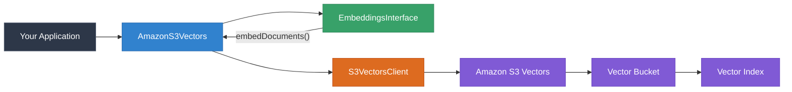

# @farukada/aws-langchain-s3-vector-ts

[](https://www.npmjs.com/package/@farukada/aws-langchain-s3-vector-ts)
[](https://github.com/FarukAda/aws-langchain-s3-vector-ts/actions/workflows/ci.yml)
[](https://github.com/FarukAda/aws-langchain-s3-vector-ts/actions/workflows/codeql.yml)
[](https://scorecard.dev/viewer/?uri=github.com/FarukAda/aws-langchain-s3-vector-ts)
[](https://nodejs.org/)
[](https://www.typescriptlang.org/)
[](https://opensource.org/licenses/MIT)
[](https://aws.amazon.com/sdk-for-javascript/)
[](https://docs.npmjs.com/generating-provenance-statements/)
[](#-testing)

Built with [LangChain](https://github.com/langchain-ai/langchainjs) · [AWS SDK v3](https://aws.amazon.com/sdk-for-javascript/) · [npm](https://www.npmjs.com/package/@farukada/aws-langchain-s3-vector-ts) · [GitHub](https://github.com/FarukAda/aws-langchain-s3-vector-ts) · [Issues](https://github.com/FarukAda/aws-langchain-s3-vector-ts/issues)

---

Drop-in LangChain-compatible **vector store** backed by [Amazon S3 Vectors](https://docs.aws.amazon.com/AmazonS3/latest/userguide/s3-vectors.html). Stores, queries, and manages vector embeddings using the native AWS S3 Vectors service with full TypeScript type safety. A faithful port of the official Python [`langchain-aws`](https://github.com/langchain-ai/langchain-aws/blob/main/libs/aws/langchain_aws/vectorstores/s3_vectors/base.py) S3 Vectors integration.

## Table of Contents

- [Features](#-key-features)
- [Architecture](#️-architecture)
- [Quick Start](#-quick-start)
- [Usage Examples](#-usage-examples)
- [Infrastructure Setup](#️-infrastructure-setup)
- [Configuration Reference](#️-configuration-reference)
- [Advanced Features](#-advanced-features)
- [API Reference](#-api-reference)
- [IAM Permissions](#-iam-permissions)
- [Testing](#-testing)
- [Project Structure](#-project-structure)
- [Contributing](#-contributing)
- [License](#-license)

## ✨ Key Features

| | Feature | Description |
|---|---|---|
| ☁️ | **Cloud-Native** | Direct integration with Amazon S3 Vectors via `@aws-sdk/client-s3vectors` |
| 🚀 | **Performance-First** | Per-batch embedding for low peak memory, configurable batch sizes |
| 🛡️ | **Fully Type-Safe** | Built with strict TypeScript 6, exported types for all config surfaces |
| 🔌 | **Drop-In Compatible** | Extends LangChain.js `VectorStore` — works with `asRetriever()`, RAG chains, agents |
| ⚙️ | **Auto-Provisioning** | Automatically creates the vector index on first write |
| 🔍 | **Metadata Filtering** | Native S3 Vectors metadata filters for similarity search |
| 🔐 | **Supply-Chain Hardened** | Published with npm provenance attestations via GitHub OIDC Trusted Publishing |

## 🏗️ Architecture


```mermaid
graph LR
    A[Your Application] --> B["AmazonS3Vectors"]
    B --> C["EmbeddingsInterface"]
    B --> D["S3VectorsClient"]
    C --> |"embedDocuments()"| B
    D --> E["Amazon S3 Vectors"]
    E --> F["Vector Bucket"]
    F --> G["Vector Index"]

    style A fill:#2d3748,stroke:#4a5568,color:#fff
    style B fill:#3182ce,stroke:#2b6cb0,color:#fff
    style C fill:#38a169,stroke:#2f855a,color:#fff
    style D fill:#dd6b20,stroke:#c05621,color:#fff
    style E fill:#805ad5,stroke:#6b46c1,color:#fff
    style F fill:#805ad5,stroke:#6b46c1,color:#fff
    style G fill:#805ad5,stroke:#6b46c1,color:#fff
```

**Data flow on write (`addDocuments`):**

1. Documents are chunked into batches of 200 (configurable).
2. Each batch is embedded via the supplied `EmbeddingsInterface`.
3. On the first write this store instance makes (not just the first batch of *this* call), the library checks the index via `GetIndexCommand` — always, regardless of `createIndexIfNotExist`, to validate its dimension and distance metric against this store's configuration — and, if it is missing and `createIndexIfNotExist` is enabled (default), creates it via `CreateIndexCommand` with the `dimension` inferred from the first vector. The result is cached for the instance's lifetime — every write after that is a single `PutVectorsCommand` call, no repeated `GetIndexCommand` round trip. (The cache is dropped automatically if a later `PutVectors` reports the index gone or changed; see [Concurrency](#concurrency).)
4. Vectors plus metadata are sent via `PutVectorsCommand` — one SDK call per batch, pipelined against the embedding of the next batch, at most `maxConcurrentBatchCalls` in flight.
5. Page content is stored as a special metadata key (`_page_content` by default) and transparently extracted on reads.

**Data flow on read (`similaritySearch*`):**

1. The query is embedded via the query-side embedding model (falls back to the indexing model).
2. `QueryVectorsCommand` sends the vector with `returnMetadata: true` and optionally `returnDistance: true`.
3. Results are reconstructed as LangChain `Document` objects, lifting the page content out of metadata.

## 📦 Quick Start

### Installation

```bash
npm install @farukada/aws-langchain-s3-vector-ts @aws-sdk/client-s3vectors @langchain/core
```

### Peer Dependencies

| Package | Version |
|---|---|
| `@aws-sdk/client-s3vectors` | `^3.1117.0` |
| `@langchain/core` | `^1.2.9` |

### Runtime Requirements

- **Node.js** `>= 20` — matches the minimum required by both peer dependencies (`@aws-sdk/client-s3vectors`, `@langchain/core`). (Publishing this package to npm separately requires Node ≥24, for npm Trusted Publishing's npm-CLI requirement — that's a CI/release-only constraint and doesn't affect consumers.)
- **npm** `>= 10.0.0`.
- **Module format:** ESM only (`"type": "module"`, a single `import` entry in `exports`, no CommonJS build). From a CommonJS project you have two options:
  - **`require()` directly** on Node ≥ 20.19 / ≥ 22.12 / any 24.x, where [`require(esm)`](https://nodejs.org/api/modules.html#loading-ecmascript-modules-using-require) is enabled by default: `const { AmazonS3Vectors } = require('@farukada/aws-langchain-s3-vector-ts');` works because this package has no top-level `await`. Confirmed against the built package.
  - **Dynamic `import()`** on Node 20.0–20.18 or 22.0–22.11: `const { AmazonS3Vectors } = await import('@farukada/aws-langchain-s3-vector-ts');`.
- **Tree-shaking:** the package declares `"sideEffects": false` — importing one export does not pull in module-level side effects, so bundlers may drop what you don't use.

### Basic Usage

```typescript
import { AmazonS3Vectors } from "@farukada/aws-langchain-s3-vector-ts";
import { BedrockEmbeddings } from "@langchain/aws";
import { Document } from "@langchain/core/documents";

const store = new AmazonS3Vectors(new BedrockEmbeddings(), {
  vectorBucketName: "my-vector-bucket",
  indexName: "my-index",
  region: "us-east-1",
});

// Add documents — embeddings are computed per batch automatically
await store.addDocuments([
  new Document({ pageContent: "Star Wars", metadata: { genre: "scifi" } }),
  new Document({ pageContent: "Finding Nemo", metadata: { genre: "family" } }),
]);

// Similarity search
const results = await store.similaritySearch("space adventure", 4);
```

## 📖 Usage Examples

### Add Texts Directly

```typescript
const ids = await store.addTexts(
  ["hello world", "goodbye world"],
  [{ source: "greeting" }, { source: "farewell" }],
);
```

### Similarity Search with Scores

The raw score is the `distance` returned by S3 Vectors — lower means more similar for both `cosine` and `euclidean` metrics.

```typescript
const results = await store.similaritySearchWithScore("neural networks", 5);
for (const [doc, distance] of results) {
  console.log(`${doc.pageContent} (distance: ${distance})`);
}
```

### Relevance Scores (for LangChain retrievers)

LangChain expects a *relevance score* (higher is better). This package ships with built-in converters:

```typescript
import {
  cosineRelevanceScoreFn,       // 1.0 - distance — bounded to [-1, 1]
  euclideanRelevanceScoreFn,    // 1.0 - distance / sqrt(4096) — see note below
} from "@farukada/aws-langchain-s3-vector-ts";

// Or supply your own:
const store = new AmazonS3Vectors(embeddings, {
  vectorBucketName: "bucket",
  indexName: "index",
  relevanceScoreFn: (d) => Math.exp(-d),
});
```

`cosineRelevanceScoreFn` is reliably bounded ([-1, 1], typically [0, 1] for normalized embeddings). `euclideanRelevanceScoreFn` is **not** reliably bounded to [0, 1]: S3 Vectors' `euclidean` metric is actually *squared* L2 distance, not linear L2, so this heuristic (inherited from the Python `langchain-aws` reference for parity) divides a squared value by a linear scale — for unit-normalized embeddings the score lands in a narrow band close to 1 rather than spanning [0, 1], and for unnormalized or high-magnitude embeddings it can go negative. Pass your own `relevanceScoreFn` if you need threshold-able scores on a euclidean index.

Use it via `similaritySearchWithRelevanceScores`:

```typescript
const results = await store.similaritySearchWithRelevanceScores("neural networks", 5);
for (const [doc, score] of results) {
  console.log(`${doc.pageContent} (relevance: ${score})`);
}
```

### Metadata Filtering

S3 Vectors supports a MongoDB-style filter syntax:

```typescript
const filtered = await store.similaritySearch(
  "adventure",
  4,
  { genre: { $eq: "scifi" } },
);

// Range + combinator filters
const recent = await store.similaritySearch(
  "announcement",
  10,
  {
    $and: [
      { year: { $gte: 2024 } },
      { category: { $in: ["product", "security"] } },
    ],
  },
);
```

A few behaviors worth knowing, confirmed live against the real service:

- **Don't pass an empty filter object.** `similaritySearch(query, k, {})` throws locally (AWS itself rejects `{}` with an opaque "Invalid filter" error rather than treating it as "no filter"). Omit the `filter` argument entirely — or pass `undefined` — to search without filtering. This matters if you build a filter dynamically and it can end up with no conditions applied.
- **A type-mismatched comparison returns zero results, not an error.** Comparing a boolean-valued field against a string (e.g. `{ popular: { $eq: "true" } }` when `popular` is actually stored as the boolean `true`) silently matches nothing rather than failing — the same as filtering on a field that doesn't exist on any document at all.
- **You can't filter on a non-filterable key.** Filtering on `pageContentMetadataKey` (or any key listed in `nonFilterableMetadataKeys`) fails with an "Invalid use of non-filterable metadata in filter" error — expected, since that's the whole point of the non-filterable list, but easy to hit by accident if you filter on the same key you excluded for index-size reasons.

### Use as a LangChain Retriever

```typescript
const retriever = store.asRetriever({ k: 5 });
const docs = await retriever.invoke("space exploration");

// With filter
const filteredRetriever = store.asRetriever({
  k: 3,
  filter: { genre: { $eq: "scifi" } },
});
```

### Raw-Vector-Only Workflow (No Embeddings Model)

When you already have vectors (e.g., from a separate embedding service):

```typescript
const store = new AmazonS3Vectors(undefined, {
  vectorBucketName: "my-bucket",
  indexName: "my-index",
  region: "us-east-1",
});

await store.addVectors(
  [[0.1, 0.2, 0.3], [0.4, 0.5, 0.6]],
  [
    new Document({ pageContent: "first" }),
    new Document({ pageContent: "second" }),
  ],
);

const results = await store.similaritySearchVectorWithScore([0.1, 0.2, 0.3], 2);
```

### Separate Query Embeddings

Some embedding providers differentiate between document-side and query-side models (e.g., Cohere's `input_type`):

```typescript
const store = new AmazonS3Vectors(documentEmbeddings, {
  vectorBucketName: "my-bucket",
  indexName: "my-index",
  queryEmbeddings: queryEmbeddings, // falls back to documentEmbeddings if omitted
});
```

### Bring Your Own Client

```typescript
import { S3VectorsClient } from "@aws-sdk/client-s3vectors";

const client = new S3VectorsClient({
  region: "eu-west-1",
  credentials: { /* your credentials */ },
});

const store = new AmazonS3Vectors(embeddings, {
  vectorBucketName: "my-bucket",
  indexName: "my-index",
  client, // takes precedence over region/credentials/endpoint
});
```

### Static Factories

```typescript
// From texts
const store = await AmazonS3Vectors.fromTexts(
  ["hello", "world"],
  [{ source: "a" }, { source: "b" }],
  new BedrockEmbeddings(),
  { vectorBucketName: "my-bucket", indexName: "my-index", region: "us-east-1" },
);

// From documents
const store = await AmazonS3Vectors.fromDocuments(
  docs,
  new BedrockEmbeddings(),
  { vectorBucketName: "my-bucket", indexName: "my-index", region: "us-east-1" },
);
```

## 🏗️ Infrastructure Setup

> **Prerequisite:** You must manually create the S3 vector bucket before using this library. The vector index inside the bucket is created automatically on first write (unless you disable `createIndexIfNotExist`).

<details>
<summary><strong>AWS CLI</strong></summary>

```bash
# Create the vector bucket
aws s3vectors create-vector-bucket \
  --vector-bucket-name my-vector-bucket

# (Optional) Create the vector index manually — otherwise the library
# creates it on first write.
aws s3vectors create-index \
  --vector-bucket-name my-vector-bucket \
  --index-name my-index \
  --data-type float32 \
  --dimension 1536 \
  --distance-metric cosine
```

</details>

<details>
<summary><strong>AWS Console</strong></summary>

1. Open the **Amazon S3 console**.
2. Select **Vector buckets** in the left navigation.
3. Choose **Create vector bucket** and supply a bucket name.
4. Leave the index creation to the library (automatic on first write) or create one manually with the matching `dimension` for your embedding model.

</details>

<details>
<summary><strong>AWS CDK (TypeScript)</strong></summary>

As of 2026-04, CDK L2 constructs for S3 Vectors are not yet available. Use `CfnResource` with the CloudFormation raw type, or provision via the CLI / console as a one-time step outside your CDK stack.

</details>

## ⚙️ Configuration Reference

| Option | Type | Default | Description |
|---|---|---|---|
| `vectorBucketName` | `string` | **required** | Name of an existing S3 vector bucket |
| `indexName` | `string` | **required** | Name of the vector index (3–63 chars; lowercase letters, numbers, `-`, `.`) |
| `client` | `S3VectorsClient` | — | Pre-configured SDK client (takes precedence) |
| `region` | `string` | — | AWS region (ignored when `client` is set) |
| `credentials` | `AwsCredentialIdentity` | — | AWS credentials (ignored when `client` is set) |
| `endpoint` | `string` | — | Custom endpoint URL |
| `dataType` | `"float32"` | `"float32"` | Vector data type (S3 Vectors currently only supports `float32`) |
| `distanceMetric` | `"cosine" \| "euclidean"` | `"cosine"` | Distance metric for similarity search |
| `createIndexIfNotExist` | `boolean` | `true` | Auto-create the index on first write. `false` still calls `GetIndex` once per instance to validate dimension/metric — see [IAM Permissions](#-iam-permissions) |
| `encryptionConfiguration` | `EncryptionConfiguration` (SDK type) | bucket default | Server-side encryption for an index **this store creates**, e.g. `{ sseType: "aws:kms", kmsKeyArn: "arn:aws:kms:…" }`. Ignored for an existing index (encryption is fixed at creation; S3 Vectors has no `UpdateIndex`) |
| `tags` | `Record<string, string>` | — | Tags applied to an index **this store creates** (cost allocation, ABAC). Ignored for an existing index |
| `maxConcurrentBatchCalls` | `number` | `10` | Cap on concurrent `PutVectors`/`DeleteVectors`/`GetVectors` calls during batched writes, deletes and fetches. Lower it (down to `1`) to share a quota with other workloads; raise it against a generous rate limit. Peak in-flight write payload scales with `maxConcurrentBatchCalls × batchSize` — see [Rate Limits, Payload Limits and Cost](#rate-limits-payload-limits-and-cost) |
| `pageContentMetadataKey` | `string \| null` | `"_page_content"` | Metadata key for storing `Document.pageContent`; `null` to disable round-tripping |
| `nonFilterableMetadataKeys` | `string[]` | — | Metadata keys excluded from query filters (reduces index size for large values). When this library creates a new index, `pageContentMetadataKey` is automatically added to this list too (unless doing so would exceed S3 Vectors' 10-key cap) — see [Non-Filterable Metadata Keys](#non-filterable-metadata-keys). |
| `queryEmbeddings` | `EmbeddingsInterface` | — | Separate embedding model for queries only |
| `relevanceScoreFn` | `(distance: number) => number` | — | Custom distance-to-score conversion |
| `embeddings` | `EmbeddingsInterface` | — | Alternative to the positional `embeddings` argument |
| `maxAttempts` | `number` | SDK default | Max attempts (initial + retries) for AWS requests (ignored when `client` is set) |
| `retryMode` | `"standard" \| "adaptive" \| "legacy"` | SDK default | AWS SDK retry mode (ignored when `client` is set) |

Full generated API docs: see [`docs/`](docs/) (TypeDoc output).

Only the options listed above are read by this library. The constructor builds its `S3VectorsClient` from exactly `region`, `credentials`, `endpoint`, `maxAttempts` and `retryMode` — any other `S3VectorsClientConfig` field (a custom `requestHandler`, `logger`, `customUserAgent`, a proxy, a fully custom `retryStrategy`, …) is **not** passed through. Build the client yourself and hand it in via `client` for anything beyond those five; every operation then flows through your client unchanged.

### Retries

Throttling (`ThrottlingException` / `TooManyRequestsException`, HTTP 429) and transient 5xx failures are retried automatically by the AWS SDK's retry strategy — **3 attempts total (1 + 2 retries) with exponential backoff and jitter** under the default `"standard"` mode. This library adds no retry layer of its own: an `AWS_REQUEST_FAILED` error you catch means the SDK's attempts were exhausted.

Tune it with `maxAttempts` / `retryMode`, or pass a fully pre-configured `client`:

- **`retryMode: "adaptive"`** is the better default for bulk ingest against a shared account. It adds a client-side token bucket that slows the *request rate* on throttling instead of only retrying — so a large `addDocuments` against a busy quota degrades to a steady trickle rather than a burst of 429s that exhaust `maxAttempts`.
- **`maxAttempts`** controls attempts per individual call (e.g. one `PutVectors` batch), not per `addDocuments`. Raising it lengthens the worst-case time a single batch can block.
- Every `AWS_REQUEST_FAILED` error carries `context.retryable` (`true` for throttling and 5xx), `context.awsErrorName`, `context.httpStatusCode` and `context.requestId`, so an application-level retry or dead-letter decision can be made from the error alone — see [Errors](#errors).

The embeddings side is different: `embedDocuments`/`embedQuery` come from *your* embeddings model, and this library never retries them (the interface gives no way to know whether a failure is safe to retry). Configure retries on the embeddings client itself.

### Errors

Every failure — validation, not-found, or an underlying AWS error — is surfaced as a single typed `S3VectorsError` carrying a `code` (`S3VectorsErrorCode`), a `context` (`{ operation, vectorBucketName, indexName, … }`), and the original `cause`. Detect it with the exported `isS3VectorsError()` guard — it's a proper TypeScript type guard, so a caught `unknown` narrows to `S3VectorsError` without a cast:

```typescript
try {
  await store.addDocuments(docs);
} catch (e) {
  if (isS3VectorsError(e)) {
    console.error(e.code, e.message); // e is narrowed, no `as S3VectorsError` needed
  }
}
```

**Partial-batch failures report what already succeeded.** If `addVectors`/`addDocuments` fails partway through a multi-batch write (a later batch throttled, hit a transient error, etc.), earlier batches are already durably committed in AWS — the thrown error's `context.writtenIds` lists every id confirmed written before the failure, including any concurrent batch that happened to succeed alongside the one that failed. This matters most with auto-generated ids: without `context.writtenIds`, those vectors would be undiscoverable and impossible to clean up or reconcile, since nothing else records what id they landed under. `delete({ ids })` reports the equivalent `context.deletedIds` on a partial failure — lower-stakes since delete is idempotent (a blind retry of the full `ids` list is always safe), but still useful to know exactly what happened. `delete({ deleteAll: true })` is idempotent in the same way: deleting an index that is already gone resolves cleanly instead of erroring, so retrying after an ambiguous network failure is safe.

This partial-progress guarantee doesn't extend to search: if a multi-page `QueryVectors` pagination sequence fails partway through, any pages already fetched are discarded rather than returned alongside the error. Reasonable asymmetry — a failed search is side-effect-free and trivially retryable, unlike a failed write — but worth knowing if you're relying on `writtenIds`/`deletedIds`-style partial-progress reporting from a read path too. The error does still report *how far* it got, via `context.pagesScanned` and `context.resultsCollected`, and a failure on page 2 or later says so explicitly — AWS pagination tokens are only valid for a few minutes, so the fix for a long-running paginated search is to re-issue the original query rather than resume it.

```typescript
try {
  await store.addDocuments(manyDocuments); // ids auto-generated
} catch (e) {
  if (isS3VectorsError(e) && e.context.writtenIds?.length) {
    console.warn(`${e.context.writtenIds.length} vectors already written before the failure:`, e.context.writtenIds);
  }
}
```

The codes are stable and exhaustive:

| Code | Raised when |
| --- | --- |
| `VALIDATION` | Caller input was invalid — mismatched counts, a non-array argument, a bad batch size, an empty filter, a reserved metadata key, an empty-string or duplicate vector id within one write call, or a `client` that is not an `S3VectorsClient`. |
| `NOT_FOUND` | A requested vector id was not found by `getByIds` (see [`getByIds` and missing ids](#getbyids-and-missing-ids)). |
| `EMBEDDINGS_MISSING` | An operation needed an embedding model but none was configured. |
| `AWS_REQUEST_FAILED` | An underlying AWS S3 Vectors request failed. `context.awsErrorName`/`httpStatusCode`/`requestId`/`retryable` say which and whether to retry. When a `PutVectors` fails with `NotFoundException` or `ValidationException` after this instance had already validated the index, `context.indexCacheInvalidated` is `true`: the store has discarded its cached dimension/metric and the *next* write re-checks the index (and, with `createIndexIfNotExist`, re-creates a missing one) — the recovery path for an index deleted or re-created outside this process. |
| `INDEX_CONFIG_MISMATCH` | The index's actual dimension or distance metric disagrees with this store's configuration. |
| `ABORTED` | The supplied `AbortSignal` fired before or during the operation. |
| `AWS_INVALID_RESPONSE` | An AWS response was missing, or carried an unusable value for, something this library requires — a non-numeric `distance`, an unrecognised `distanceMetric`, a malformed `GetIndex` payload, or a `QueryVectors`/`GetVectors` response that wasn't an object at all. Reachable only from a mocked, stubbed or otherwise non-conforming client. |
| `QUERY_PAGE_LIMIT_EXCEEDED` | A paginated search stopped without reaching `k` while more pages were still available — either 10 consecutive pages returned no results at all, or the 1,000-page runaway ceiling was reached. `context.pagesScanned` and `context.resultsCollected` say how far short it fell, and the message names which guard fired — narrow the filter or lower `k`. A search that legitimately runs out of matches returns what it found, without error, and a sparse search that keeps making progress keeps paging. |
| `NOT_IMPLEMENTED` | `maxMarginalRelevanceSearch`, which this store intentionally does not implement. |
| `UNEXPECTED_ERROR` | A failure that never touched AWS — a raw throw from a caller-supplied embeddings model, or input malformed enough to bypass validation. |

**Logging errors safely.** `error.context.instance` (set only by the `fromDocuments`/`fromTexts` factories) is a live store handle for programmatic recovery. It is a *non-enumerable* property, so `JSON.stringify(error.context)`, `util.inspect(error)`, `console.error(error)` and structured loggers all omit it; direct access still works. Independently of that, the store never keeps `credentials` or the SDK `client` in any enumerable field (they are excluded from LangChain's `lc_kwargs`), so printing a store — or an error that carries one — cannot leak credential material. Regression tests pin both.

### Maximal Marginal Relevance (MMR)

`maxMarginalRelevanceSearch` is intentionally **not** implemented, matching the Python `langchain-aws` reference. Use metadata pre-filtering or client-side re-ranking when you need result diversity.

### Non-goals

Deliberately outside this library's scope, so you can plan around them rather than wait for them:

- **Listing/scanning vectors** (`ListVectors`). Enumeration is an operational task with its own pagination and cost profile; call the SDK's `ListVectorsCommand` directly with your own client. The exported `createDocument(vector, pageContentMetadataKey)` helper turns each returned vector into the same `Document` shape this store produces.
- **Bucket lifecycle** (`CreateVectorBucket`, bucket policies, encryption defaults). The vector bucket is infrastructure — provision it with the console, CLI or IaC.
- **A retry layer of its own.** Retries are the AWS SDK's job; configure them there (see [Retries](#retries)).
- **Client-side metadata-size enforcement.** See [Rate Limits, Payload Limits and Cost](#rate-limits-payload-limits-and-cost) for why.
- **MMR**, as above.

### Observability

The library emits no logs by design — no `console.*` call exists anywhere in `src/`, and a unit test pins that. It stays a thin, dependency-light adapter. To instrument requests (logging, metrics, tracing), construct your own `S3VectorsClient` with the desired `logger`/middleware and pass it via the `client` option; all operations flow through it. A `client` that is not an `S3VectorsClient` is rejected with a coded `VALIDATION` error rather than silently replaced — a silent replacement would fall back to the ambient credential chain and default region, which could point the store at a different AWS account.

## 🔧 Advanced Features

### Per-Batch Embedding and Concurrent Writes

Documents are embedded one batch at a time (default: 200 docs per batch, matching the Python `langchain-aws` implementation) — `embedDocuments` is never called concurrently for two batches, since most embedding providers rate-limit aggressively and this library gives no retry/backoff guarantee for that call.

Embedding and writing are **pipelined**. Once a batch is embedded, its `PutVectors` call is dispatched and the *next* batch is embedded immediately, without waiting for that put to finish — so a large ingest is bounded by embedding time, not embedding-plus-put time. At most `maxConcurrentBatchCalls` (default 10) `PutVectors` calls are in flight at once; when that window is full, embedding pauses until one settles (AWS's SDK already retries throttling on the put side). `delete()`/`getByIds()` use the same cap for `DeleteVectors`/`GetVectors`, and `addVectors` (no embedding step) dispatches its `PutVectors` calls under it too. The very first batch of any write is always embedded and sent alone, since it's the one that creates or validates the index.

Peak memory for in-flight vectors is therefore bounded by roughly `(maxConcurrentBatchCalls + 1) × batchSize` vectors — a deliberately higher ceiling than a strict one-batch-at-a-time loop, in exchange for real write throughput. Tune either knob:

```typescript
// Smaller batches, default concurrency:
await store.addDocuments(largeDocs, { batchSize: 50 });

// Strictly sequential AWS calls (share a tight account quota):
const gentle = new AmazonS3Vectors(embeddings, { ...config, maxConcurrentBatchCalls: 1 });
```

On a failure, no further batch is embedded or written; the error is thrown only after every `PutVectors` already in flight has settled, so `context.writtenIds` is complete and in document order.

### Rate Limits, Payload Limits and Cost

The limits this library enforces locally (failing fast with a `VALIDATION` error, before any round trip) and the ones it leaves to AWS:

| Limit | Value | Enforced |
|---|---|---|
| Vectors per `PutVectors` call (`batchSize` for `addDocuments`/`addVectors`/`addTexts`) | ≤ 500 (default 200) | locally |
| Keys per `DeleteVectors` call (`batchSize` for `delete`) | ≤ 500 (default 500) | locally |
| Keys per `GetVectors` call (`batchSize` for `getByIds`) | ≤ 100 (default 100) | locally |
| `k` (`topK`) per query | 1 – 10,000 | locally |
| Results per `QueryVectors` page | up to 100 (paginated transparently) | — |
| Vector ids | non-empty strings, unique within one write call | locally |
| Vector dimension | consistent within a batch and with the index (1 – 4,096 per AWS) | within-batch and vs. index locally; absolute range by AWS |
| Filterable metadata per vector | 2,048 bytes | AWS |
| Total metadata per vector | 40,960 bytes | AWS |
| Non-filterable metadata keys per index | 10 | locally (when this library creates the index) |
| Request payload per call | AWS's per-request limit | AWS |

The metadata byte caps are not checked locally on purpose: probing the live service shows the counted size isn't a simple `JSON.stringify(...).length`, and AWS doesn't publish the algorithm — a guessed formula would reject metadata AWS accepts, or go stale silently. AWS's own error is specific (`"Filterable metadata must have at most 2048 bytes"` / `"Metadata object must have at most 40960 bytes"`); see [Non-Filterable Metadata Keys](#non-filterable-metadata-keys) for keeping large text out of the filterable budget. Request-rate quotas are account-level and published by AWS; see [Retries](#retries) for how to behave under them.

**Cost model, briefly.** S3 Vectors bills per API request plus storage; the request count is what this library's knobs control. A write of *N* documents costs `ceil(N / batchSize)` `PutVectors` requests plus one `GetIndex` (and possibly one `CreateIndex`) per store instance lifetime, plus whatever your embeddings provider charges. A `similaritySearch` with `k > 100` costs one `QueryVectors` request per 100-result page. `getByIds`/`delete` cost `ceil(N / batchSize)` requests each. Larger `batchSize` values therefore mean fewer billable requests — the default 200 for writes is a balance between request count and the size of a failed batch to retry; raise it toward 500 for bulk backfills. `maxConcurrentBatchCalls` changes *how fast* those requests are issued, not how many. Check the [S3 Vectors pricing page](https://aws.amazon.com/s3/pricing/) for current rates.

### Non-Filterable Metadata Keys

Store large metadata values (e.g. raw HTML, full text) that don't need to be query-filterable — they're excluded from the filter index and won't count against filter-index size limits:

```typescript
const store = new AmazonS3Vectors(embeddings, {
  vectorBucketName: "my-bucket",
  indexName: "my-index",
  nonFilterableMetadataKeys: ["full_text", "raw_html"],
});
```

By default, the configured `pageContentMetadataKey` (`_page_content` unless changed) is automatically included in this list when this library creates the index — document text is exactly the kind of large value this feature exists for, and filterable metadata is capped at 2048 bytes per vector versus 40,960 bytes total. Pass your own `nonFilterableMetadataKeys` alongside it as shown above; the two lists are merged (deduplicated).

AWS caps `nonFilterableMetadataKeys` at 10 keys per index. If your own list is already at 10 and `pageContentMetadataKey` would push it to 11, index creation throws a validation error rather than silently creating the index with page content left out of the list — a `10`-and-under-with-page-content-included list would otherwise make page content *filterable* metadata (the 2048-byte cap) instead of non-filterable (40,960 bytes), with no way to fix it afterward (S3 Vectors has no way to reconfigure an existing index's metadata configuration). If you hit this, either trim your own list to 9 keys or fewer, or set `pageContentMetadataKey: null` to store page content as filterable metadata deliberately.

This configuration applies at index-creation time — it cannot be changed after the index exists.

These two caps (2048 bytes filterable, 40,960 bytes total per vector) aren't checked locally before the `PutVectors` call. AWS's own error is already specific (`"Filterable metadata must have at most 2048 bytes"` / `"Metadata object must have at most 40960 bytes"`), but reproducing the exact byte count client-side turned out not to be safe: probing the live service shows the counted size isn't a simple `JSON.stringify(...).length` of the metadata object, or of the value alone — the true boundary sits somewhere between those two measures. Since the AWS SDK doesn't publish the exact algorithm, a local check built on a guessed formula risks rejecting metadata AWS would have accepted (worse than the current opaque-but-correct AWS error), and it would silently go stale the moment AWS changes its wire encoding. If you're batching large text into metadata, keep an eye on this cap yourself rather than relying on this library to catch it early.

### Metadata Value Types

S3 Vectors only accepts metadata values that are strings, numbers, booleans, or arrays of strings/numbers (an array mixing types, e.g. a boolean alongside strings, is rejected). `null` and nested objects are rejected outright by AWS with a `PutVectors` validation error.

Two JavaScript types are **silently converted** rather than rejected — worth knowing before you rely on round-tripping them:

- A `Date` value is stored (and read back) as a **number** — Unix epoch **seconds**, not milliseconds, and not an ISO string. Reading it back gives you a plain number, not a `Date`.
- `NaN` is stored (and read back) as the **string** `"NaN"`.

A key whose value is `undefined` is silently dropped rather than stored as `null` or rejected. If you need `Date`/`NaN` values preserved as such, convert them yourself (e.g. `date.toISOString()`) before passing metadata in.

### Disabling Page-Content Round-Tripping

By default the page content is stored as `_page_content` in metadata so it can be restored on reads. Set `pageContentMetadataKey` to `null` to skip this (e.g. when you only need embeddings + metadata, not the original text):

```typescript
const store = new AmazonS3Vectors(embeddings, {
  vectorBucketName: "my-bucket",
  indexName: "my-index",
  pageContentMetadataKey: null, // documents come back with empty pageContent
});
```

If a document's own metadata already uses the reserved `pageContentMetadataKey` name, `addDocuments`/`addVectors` throws a `VALIDATION`-coded `S3VectorsError` rather than silently overwriting that field — rename the field or configure a different `pageContentMetadataKey`.

### `getByIds` and missing ids

`getByIds` **throws** (`NOT_FOUND`) when any requested id is absent, rather than returning fewer documents than ids. This matches the Python `langchain-aws` `AmazonS3Vectors.get_by_ids`, but is stricter than `@langchain/core`'s generic `VectorStore.getByIds` contract, which permits a store to skip missing ids silently. The strict behaviour is deliberate: an id you asked for that isn't there is a data-integrity signal, and throwing means a result array can never be silently misaligned against the id list you passed in. If your workflow expects some ids to be gone (a soft-deleted cache, a best-effort prefetch), catch the error and read `context.foundIds` — every id that *was* found is listed there, so you don't refetch from scratch:

```typescript
try {
  docs = await store.getByIds(ids);
} catch (e) {
  if (isS3VectorsError(e) && e.code === S3VectorsErrorCode.NOT_FOUND) {
    const found = new Set(e.context.foundIds);
    docs = await store.getByIds(ids.filter((id) => found.has(id)));
  } else throw e;
}
```

### Deep-Copy Metadata on Duplicate-ID Fetches

When `getByIds` is called with duplicate IDs, returned documents get independently-cloned metadata (via `structuredClone`) so mutating one does not affect the other — matching the Python reference implementation's behaviour exactly.

### Read-Modify-Write Upserts via `Document.id`

`addVectors`/`addDocuments` use each document's own `id` as the vector's key when `options.ids` is omitted — a fresh UUID is generated only for documents that have no `id` of their own. A document fetched via `getByIds` already has `id` set (`vector.key`), so a natural read-modify-write round-trip upserts instead of creating a duplicate:

```typescript
const [doc] = await store.getByIds(["existing-id"]);
doc.metadata.reviewed = true;
await store.addDocuments([doc]); // overwrites "existing-id", doesn't create a new vector
```

An explicit `options.ids` always takes priority over `document.id` when both are present. This is a deliberate departure from the Python `langchain-aws` reference (which only ever uses `options.ids` or a fresh UUID, never inspecting the document itself) — not a parity gap, since the improvement doesn't affect wire format or stored data shape.

### Concurrency

Multiple concurrent writers — whether separate calls on the same store instance, or entirely separate `AmazonS3Vectors` instances (different processes) — can safely race to create the same new index: whichever one loses the creation race gets a benign `ConflictException` from AWS, which this library recovers from automatically, re-validating against whichever writer actually won. This is verified against real AWS with more than two concurrent instances racing at once, not just two.

`delete({ deleteAll: true })` running concurrently with an in-progress write is not specially handled — if the delete wins the race, the write's remaining batches are expected to fail (e.g. against a since-deleted index) rather than being coordinated. Unit tests cover the case where a write has already passed local validation and is inside its actual `PutVectors` call when the delete lands, confirming this library's own state (its index-validation cache in particular) doesn't corrupt or hang under either ordering — that hasn't been separately confirmed against live AWS for this exact interleaving. If your application deletes and writes to the same index concurrently, treat that write's failure as expected and handle it, rather than assuming both always succeed independently.

**An index deleted or re-created outside this process.** Each store instance caches the index's dimension and distance metric after its first successful write, so later writes skip `GetIndex`. If another process (an ops script, a redeploy, a different service) deletes the index — or re-creates it with a different dimension — that cache is stale, and the next `PutVectors` fails with AWS's `NotFoundException`/`ValidationException`. The store treats either as "the cache can no longer be trusted": it discards the cache, marks the error with `context.indexCacheInvalidated: true`, and the *next* write re-checks the index via `GetIndex` — re-creating a missing one when `createIndexIfNotExist` is on. So exactly one write fails, and an ordinary application-level retry recovers, without restarting the process.

**What `deleteAll` actually deletes.** `delete({ deleteAll: true })` calls `DeleteIndex` — it removes the *index*, not just its vectors. Everything attached to the index goes with it: its encryption configuration, tags, non-filterable-metadata configuration, and the resource any index-scoped IAM statements point at. A later write with `createIndexIfNotExist: true` re-creates the index from *this store's* configuration (`dimension` from the first vector, `distanceMetric`, `nonFilterableMetadataKeys`, `encryptionConfiguration`, `tags`), which may differ from how the original was provisioned. S3 Vectors has no "truncate" operation; if the index itself must survive, delete vectors by id instead.

### Cancellation (`AbortSignal`)

Every method that calls AWS accepts an `AbortSignal` — `addVectors`, `addDocuments`, `addTexts`, `delete`, `getByIds`, `similaritySearch*`, and the `fromTexts`/`fromDocuments` static factories:

```typescript
const controller = new AbortController();
setTimeout(() => controller.abort(), 5000); // give up after 5s

await store.addDocuments(largeDocs, { signal: controller.signal });
```

An aborted operation rejects with a coded `S3VectorsError` (`code: "ABORTED"`), distinct from `AWS_REQUEST_FAILED`. Cancellation cancels the AWS request currently in flight (confirmed live: an abort mid-write stops the request instead of waiting for it to complete) and stops any further batches or pages from starting; a signal that's already aborted before the call even starts rejects immediately, with no network call at all — and, for the text-based search and write methods, without paying for a billable `embedQuery`/`embedDocuments` call either.

One exception: the shared index existence-check/creation calls (`GetIndex`/`CreateIndex`) triggered whenever a write needs the index checked or created — whether or not another caller happens to be racing it — are not tied to any single caller's signal, so that a concurrent sibling's write sharing that same in-flight check can never be cancelled by another caller's abort. A practical consequence: aborting mid-index-creation rejects your own call promptly, but the index may still end up created.

One signature note: `similaritySearchWithRelevanceScores` takes the signal as its fifth argument, matching `similaritySearch` and `similaritySearchWithScore`. It also still accepts an `AbortSignal` in the fourth position, where earlier versions expected it, so existing callers keep working either way.

`similaritySearch` and `similaritySearchWithScore` do **not** accept a signal in that fourth position — it is the `Callbacks` slot, and a signal there used to be silently discarded, letting the search run uncancelled after already spending a billable `embedQuery` call. Since 0.9.0 they raise a coded `VALIDATION` error naming the fifth slot instead.

One real limitation: `embedDocuments`/`embedQuery` (from your embeddings model) have no cancellation support in LangChain's `EmbeddingsInterface`, so a batch already being embedded when the signal fires still completes — only the AWS side (and any batch not yet started) is actually cancelled.

A second one, on the retriever path: `store.asRetriever()` is `@langchain/core`'s generic `VectorStoreRetriever`, and its `invoke(query, { signal })` does **not** forward that signal to this store's `similaritySearch` — LangChain's runnable config `signal` governs the runnable chain, not the underlying store call. A retriever invocation cancelled mid-query therefore rejects promptly at the chain level, but the `QueryVectors` request (and the `embedQuery` call before it) still runs to completion. If cancellation of the AWS call matters (per-request timeouts in a request handler, for instance), call `store.similaritySearch(query, k, filter, undefined, signal)` directly instead of going through the retriever.

### Custom Retriever Configuration

```typescript
const retriever = store.asRetriever({
  k: 10,
  filter: { category: { $eq: "docs" } },
});
```

`@langchain/core`'s `asRetriever()` accepts a `searchType` of `"similarity"` (the default, and the only one this store supports) or `"mmr"` — `"mmr"` throws at call time, since [Maximal Marginal Relevance](#maximal-marginal-relevance-mmr) is intentionally not implemented here. `"similarity_score_threshold"`, offered by some other LangChain vector stores, isn't a valid `searchType` for any store — check `scoreThreshold` support in your specific retriever's docs before relying on it.

## 📋 API Reference

### Instance Methods

| Method | Returns | Description |
|---|---|---|
| `addDocuments(docs, options?)` | `Promise<string[]>` | Embed and store documents (per-batch) |
| `addTexts(texts, metadatas?, options?)` | `Promise<string[]>` | Convert texts + metadata to documents and store |
| `addVectors(vectors, docs, options?)` | `Promise<string[]>` | Store pre-computed vectors |
| `similaritySearch(query, k?, filter?, callbacks?, signal?)` | `Promise<Document[]>` | Text query → documents |
| `similaritySearchWithScore(query, k?, filter?, callbacks?, signal?)` | `Promise<[Document, number][]>` | Text query → documents with distance |
| `similaritySearchWithRelevanceScores(query, k?, filter?, callbacks?, signal?)` | `Promise<[Document, number][]>` | Text query → documents with relevance score (higher is better) |
| `similaritySearchVectorWithScore(vector, k?, filter?, signal?)` | `Promise<[Document, number][]>` | Vector query → documents with distance |
| `similaritySearchByVector(vector, k?, filter?, signal?)` | `Promise<Document[]>` | Vector query → documents |
| `maxMarginalRelevanceSearch(query, options, callbacks?)` | never resolves | Always throws `NOT_IMPLEMENTED` — intentionally unsupported |
| `getByIds(ids, options?)` | `Promise<Document[]>` | Retrieve documents by vector IDs; throws `NOT_FOUND` if any id is missing (see [`getByIds` and missing ids](#getbyids-and-missing-ids)) |
| `delete(params?)` | `Promise<void>` | Delete by IDs, or the **entire index** (`DeleteIndex`, not a bulk vector delete) when `{ deleteAll: true }` is passed — see [Concurrency](#concurrency) for what that removes |
| `asRetriever(options?)` | `VectorStoreRetriever` | Convert to a LangChain retriever |

### Static Factories

| Method | Returns | Description |
|---|---|---|
| `fromTexts(texts, metadatas, embeddings, config)` | `Promise<AmazonS3Vectors>` | Create store and add texts |
| `fromDocuments(docs, embeddings, config)` | `Promise<AmazonS3Vectors>` | Create store and add documents |

### Exported Utilities

```typescript
import {
  cosineRelevanceScoreFn,
  euclideanRelevanceScoreFn,
  // Error handling
  S3VectorsError,
  S3VectorsErrorCode,
  isS3VectorsError,
  // Types
  AmazonS3VectorsConfig,
  DistanceMetric,
  VectorDataType,
  S3VectorsDeleteParams,
  S3OutputVector,
  S3VectorsErrorContext,
} from "@farukada/aws-langchain-s3-vector-ts";
```

## 🔐 IAM Permissions

The store uses the following S3 Vectors actions. The IAM policy below enumerates them explicitly — no `s3vectors:*` wildcard.

```json
{
  "Version": "2012-10-17",
  "Statement": [
    {
      "Sid": "S3VectorsIndexLifecycle",
      "Effect": "Allow",
      "Action": [
        "s3vectors:CreateIndex",
        "s3vectors:GetIndex",
        "s3vectors:DeleteIndex"
      ],
      "Resource": [
        "arn:aws:s3vectors:<region>:<account-id>:bucket/<vector-bucket>",
        "arn:aws:s3vectors:<region>:<account-id>:bucket/<vector-bucket>/index/<index-name>"
      ]
    },
    {
      "Sid": "S3VectorsRead",
      "Effect": "Allow",
      "Action": [
        "s3vectors:GetVectors",
        "s3vectors:QueryVectors"
      ],
      "Resource": "arn:aws:s3vectors:<region>:<account-id>:bucket/<vector-bucket>/index/<index-name>"
    },
    {
      "Sid": "S3VectorsWrite",
      "Effect": "Allow",
      "Action": [
        "s3vectors:PutVectors",
        "s3vectors:DeleteVectors"
      ],
      "Resource": "arn:aws:s3vectors:<region>:<account-id>:bucket/<vector-bucket>/index/<index-name>"
    }
  ]
}
```

**Reducing the policy further:**

- If you pre-create the index (disabling `createIndexIfNotExist`), remove `s3vectors:CreateIndex` — but **keep `s3vectors:GetIndex`**. Every first write on a store instance calls `GetIndex` once, regardless of `createIndexIfNotExist`, to validate the index's dimension and distance metric against this store's configuration (the result is cached for the instance's lifetime). Without it, the first `addDocuments`/`addVectors` fails with an `AccessDeniedException` on `GetIndex` before anything is written.
- If you never call `delete()`, remove `s3vectors:DeleteIndex` and `s3vectors:DeleteVectors`.
- If your application is read-only (`similaritySearch*`, `getByIds`), keep only the `S3VectorsRead` statement — the read path never calls `GetIndex`.

**A missing *bucket* is not a missing index.** `GetIndex` against a vector bucket that doesn't exist returns `NotFoundException`, the same exception as for a missing index. With `createIndexIfNotExist: true` the store therefore proceeds to `CreateIndex`, which then fails with its own `NotFoundException` naming the bucket. There is no bucket-level pre-check (`GetVectorBucket` would be one more permission and one more round trip on every cold start); if you see a `CreateIndex … NotFoundException`, check the bucket name and region first.

## 🧪 Testing

### Unit tests

```bash
npm test            # Run all unit tests with coverage
npm run test:watch  # Watch mode
```

Unit tests use [`aws-sdk-client-mock`](https://github.com/m-radzikowski/aws-sdk-client-mock) — the library [AWS officially recommends](https://aws.amazon.com/blogs/developer/mocking-modular-aws-sdk-for-javascript-v3-in-unit-tests/) for SDK v3 — to mock `S3VectorsClient` without network calls. Coverage thresholds: **100% branches / 100% functions / 100% lines / 100% statements**, enforced in CI.

### Integration tests (live AWS)

> **LocalStack does not currently support the `s3vectors` service** ([localstack/localstack#13498](https://github.com/localstack/localstack/issues/13498)). Integration tests run against real AWS and are gated off by default.

**Local run:**

```bash
export RUN_LIVE_INTEGRATION=1
export AWS_VECTOR_BUCKET=<your-pre-created-vector-bucket>
export AWS_REGION=us-east-1
# Plus AWS credentials (AWS_PROFILE or AWS_ACCESS_KEY_ID / AWS_SECRET_ACCESS_KEY)

npm run test:integration
```

Without `RUN_LIVE_INTEGRATION=1` **and** `AWS_VECTOR_BUCKET` set, the suite prints a skip message and exits 0 — no false passes, no false fails.

**CI run (on-demand):**

The [`Integration (live AWS)`](https://github.com/FarukAda/aws-langchain-s3-vector-ts/actions/workflows/integration-live.yml) workflow is triggered manually via the GitHub Actions UI (`workflow_dispatch`). It uses GitHub OIDC to assume an IAM role (configured via the `AWS_ROLE_TO_ASSUME` secret) and runs against the bucket named in the `AWS_VECTOR_BUCKET` repository variable.

### Verifying against real AWS

Standalone verification scripts in [`examples/`](examples/) exercise the full public API against live Amazon S3 Vectors using real [Amazon Bedrock](https://aws.amazon.com/bedrock/) embeddings (Amazon Titan Text Embeddings V2, `amazon.titan-embed-text-v2:0`). Each script provisions a unique `verify-*` index, runs its checks, prints a `PASS/FAIL` summary, tears its index down, and exits non-zero on any failure.

You need an existing S3 vector bucket and Bedrock model access to Titan Text Embeddings V2 in your region.

```bash
export AWS_VECTOR_BUCKET=<your-pre-created-vector-bucket>
export AWS_REGION=us-east-1
# Plus AWS credentials (AWS_PROFILE or AWS_ACCESS_KEY_ID / AWS_SECRET_ACCESS_KEY)

npm run verify          # build + core, search, and edge-case scripts
# or individually:
npm run verify:core     # CRUD, index lifecycle, fromTexts/fromDocuments, queryEmbeddings, retry config
npm run verify:search   # search surface, cosine/euclidean, full filter-operator matrix, asRetriever
npm run verify:edge     # null page-content key, raw vectors, duplicate ids, nonFilterable keys,
                        # typed error codes, and 200/100/500 batch boundaries
```

`@langchain/aws` (which provides the Bedrock embeddings) is a **devDependency only** — it is used by the verification scripts and never ships in the published package.

### Type-checking, lint, build

```bash
npm run typecheck   # tsc --noEmit
npm run lint        # ESLint (read-only)
npm run lint:fix    # ESLint with --fix
npm run build       # Compile to dist/
npm run docs        # Regenerate TypeDoc output
```

## 📁 Project Structure

```
src/
├── index.ts                      # Public API — class, error types, utilities
├── s3-vectors.ts                 # AmazonS3Vectors — core VectorStore implementation
├── relevance-scores.ts           # cosineRelevanceScoreFn, euclideanRelevanceScoreFn
├── types.ts                      # Config + output types
├── shared/                       # Internal helpers (not re-exported)
│   ├── stub-embeddings.ts        # StubEmbeddings placeholder for raw-vector workflows
│   ├── validation.ts             # assertValidIndexConfig (bucket/index-name checks)
│   ├── metadata.ts               # buildPutMetadata, createDocument (pure functions)
│   ├── batching.ts               # chunk, offsetBatches (pure functions)
│   └── errors/                   # Typed error model
│       ├── s3-vectors-error.ts   # S3VectorsError + isS3VectorsError guard
│       ├── error-code.ts         # S3VectorsErrorCode enum
│       ├── wrap-error.ts         # wrapAwsError / toError
│       ├── aws-not-found.ts      # isAwsNotFoundException guard
│       ├── aws-conflict.ts       # isAwsConflictException guard
│       └── aws-abort.ts          # isAbortError guard
└── guide.md                      # In-depth usage guide

test/                             # Unit (100% coverage), contract, property, types
├── helpers.ts                    # aws-sdk-client-mock factories
├── *.test.ts                     # Per-method unit suites (add/query/delete/get/errors…)
├── shared/                       # Mirrors src/shared (incl. errors/, validation)
├── contract/                     # VectorStore + MMR contract tests
├── property/                     # fast-check invariants (metadata, batching)
├── types/                        # Compile-time public-API assertions
├── package-smoke/                # Packed-tarball import smoke (node --test)
└── integration/                  # Live-AWS integration tests (env-gated)

examples/                         # Standalone real-AWS verification scripts (.mjs)
├── _harness.mjs / _embeddings.mjs
└── verify-core / verify-search / verify-edge-cases

.github/workflows/
├── ci.yml                        # CI on push/PR to main (3 OS × Node 20/22/24)
├── codeql.yml                    # Static analysis on push/PR to main + weekly
├── dependency-review.yml         # Fails a PR introducing a high-severity+ vulnerable dependency
├── scorecard.yml                 # OpenSSF Scorecard, published weekly + on push to main
├── integration-live.yml          # Nightly + workflow_dispatch live-AWS smoke via OIDC
└── release.yml                   # Tag-triggered publish via npm Trusted Publishing (+ SBOM)

docs/                             # TypeDoc-generated API docs (checked in)
```

## 🤝 Contributing

Contributions are welcome — please open an issue to discuss non-trivial changes before submitting a PR. See [`CONTRIBUTING.md`](./CONTRIBUTING.md) for local development setup, coding standards, and PR expectations, and [`CODE_OF_CONDUCT.md`](./CODE_OF_CONDUCT.md) for community expectations.

Found a security issue? See [`SECURITY.md`](./SECURITY.md) instead of opening a public issue.

## 📄 License

[MIT](./LICENSE) © Faruk Ada.
